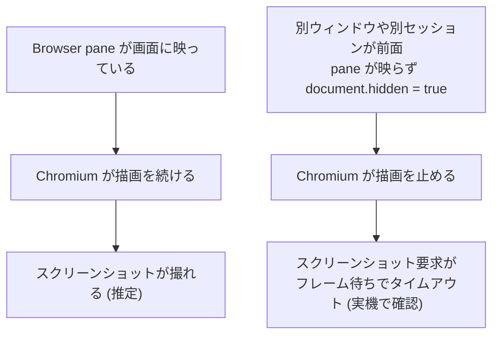

> 本記事では、Claude Code のデスクトップアプリに増えた Browser pane が、ふだんブラウザ操作に使っている Playwright の代わりになるのかを、公式説明で裏を取りつつ実機で動かして確かめてみました。

## TL;DR

- Browser pane は2026年7月に追加された、Claude Code デスクトップアプリ内蔵のブラウザです。**もとからあった Preview ペインを改名し、外部サイトの閲覧に対応させたもの**でした。
- 中身は Electron 42 / Chromium 148 で、実機で動かすと**ページのテキストや DOM、JavaScript の実行はどれも問題なく取れました**。
- ただしスクリーンショットは、Browser pane が画面に映っていないと30秒でタイムアウトしました。映っていないページの描画を Chromium が止めるためで、**別ウィンドウや別セッションを見ながら任せる使い方で起きやすい**です。
- Playwright と比べて Browser pane に分があるのは、ローカル開発サーバのプレビュー統合と、セットアップなしでクリーンな環境を開ける点でした。逆に、画像を確実に取りたい作業やログイン済みの操作、そして**画面を見ずに裏で回し続けたい作業は Playwright の方が向いています**。

## はじめに

Claude Code のデスクトップアプリを起動したら、ブラウザ機能が増えたという案内が出ました。言われてみれば、作業をさせているうちに Browser pane というブラウザが開いていました。ちょうどあるページの内容と画像を取り込みたかったので、そのまま使ってみました。ところが思うように取り込めず、結局 Playwright に切り替えて用を済ませました。

追加されたばかりの機能をうまく扱えなかっただけかもしれません。そこで、この Browser pane が実際に何をする機能で、どこまでできるのかを、公式の説明と実機の両方で確かめました。

先に結論を言うと、**Browser pane はテキストや DOM を読む用途では十分に使えますが、画像やスクリーンショットが絡む作業には現時点の実装だと不安が残りました**。

## Browser pane とは何か

まず公式の説明を整理します。Browser pane は Claude Code デスクトップアプリの Code タブに並ぶペインの1つで、実行中のアプリの隣にドキュメントや issue tracker などのサイトを開けるタブ型ブラウザ、と説明されています ([Desktop application](https://code.claude.com/docs/en/desktop))。開くショートカットは Windows で Ctrl+Shift+B、macOS で Cmd+Shift+B です。


*左のチャットで頼むと、右の Browser pane に Sonnet 5 の公式ページが開く*

追加されたのは2026年7月10日ごろ、デスクトップ v2.1.206 前後です。ただしゼロから足された新機能ではなく、**もとからあった Preview ペイン (実行中のアプリのプレビュー) を改名し、外部サイトの閲覧を足したもの**です。公式の changelog にも、改名に先立って Claude Preview と Claude Browser という名前を予約した項目が残っています ([changelog](https://code.claude.com/docs/en/changelog))。

| 項目 | 公式の説明 |
|---|---|
| 名称 | Browser (Browser pane) |
| 追加時期 | 2026年7月、デスクトップ v2.1.206 前後 |
| 成り立ち | Preview ペイン (実行中のアプリのプレビュー) を改名し外部サイト閲覧に対応 |
| プロファイル | クリーンプロファイル。保存ログインや履歴を持たない |
| 住み分け | ログイン済みで操作したいときは Claude in Chrome 拡張を使う |
| 安全策 | 外部ページへの書き込みは分類器が確認、サイトは初回に許可 |

プロファイルについては、公式が明確に住み分けを書いています。Browser pane は個人のブラウザとは別のクリーンな環境で、保存済みのログインや履歴を持ちません。自分のログイン状態のまま操作させたいときは Claude in Chrome 拡張を使う、という位置づけです ([Desktop application](https://code.claude.com/docs/en/desktop))。

## 試し方

公式の説明だけでは、実際にどこまで取れるかは分かりません。中立なページ (example.com と英語版 Wikipedia) を開いて、Claude Code から次を順に確かめました。

- `navigator.userAgent` を読み、ブラウザの正体を特定する
- `document.visibilityState` と `document.hidden` を読み、ページの表示状態を見る
- ページのテキスト、DOM、画像を取得する操作をそれぞれ試す
- スクリーンショットを撮る

環境は Windows 11、Claude Code デスクトップの build 1.20186.1 です。ペインは前面に固定せず、エージェントがふだん外部ページを扱うのと同じく裏で動かした状態で試しています。

## 実機で動かした結果

結果を先にまとめると、**読み取り系はすべて成功し、スクリーンショットだけが失敗しました**。

| 操作 | 結果 |
|---|---|
| ページのテキスト取得 | 取得できた |
| DOM / アクセシビリティツリー | 取得できた |
| JavaScript の実行 | 実行できた |
| 画像バイト列の取得 (fetch) | 取得できた (SVG を約115KB取得) |
| スクリーンショット / ズーム | 30秒でタイムアウト |

まず正体です。`navigator.userAgent` はこうでした。

```
Claude/1.20186.1 Chrome/148.0.7778.271 Electron/42.5.1 ... MSIX
```

Browser pane は Electron 42 上の Chromium 148 で動く、独立した webview です。公式は Chromium ベースとしか書いていないので、この版までは実機で動かして初めて分かります。

読み取りの例として、example.com を read で取ると、次のようなアクセシビリティツリーが返ります。

```
heading "Example Domain" [ref_1]
generic "This domain is for use in documentation examples..." [ref_2]
link "Learn more" [ref_3] href="https://iana.org/domains/example"
```

要素ごとに ref という番号が振られ、この番号を指してクリックや入力ができます。Wikipedia の記事では画像も DOM から一覧でき、`fetch` で先頭の画像を約115KB のバイト列として取得できました。テキストと DOM は、記事本文を丸ごと読める程度に取れています。読み取りに関しては、静的なページなら不足を感じませんでした。

問題はスクリーンショットです。同じページで撮ろうとすると、30秒でタイムアウトしました。ビューポートのサイズを与え直しても、3回試しても結果は同じです。エラーで弾かれるのではなく、待ち続けた末のタイムアウトでした。

画像については補足があります。Browser pane に、画像を1つ選んで保存するような一発の操作はありません。ページの見た目を取り込む正規の道はスクリーンショットで、そこが今回止まっています。画像をデータとして欲しいだけなら、先ほどのように `fetch` を自分で走らせてバイト列を受け取る手もありますが、これは機能というより回避策です。

## スクリーンショットが止まる理由

原因の手がかりは、試し方で読んだ表示状態にありました。ページは常に `document.hidden = true`、つまり非表示と判定されていました。

ここからは推測を含みます。Chromium は画面に映っていないページの描画を止めます。描画されないページにスクリーンショットを求めると、来ないフレームをずっと待つことになります。エラーではなくタイムアウトで終わったことも、これで説明がつきます。



では、どういうときに非表示になるのか。Code タブでは Browser pane がチャットの右隣に並ぶので、このセッションを開いて見ている間は、ペインも画面に映っているはずです。その状態なら撮れるかもしれませんが、そこは確かめきれていません。**止まるのは、別のウィンドウや別のセッションを前面にしていて、このセッションのペインが画面から外れているとき**です。エージェントに任せて自分は別のことをしている場面ほど、この状態に入りやすいことになります。

撮れる状態を保つには、ペインを常に右側に開いておく必要があり、そのぶん画面の右側を占有し続けます。公式はスクリーンショットを撮って DOM を見て自動で検証すると説明していますが、少なくとも今回のペインが映っていない条件では、その視覚の部分が働きませんでした。

## Playwright との使い分け

ここまでの結果を、ふだんブラウザ操作に使っている Playwright と並べて考えます。Playwright には実ブラウザに直結するモードと、専用のブラウザを立てるヘッドレスのモードがあります。

| 観点 | Browser pane | Playwright (実ブラウザ直結) | Playwright (ヘッドレス) |
|---|---|---|---|
| セットアップ | 不要。アプリに内蔵 | 拡張や CDP の用意が要る | ランタイムの用意が要る |
| ログイン状態 | クリーン。共有しない | 既存ログインを共有できる | クリーン。任意で作る |
| スクリーンショット | 画面に映っている時のみ | 撮れる | 撮れる |
| 画面を見ずに動かせるか | 映していないと止まる | 動く | 動く |
| 開発サーバ連携 | 起動から表示までアプリが面倒を見る | 自前で起動して接続 | 自前で起動して接続 |
| 実ブラウザへの副作用 | 無い | あり得る | 無い |

こうして並べると、**Browser pane に分がある場面が2つ**見えてきます。

1つは、ローカル開発サーバのプレビューです。Claude Code はアプリの編集後に開発サーバを起動し、その画面を Browser pane に出して、自分で確認しながら直します。起動から表示までを1つのペインでつないでくれるので、フロントエンドの手直しを見せながら進めたいときは素直に便利です。

もう1つは、セットアップの要らなさとクリーンさです。拡張の接続もランタイムの用意もなく、その場で開けます。ログインを共有しないので、未ログインの状態でサイトがどう見えるかを確かめたいときや、自分の実ブラウザに副作用を出したくないときにも向きます。ヘッドレスの Playwright でも同じことはできますが、こちらは何の準備も要りません。

逆に **Playwright に分があるのは、画像やスクリーンショットを確実に取りたい作業、ログイン済みの操作、そして画面を見ずに裏で回し続けたい作業**です。画像はここまで見たとおり、ログインは公式も Claude in Chrome 拡張に振っているとおりで、Browser pane のクリーンプロファイルでは扱えません。そして最後の点、Browser pane は映していないとスクリーンショットが止まるので、任せて別の作業を進める使い方はしにくく、ここが対照的です。

## おわりに

Browser pane は、テキストや DOM を読む用途なら実機でも十分に使えました。ひっかかるのはスクリーンショットで、ペインが画面に映っていないと止まります。見た目の確認まで任せるにはペインを画面に出したままにする必要があり、裏に送って別の作業をしながら任せる、という使い方がしにくいです。最初に思うように取り込めなかったのも、これが理由だったと考えると筋が通ります。

とはいえ、使いどころが無いわけではありません。**ローカル開発サーバのプレビューを見ながら直すときや、準備なしでクリーンにサイトを開きたいときは、画面に出して使う前提でも手軽**です。逆に、画像を確実に取りたいときやログイン済みで操作したいときは、Playwright や Claude in Chrome 拡張が向きます。とくに、任せて裏で別の作業を進めたいなら、画面を見ずに動かせるヘッドレスの Playwright が向いています。自分は当面 Playwright を主にしたまま、この2つの場面だけ Browser pane を使ってみるつもりです。まだ出たばかりの機能なので、映っていない状態でもスクリーンショットが撮れるようになれば、その使い分けも見直すと思います。

（出典: [Desktop application](https://code.claude.com/docs/en/desktop) / [Claude Code changelog](https://code.claude.com/docs/en/changelog) / [Claude in Chrome](https://code.claude.com/docs/en/chrome) / [9to5Mac (2026-07-10)](https://9to5mac.com/2026/07/10/anthropic-highlights-claude-codes-in-app-browser-on-the-desktop/) 。実機の確認は Claude Code デスクトップ build 1.20186.1 時点）
