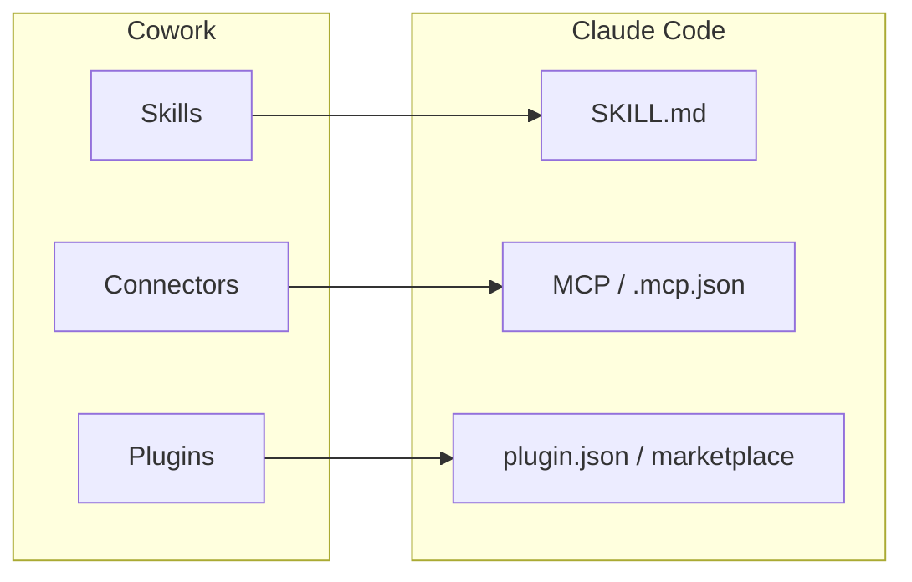

> 本記事では、Claude Cowork の主要機能 (Skills / Connectors / Plugins) が、ふだん使っている Claude Code でもそのまま使えるのかを、公式ドキュメントで裏を取りつつ実際に手元で動かして確かめてみました。

## TL;DR

- Cowork は公式に Claude Code power for knowledge work と位置づけられていて、**同じエージェント基盤をターミナル抜きで Claude Desktop に載せたもの**でした。
- 拡張の仕組み (Skills / Connectors / Plugins / slash commands / hooks / subagents / marketplace) は Cowork と Claude Code で**ファイル形式まで共通**で、公式ドキュメントも The format is shared with Claude Code と明記しています。
- Anthropic 公式の業務プラグイン集は Cowork 向けですが、Claude Code でも動くと明記されていて、`claude plugin install` で**そのまま入りました**。
- **機能そのものはほぼ同じ**で、あとは誰が使うか、どう操作するかが違うだけでした。Cowork はターミナルなしで非開発者でも使え、Claude Code は設定を自分で細かく変えられます。

## はじめに

Cowork は Anthropic が2026年1月に出した、知的労働向けのエージェント型AI (公式表現では agentic AI for knowledge work) です。フォルダを指定すると、ファイルを整理し、資料をまとめ、スケジュールされたタスクを回してくれる、といった紹介がされています。

私はふだん Claude Code を CLI と Desktop アプリで使っています。Cowork の説明を読むと、Skills・Connectors・Plugins という拡張の名前や、文書生成・リサーチ・スケジュールタスクといった機能が並んでいて、どれも Claude Code で見覚えがありました。そこで、Cowork の機能がどこまで Claude Code で再現できるのかを、公式ドキュメントで裏を取ったうえで、実際に手元で動かして確かめました。

先に結論を言うと、Cowork の目玉である Skills / Connectors / Plugins は、**仕組みからして Claude Code と同じ**でした。以下、その根拠と実際に動かした様子を順に示します。

## Cowork がやっていること

まず Cowork 側を公式情報で整理します。Cowork は Claude Desktop アプリの中で動く作業モードで、ターミナルを開かずに Claude Code と同じエージェント基盤を使える、と説明されています ([Claude Cowork](https://claude.com/product/cowork))。実際、Anthropic は Cowork が生まれた経緯として、マーケティングやデータのような非技術チームが chat を飛ばして Claude Code を使い始めたから、と書いています ([anthropic.com](https://www.anthropic.com/product/claude-cowork))。

主な機能は次のとおりです。

| 機能 | Cowork での中身 |
|---|---|
| Skills | docx / pptx / xlsx / pdf など、Claude が使う再利用可能な能力 |
| Connectors | Gmail / Google Drive / Slack / DocuSign などへの OAuth 接続 |
| Plugins | Skills・Connectors・subagents をまとめた配布単位 |
| 作業能力 | 自律実行・ファイル整理・文書生成・リサーチ・データ抽出・スケジュールタスク |

このうち Skills / Connectors / Plugins が拡張の中心です。今回はこの3つを軸に、Claude Code 側の対応を見ていきます。

## 拡張の仕組みは Claude Code と共通だった

いちばん確認したかったのがここです。公式の拡張ドキュメント ([MCP, plugins, skills, and hooks](https://claude.com/docs/cowork/3p/extensions)) を読むと、Cowork の拡張は Claude Code と**まったく同じでした**。

| Cowork の拡張 | 実体・ファイル形式 | Claude Code 側 |
|---|---|---|
| Skills | `skills/SKILL.md` | 同一の `SKILL.md` |
| Plugins | `.claude-plugin/plugin.json` ＋ `agents/` `commands/` `skills/` `hooks/` | 同一構造 |
| Marketplaces | git リポジトリ ＋ `.claude-plugin/marketplace.json` | 同一 |
| MCP / Connectors | HTTP / SSE / stdio、OAuth | 同一 (`.mcp.json` / `claude mcp add`) |
| Slash commands | `commands/*.md` | 同一 |
| Hooks | ライフサイクルイベント | 同一 (`settings.json` hooks) |
| Sub-agents | `agents/*.md` | 同一 |

Skills について、ドキュメントは The format is shared with Claude Code とはっきり書いています。つまり別物を似せて作っているのではなく、**同じ形式を Cowork と Claude Code の両方が読んでいる**、という関係です。



## 実際に Cowork のプラグインを Claude Code に入れる

仕組みが同じなら、Cowork 向けのプラグインもそのまま入るはずです。Anthropic は業務プラグイン集を [anthropics/knowledge-work-plugins](https://github.com/anthropics/knowledge-work-plugins) で公開していて、リポジトリの説明にも Built for Claude Cowork, also compatible with Claude Code とあります。案内どおり Claude Code の CLI から入れてみます。

```bash
# marketplace を登録
$ claude plugin marketplace add anthropics/knowledge-work-plugins
✔ Successfully added marketplace: knowledge-work-plugins

# プラグインを1つ入れる
$ claude plugin install productivity@knowledge-work-plugins
✔ Successfully installed plugin: productivity@knowledge-work-plugins (scope: user)
```

問題なく入りました。何が入ったのかは `details` で確認できます。Claude Code はコンポーネントの内訳と、常時かかるトークンコストまで表示してくれます。

```bash
$ claude plugin details productivity@knowledge-work-plugins
productivity 1.3.0
Component inventory
  Skills (4)  memory-management, start, task-management, update
  MCP servers (9)  slack, notion, asana, linear, atlassian, monday, clickup,
                   google calendar, gmail
Projected token cost
  Always-on:   ~352 tok   added to every session
```

プラグインが持ち込んだ MCP サーバは、そのまま Connectors として一覧に出ます。

```bash
$ claude mcp list
Gmail: ...                         - ✔ Connected
Claude in Chrome: ...              - ✔ Connected
plugin:productivity:slack: ...     - ! Needs authentication
plugin:productivity:notion: ...    - ! Needs authentication
plugin:productivity:linear: ...    - ! Needs authentication
...
```

CLI だけでなく Claude Code の Desktop アプリでも同じものが見えます。Customize メニューには Skills / Connectors / Plugins が並んでいて、これは **Cowork とまったく同じ画面**です。しかも設定のナビには Claude Code と Cowork が並んでいて、同じアプリの中に両方が同居していることが分かります。

入れた productivity プラグインは、Plugins の一覧にそのまま出てきます。


*Desktop アプリの Customize > Plugins。入れた productivity プラグインが一覧に並ぶ*

Connectors も同様で、GitHub / Gmail / Google Drive / Google Calendar / Claude in Chrome といった標準のコネクタに加えて、プラグインが持ち込んだ slack / notion / asana / linear などが並びます。


*Desktop アプリの Customize > Connectors。標準のコネクタに加えて、プラグイン由来の asana / notion / linear などが Plugin タグ付きで並ぶ*

Connectors が MCP そのものである以上、Cowork にある接続先は Claude Code でもだいたい同じように使えますし、必要なら自作の MCP サーバを足すこともできます。ここは **Claude Code のほうが自由度は高い**です。

## Office ドキュメントも同じスキルで作れる

Cowork の代表的な使い方に、データや領収書を表計算にまとめる、という作業があります。これは Claude Code に入っている office ドキュメント生成のスキル (docx / pptx / xlsx / pdf) と同じもので、試しに今回の対応表をそのまま xlsx にしてもらいました。ヘッダーの塗り・列幅・セルの色分けまで付いた、普通に開けるスプレッドシートが出力されます。


*Claude Code が xlsx スキルで生成したスプレッドシート。ヘッダーの塗り・列幅・セルの色分けまで付く*

なお Desktop アプリの Customize > Skills の一覧に出るのは、ディレクトリから追加したスキル (skill-creator など) です。docx や xlsx のような組み込みのスキルはこの一覧には並びませんが、エージェント側では普通に使えて、実ファイルが出力されます。

## デスクトップ操作について

Cowork はブラウザを開いて操作したり、画面を見て作業したりもします。Claude Code でも、ブラウザなら claude-in-chrome (DOM 操作) や Playwright (ヘッドレス)、デスクトップ全体なら computer-use や windows-mcp で同じことができます。バックエンドを用途で選べるぶん、むしろ選択肢は多いです。

この記事に載せた Plugins と Connectors のスクリーンショットも、手で撮ったものではありません。目的のウィンドウを前面に出し、画面をキャプチャして必要な範囲を切り出すまで、Claude Code が windows-mcp を通して行っています。

デスクトップ操作は深掘りすると長くなるので、ここでは同じことができるという確認までにとどめます。

## 何が違うのか

ここまで見たとおり、機能そのものはほぼ同じでした。違いは、**誰が使うか、どう操作するか**にあります。

| 観点 | Cowork | Claude Code |
|---|---|---|
| 実行環境 | Claude Desktop アプリ、ターミナル不要 | CLI 中心 (＋Desktop / IDE) |
| 想定ユーザー | 非開発者・知的労働者 | 開発者 |
| セットアップ | Customize 画面でクリック導入、OAuth はワンクリック | 設定ファイルやコマンド |
| Memory | プロジェクト内。単発セッションを跨いでは残らない | CLAUDE.md ＋ auto-memory でセッションを跨いで残せる |
| Scheduled tasks | PC と Desktop アプリが起動中のみ動く | クラウドの routine なら端末オフでも動く |

Cowork が向くのは、ターミナルを触りたくない人や、OAuth のワンクリック接続とガイド付きセットアップで手早く始めたい人です。逆に Claude Code が向くのは、hooks や subagents、カスタムコマンド、headless 実行、クロスモデルレビューまで自分で組みたい人です。同じ機能でも、Cowork は GUI で手軽に使えて、Claude Code は設定ファイルまで自分で書けます。

## おわりに

Cowork の Skills / Connectors / Plugins は、仕組みからして Claude Code と同じでした。公式ドキュメントが The format is shared with Claude Code と書き、公式のプラグイン集が Claude Code でも動くと明記し、実際に `claude plugin install` で入って Desktop アプリの一覧にも出る、というところまで確認できました。

なので、すでに Claude Code を使っているなら、**Cowork の目玉機能は追加コストなしでだいたい手元にあります**。Cowork を別で契約しないと使えない機能を待つより、いま使っている Claude Code の Customize をのぞいて、Skills / Connectors / Plugins を一度触ってみるのが早いと思います。

（出典: [Claude Cowork](https://claude.com/product/cowork) / [Anthropic 製品ページ](https://www.anthropic.com/product/claude-cowork) / [Get started with Claude Cowork](https://support.claude.com/en/articles/13345190-get-started-with-claude-cowork) / [MCP, plugins, skills, and hooks](https://claude.com/docs/cowork/3p/extensions) / [anthropics/knowledge-work-plugins](https://github.com/anthropics/knowledge-work-plugins) 。動作確認は Claude Code 2.1.197 時点）
