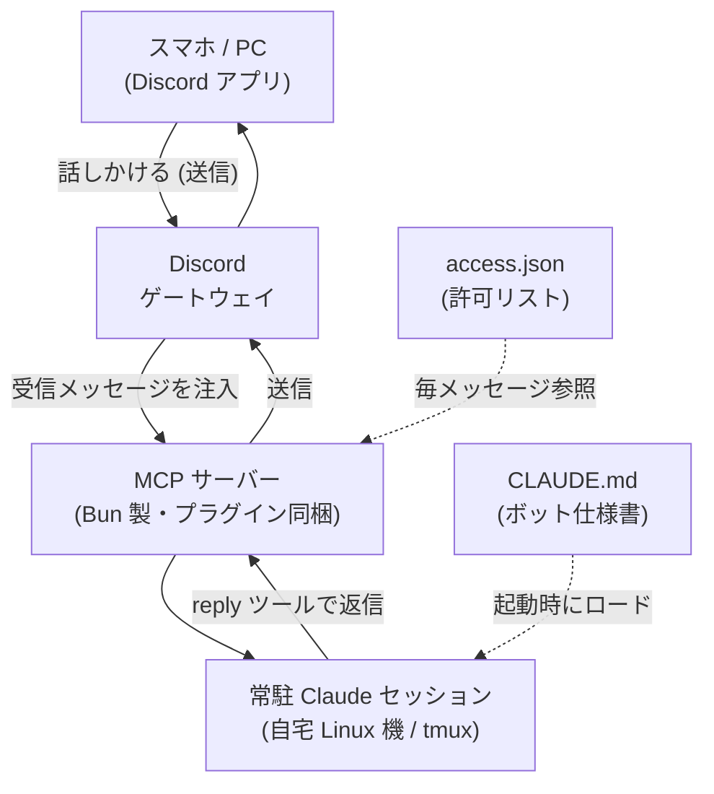

> ふだん使っている Claude Code を、そのまま Discord のボットにできます。公式プラグインを入れて起動オプションを1つ足すだけで、自分の Claude が Discord に常駐し、話しかけても返ってきます。汎用アシスタントとして常駐させてチャンネルに招いた人に使ってもらったり、競技プログラミングの出題のように用途を決めた専用ボットを並べたりできます。API を別に叩く自作ボットではなく、いつもの Claude Code のセッションがそのまま動くので、課金もふだんと同じです。実際に動かしている構成で紹介します。

## TL;DR

- 公式プラグイン `discord@claude-plugins-official` を入れ、起動時に `--channels` を足すだけで、**ふだんの Claude Code がそのまま Discord ボットになります**。API 課金の自作ボットを書く必要はありません
- **汎用アシスタントとして常駐**させ、チャンネルに招いた人にも使ってもらえます。応答を返すのはこちらの常駐 Claude Code なので、相手は自分で契約していなくても**こちらのサブスクの枠で**使えます
- そのボットに Discord 上で `/spec` して、**Obsidian 風の Markdown ビューアのような小さな Web アプリをその場で作らせる**こともできました
- ボットの性格とやることは、作業ディレクトリの **`CLAUDE.md` が決めます**
- 用途ごとにボットを分けられます。トークンと状態ディレクトリ (`DISCORD_STATE_DIR`) を分けるだけで、既存のボットと衝突させず、競プロ出題のような専用ボットを足せます。常駐と cron の二段でも動かしています
- 他人も触れて無人でも動くので、できることは OS 側のサンドボックスで絞りました

## 何ができるのか

やっていることは単純で、Discord から、自宅で常駐している自分の Claude に話しかけて返事をもらう、というものです。よくある「LLM を呼ぶ自作 Discord ボット」と違うのは、API を別に叩かない点です。ふだん使っている Claude Code のセッションがそのまま Discord に出てくるので、ツールもメモリもいつもの環境のままで、課金もふだんの Claude Code と同じです。

そのうえで、二つの使い方をしています。一つは**汎用アシスタント**を1体、サーバーのチャンネルに常駐させて、招いた人にも使ってもらう形。もう一つは、**競技プログラミングの出題**のように用途を決めた**専用ボット**を別に並べる形です。前者から順に書きます。

## 仕組み — 最初に押さえておくこと

Claude Code 公式の Discord プラグイン (`discord@claude-plugins-official`) は、次のように動きます。

- プラグインは**セッションごとに MCP サーバー (Bun 製) を起動**し、ボットトークンで Discord の**ゲートウェイに接続**します
- 受信したメッセージは `<channel source="discord" chat_id="...">` のブロックとしてセッションに**注入**され、モデルは **`reply` ツール** (`mcp__plugin_discord_discord__reply`) で返信します
- 受信を有効にするには、起動時に **`--channels plugin:discord@claude-plugins-official`** を付けます。これが無いと、受信通知が破棄されて「タイピング表示は出るのに返信しない」状態になります
- 誰の発言に応答するかは状態ディレクトリの `access.json` で決まります。DM の許可リスト、サーバーのチャンネル許可を持ち、**メッセージごとに再読込**されるので変更は即時反映です
- 作業ディレクトリの **`CLAUDE.md` がそのままボットの仕様書**として起動時にロードされ、振る舞いを決めます

全体の流れは次の通りです。



前提は2つだけです。

- **Bun** (`curl -fsSL https://bun.sh/install | bash`)。プラグインの MCP サーバーが Bun で動きます
- **常時起動のホスト**。ボットは待ち受けなので、常に動いているマシンが要ります。自宅サーバーがあればそれでよいですし、無ければ安い VPS、Raspberry Pi、普段つけっぱなしの PC でも構いません。今回は常時稼働させている自宅の Linux 機を使っています。構成は別記事「[自宅ホームラボを月500円で運用している話](https://zenn.dev/marvelousu/articles/claude-code-homelab)」に書きました

## まず自分の Claude を Discord に置く

最小の手順はこれだけです。一度通せば、あとは用途別に増やすのも同じ流れです。

### プラグイン導入

```
/plugin install discord@claude-plugins-official
/reload-plugins
```

### Discord 側でボットを登録する

1. [Discord Developer Portal](https://discord.com/developers/applications) で **New Application (新しいアプリケーション)** を押してアプリを作ります
2. **Bot** タブ → Privileged Gateway Intents の **Message Content Intent** を ON にします。これが無いと本文が空で届きます
3. **Reset Token (トークンをリセット)** でトークンを取得します。表示は一度きりなので、その場で控えます
4. **OAuth2 URL Generator (OAuth2 URLジェネレーター)** を開き、scope で `bot` を選びます。すると下に **Bot Permissions (Botの権限)** が現れるので、View Channels (チャンネルを表示)、Send Messages (メッセージを送る)、Send Messages in Threads (Threadsでメッセージを送る)、Read Message History (メッセージ履歴を読む)、Attach Files (ファイルを添付)、Add Reactions (リアクションを付ける) を選び、生成された URL でサーバーに招待します
5. 専用チャンネルを作り、User Settings (ユーザー設定) → Developer (開発者) タブで **Developer Mode (開発者モード)** を ON にしてから、チャンネルを右クリック → **Copy Channel ID (チャンネルIDをコピー)** で ID を控えます

:::message
5 のとき、**サーバー (ギルド) IDとチャンネルIDを取り違えやすい**点に注意しましょう。後述のアクセス制御で要るのはチャンネルIDで、サーバーIDを入れると黙って無視されます。
:::

### トークンとアクセス制御

トークンは状態ディレクトリの `.env` に置きます (パーミッションは 600)。

```
# ~/.claude/channels/discord/.env
DISCORD_BOT_TOKEN=<TOKEN>
```

応答対象は `access.json` で決めます。DM は許可リスト、サーバーはチャンネル単位です。

```json
{
  "dmPolicy": "allowlist",
  "allowFrom": ["<自分のユーザーID>"],
  "groups": {
    "<チャンネルID>": { "requireMention": false, "allowFrom": [] }
  },
  "pending": {}
}
```

- `dmPolicy: "allowlist"` + `allowFrom` … その DM に登録したユーザーだけが使えます
- `groups` の `requireMention` … `true` なら `@ボット名` を付けたメッセージだけに反応、`false` ならそのチャンネルの全メッセージに反応します
- `groups` の `allowFrom` … 空なら (メンション条件を満たせば) 誰でも、ID を入れるとその送信者に限定します

`access.json` はメッセージごとに読み直されるので、ここの変更に再起動は要りません。トークン (`.env`) を変えたときだけ再起動します。

### 常駐させる

tmux の中でセッションを起動し、デタッチして常駐させます。

```bash
tmux new -d -s discord-bot
tmux send-keys -t discord-bot \
  'cd ~/discord-bot/workspace && \
   claude --channels plugin:discord@claude-plugins-official' Enter
# Ctrl-b d でデタッチ。これでボットがオンライン
```

ここまでで、自分の Claude が Discord に常駐し、話しかけると返ってくる状態になります。アイドル中はトークンを消費せず、メッセージが来たときだけ動きます。

## 汎用アシスタントとして常駐させ、人を招く

一つ目の使い方は、雑多な相談に乗る汎用アシスタントです。サーバーに専用チャンネルを作って常駐させ、そこに招いた人にも使ってもらっています。

誰が使えるかは `access.json` で決まります。DM は許可リストで自分だけにし、サーバーのチャンネルは `requireMention: false` かつ `allowFrom` を空にしておくと、そのチャンネルに居る人はメンションなしでそのまま話しかけられます。応答を返すのはこちらの常駐 Claude Code なので、**相手は自分で Claude を契約していなくても、こちらのサブスクの枠で使えます**。その分こちらの利用枠は消費しますし、誰を入れるかは `access.json` のチャンネル単位・ユーザー単位で絞れます。

このボットには、相談に答えるだけでなく**その場で物を作らせる**こともできます。試しに Discord 上で `/spec` を回して仕様を詰め、そのまま実装させて、Obsidian 風の Markdown ビューアを1本作らせました。Node.js (Fastify) ＋バニラ JS の小さな Web アプリで、ファイルを都度読むライブ反映、全文検索、グラフ表示、ダーク・ライト、モバイル対応まで入っています。ログイン制にして、招いた相手もブラウザからログインするだけで、どこからでも閲覧できる形にしました。会話で仕様を詰めて、その日のうちに動く Web アプリになる、というのは常駐ボットならではの体験でした。

無人で応答させるうえ、自分以外も触れるので、起動には `--dangerously-skip-permissions` を付ける代わりに、**OS 側で何ができるかを物理的に絞っています**。systemd の transient unit として起動し、サンドボックスで書き込み先を限定しています。

- ファイルの読み書きは専用の `workspace` に閉じる
- `ProtectHome=read-only` でホーム配下は原則読み取り専用。`ReadWritePaths` で `workspace` と Claude の動作に要る状態ディレクトリだけ書き込み可にする
- `~/.ssh` は `InaccessiblePaths` で読み取りすら不可

「Claude を信用するか」だけで判断せず、万一おかしな指示が通っても被害が作業ディレクトリの外に出ないようにしておく、という考え方です。人を招いて使ってもらえるのも、この封じ込めが前提になっています。

## ボットの性格は CLAUDE.md で決める

繋いだ後にやることは、ほぼ `CLAUDE.md` を書くことです。作業ディレクトリの `CLAUDE.md` がそのままボットの定義になります。汎用アシスタントなら役割と作業境界を書きます。たとえば「複数の相手に応答する」「書き込みは workspace 内だけ」「返信は必ず `reply` ツールで送る」といった内容です。専用ボットにするなら、次のようにその仕事だけを書きます。

最初は凝って書きましたが、結局いちばん使いやすかったのは要点だけに絞った素のボットで、削ぎ落とす方向に直しました。`CLAUDE.md` がボットの全てを決めるぶん、ここを凝りすぎないことが運用しやすさに効きました。

## 用途ごとにボットを分ける

汎用ボットとは別に、競プロの問題だけを出す専用ボットを足したくなりました。ここで素直に**同じボットトークンで2つ目のセッションを起動すると、同一メッセージに二重応答**します。プラグインに単一オーナーやロックの仕組みが無く、同じトークンで受信を有効にしたセッションがそれぞれ独立に反応するためです。

なので、用途別のボットは**別トークンと別の状態ディレクトリ**にします。

1. Developer Portal で**2つ目のアプリケーション (別トークン)** を作る
2. そのボット専用に**別の状態ディレクトリ**を用意する (例: `~/.claude/channels/discord-cp/`)
3. その中に専用の `.env` (2つ目のトークン) と `access.json` を置く
4. 起動時に `export DISCORD_STATE_DIR=~/.claude/channels/discord-cp` する

別トークンは別のゲートウェイ接続になり、状態ディレクトリも分かれるので、既存の汎用ボットと**完全に分離**されます。タスクが増えれば、同じやり方でボットを足していけます。

### 例: 競プロ出題ボット

専用ボットの `CLAUDE.md` は「本番形式の問題を1問ずつ淡々と出す」だけに絞りました。出すのは AtCoder ABC 相当のオリジナル問題、難易度は `level.txt` に従う、応答は必ず `reply` で短く、数式は描画されないので LaTeX を使わず Unicode で書く、といった要点だけです。

専用の状態ディレクトリを渡して、tmux に常駐させます。

```bash
tmux new -d -s cp-coach
tmux send-keys -t cp-coach \
  'cd ~/learning/cp_practice && export DISCORD_STATE_DIR="$HOME/.claude/channels/discord-cp" && \
   claude --model sonnet --effort medium \
          --channels plugin:discord@claude-plugins-official \
          --dangerously-skip-permissions "$(cat coach_kickoff.txt)"' Enter
```

「ドリル」と送ると1問出て、解答を返すと採点が返ってきます。モデルは Sonnet、effort は medium にしました。出題や採点のように**難度が低くレイテンシが効く用途**では、Opus を高 effort で回すより体感が大きく良くなりました。

### 毎朝1問を自動配信する (cron)

常駐とは別に、毎朝1問をチャンネルへ自動投稿します。headless 実行 (`-p`) で配信プロンプトを読ませ、`reply` で投稿してログに残します。

```bash
# crontab -e
0 22 * * * cd ~/learning/cp_practice && DISCORD_STATE_DIR=~/.claude/channels/discord-cp \
  <claude のフルパス> -p "$(cat daily_prompt.txt)" --model sonnet \
  --allowedTools "Read,Glob,Grep,mcp__plugin_discord_discord__reply" \
  >> ~/learning/cp_practice/daily.log 2>&1
```

- `0 22 * * *` は UTC の 22:00 で、日本時間の翌朝 07:00 です。cron は UTC で動くので、JST から9時間引いて指定します
- `--allowedTools` で使えるツールを読み取り系と `reply` に絞り、無人実行で余計なことをさせないようにします
- cron は非ログインシェルで動くので、`claude` は実体のフルパスで書き、プロンプトが cwd 依存なら `cd <作業ディレクトリ> &&` を先頭に置きます。どちらも一度ずつ踏みました

## 引っかかりやすい挙動

繋ぐのは簡単ですが、Discord ならではの挙動でいくつか引っかかりました。実際に踏んだものを挙げます。

### タイピングは出るのに返信が来ない

起動コマンドに `--channels plugin:discord@claude-plugins-official` が付いていないと、受信通知が破棄されます。Discord 上ではタイピング表示だけ出て、返信が返ってきません。MCP のログに `Channel notifications skipped` が出ていれば、これが原因です。

### モデルが返事を「書く」だけで送らない

`reply` ツールで送らないと Discord には届きません。モデルが返答を生成して端末 (TUI) に出力するだけで、送信を忘れることがあります。`CLAUDE.md` に「応答は必ず `reply` で送る・短く」を明記して塞ぎました。

### Discord は数式を描画しない

`$...$` や `\leq` `\times` のような LaTeX は描画されず、生のまま出ます。出題ボットでは数式が要るので、Unicode とプレーン表記に倒しました。`≤ ≥ × … √`、指数は `10^9`、添字は `A_1` という具合です。

## おわりに

筆者は現在、この常駐機の上で Claude Code を日々の作業の中心に据える整備を続けていて、Discord ボットはその入口として足したものです。自分用には汎用アシスタントを常駐させて外出先から相談したり、その場で小さなツールを作らせたりしていて、招いた相手にも同じボットを使ってもらっています。それとは別に、競プロ出題のような用途を決めたボットを分けて並べています。

繋ぐだけならすぐ動きます。価値が出るのは、`CLAUDE.md` でボットの仕事を素直に書くところと、用途ごとにトークンと状態ディレクトリを分けて専用のボットに仕立てるところでした。同じように常駐 Claude を持っている方の参考になれば嬉しいです。
