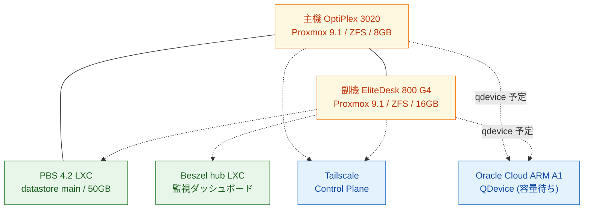

## TL;DR

- 前回記事の **OOM (Out of Memory) 事件** で **Claude Code 常駐セッションが落ちた**のを受け、「電源・SSD・メモリのどれか1つで全停止する」状態を脱したく、月500円ホームラボの常駐機にもう 1 台中古 PC を足して **Proxmox 2 台クラスタ** に拡張しました。合算の電気代は **月およそ900円**(合算 34W 程度の見積もり、実測は別途予定)。
- 両機を **ZFS** で組み直し、副機 → 主機への **15 分ごと自動同期** を副機上の業務用 LXC/VM(200/201/202 と VM 101)に設定。片方が落ちても、もう片方に直近 15 分前までのデータが揃った状態を作りました(別ノードへの移行経路は成立、無停止の実機確認は次回)。
- 主機の中に **バックアップ専用サーバー(PBS 4.2)** を内蔵し、クラスタ全体を **毎日 02:00 に自動バックアップ**。週次で破損チェックと、半年保持で古いものから自動整理しています。
- 前回入れた Beszel に主機を追加し、**5 台の状態を 1 画面で監視** しています。
- 第 3 の投票役(QDevice)用の **Oracle Cloud ARM A1 無料枠** はまだ容量待ちで、自動取得スクリプトを常駐中。自動フェイルオーバーは次回、いまは「**電源 / SSD / メモリのどれか片方が壊れても作業を続けられる土台**」までで完結しています。

## はじめに

想定読者は、

- **Claude Code を 24 時間常駐させたいが、1 台運用での OOM / 電源 / SSD 単一障害が気になり始めた** 方
- 自宅で常駐 PC を 1 台で回しているが、**電源やストレージの単一障害点が気になり始めた** 方
- 個人で **VM/コンテナを試したいが VPS や AWS の月額が重い** 方
- Proxmox を聞いたことはあるが「家庭で 2 台クラスタを組む現実的な設計」がイメージしづらい方
- 同じ構成を組むときに、先に通った人の設定値や詰まった点を見たい方

の方を念頭に書いています。書き手は半導体のデジタル設計を本業にしている新卒2年目で、Web/クラウド・Linux 周りは資格と個人開発で触っている段階です。本記事も「実際に手を動かして、実際に詰まって、実際に直した」記録をそのまま書いていきます。

なお、本記事で扱う **Proxmox** は Linux 上で VM やコンテナを Web UI から一元管理できるオープンソースの仮想化基盤(Proxmox VE)で、家庭・小規模環境では VMware の代替として広く使われています。

前々回までの構成・障害対応はそれぞれ別記事にしています。本記事はその続きです。

- [Claude Code を24時間常駐させる自宅ホームラボを月500円で運用している話](https://zenn.dev/marvelousu/articles/claude-code-homelab)(1台構成 / 省電力 / Tailscale / `/remote-control`)
- [Claude Code 多重運用 OOM を Claude 自身と切り分けて systemd user slice で止めた記録](https://zenn.dev/marvelousu/articles/claude-code-oom-systemd-slice)(常駐セッション増加で OOM → cgroup v2 で隔離)

本記事も、各段階のエラーログ解析・設定値の検討・詰まり所の切り分けを **Claude Code 自身に投げながら**進めました。詰まり所リストや実装手順は、その過程で得られた指摘を地の文に織り込んでいます。

## なぜ 2 台目を足したか

本記事の発端は前回記事の **OOM 事件** です。Claude Code を複数セッション常駐させていたら、メモリを食い尽くして主機が落ちました。systemd user slice で **Claude Code に割けるメモリ上限を絞る** ことで対症療法的には収まりましたが、これは「Claude Code が他プロセスを巻き込んで落ちないようにする」だけで、根本的に「メモリが足りない / SSD・電源が壊れる / 起動が止まる」のいずれか1つで Claude Code 基盤が全停止する構造は残っています。

そこで「常駐ジョブを諦めない」「家計に効く電気代で済ませる」の両立を、**もう 1 台中古 PC を足して片方落ちても続く最低ライン** で組むことにしました。第 3 票(QDevice)による自動フェイルオーバーは次回ですが、まずは「**手動で隣に逃がせる**」状態に持っていくのが本記事のゴールです。

## 何を作ったか

「クラスタ化」の範囲はピンキリなので、今回どこまで作ったかを最初に整理します。

| 機能 | 状態 |
| --- | --- |
| 2 台 Proxmox クラスタ(Web UI で両機を一元管理) | ✅ 完了 |
| ZFS の 15 分ごと自動同期(副機 → 主機、副機上の LXC/VM) | ✅ 完了 |
| 別ノードへ移す(Proxmox の移行機能) | 🟡 経路成立、無停止の実機確認は次回 |
| 毎日の自動バックアップ(PBS)+ 週次破損チェック + 自動整理 | ✅ 完了 |
| クラウド側の第 3 の投票役(QDevice / Oracle Cloud ARM 無料枠) | 🟡 容量待ち |
| 片方落ちても自動再起動(HA / 自動フェイルオーバー) | 🟡 第 3 票投入後 |

HA(片方落ちたら自動再起動)は **第 3 票が揃ってからの次回記事** に分けます。本記事は **2 台連携 + 自動同期 + 自動バックアップ** までで完結します。


*Datacenter > Cluster: 2 ノード(pve01 / optiplex)が登録された状態*

## 全体構成



主機・副機の corosync ring(クラスタの心拍同期)は LAN 直結で、QDevice は将来的に Tailscale 経由でクラウドから 1 票だけ提供する形になります。

## 機器構成


*主機 OptiPlex 3020 SFF(左)+ 副機 EliteDesk 800 G4 DM(右)*

| 役割 | 機種 | CPU | メモリ | ストレージ | OS |
| --- | --- | --- | --- | --- | --- |
| 主機 | Dell OptiPlex 3020 SFF | i3-4130(2C4T) | 8GB(4GBから増設) | SATA SSD 128GB | Proxmox VE 9.1 / ZFS rpool |
| 副機 | HP EliteDesk 800 G4 DM | i5-8500T(6C6T) | 16GB | NVMe 256GB | Proxmox VE 9.1 / ZFS rpool |

副機 EliteDesk は中古ミニPC市場で **14,800 円で買い直した**ものです。前回記事公開後にリソース不足を感じる場面が増え、「もう1台で逃がしたい」という素直な欲求から増やしました。中古相場は 2026年春時点でビジネス向け Mini/Tiny 系がやや高騰していて、調達には少し粘りが要ります。

主機側は **メモリを 4GB → 8GB に増設**(中古 DDR3-1600 UDIMM 4GB×2、約 1,000 円)しています。Proxmox + ZFS ARC + PBS LXC を同居させるには 4GB だと PBS の verify 時にメモリが足りず OOM 寸前まで詰まる、という見立てが事前検討で出ていたためです。実際に 8GB 化後の余裕は十分でした。


*主機 Proxmox インストーラの最終 Confirm 画面 — Bootdisk filesystem に **ZFS RAID0** を選択*

## なぜこの構成にしたか

主な選び方はこの 4 つです。

| 軸 | 選択 | 主な理由 |
| --- | --- | --- |
| 仮想化基盤 | **Proxmox VE** | LXC(軽量コンテナ)+ VM(完全な仮想マシン)の両方が標準。Web UI で完結、無料、クラスタとバックアップサーバーが同じ製品系 |
| ストレージ | **両機とも ZFS** | snapshot や圧縮が標準。自動同期(replication)を成立させるための前提 |
| クラスタ規模 | **2 台 + クラウドの第 3 票** | 家庭で 3 台常時稼働は電気代と置き場が重い。2 台 + 軽い witness が現実解 |
| バックアップ | **主機の中に PBS LXC を内蔵** | 専用機を増やさず、副機側のバックアップは主機の PBS に逃がす |

特に **「両機とも ZFS にする」** が今回の核でした。Proxmox の自動同期(`pvesr`)は両側が ZFS でないと動きません。前回まで主機は Ubuntu、副機の Proxmox も別ファイルシステム構成だったので、**副機を OS 再インストール、主機を Ubuntu → Proxmox に置き換え** という二重の入れ替えが事前作業の大部分を占めました。


*主機 OptiPlex の Disks > ZFS タブ — rpool が ONLINE で並ぶ*


*副機 EliteDesk(pve01)の Disks > ZFS タブ — こちらも rpool が ONLINE。両機 ZFS が成立して、初めて自動同期(replication)が動く*

## 実装ハイライト

### 1. Proxmox 2 台クラスタ

副機側で `pvecm create` してクラスタを立て、主機を `pvecm add` で参加させます。

```bash
# 副機(192.168.x.10)
pvecm create homelab-v2

# 主機(192.168.x.11)
pvecm add 192.168.x.10 --use_ssh
```

完了後、両機で `pvecm status` を叩くと `Quorate: Yes / Total votes: 2` が出ます。

```text
Membership information
----------------------
    Nodeid      Votes Name
0x00000001          1 192.168.x.10 (local)
0x00000002          1 192.168.x.11
```

設定ファイル(`/etc/pve` 配下)は両機で常時同期されるので、Web UI からは片方を触るだけでもう片方にも反映されます。

ただし **2 台のままだと、1 台落ちると残り 1 台で過半数が取れず、書き込み禁止になります**。これを 3 票に増やすのが次回扱う第 3 票(QDevice)の役割です。

### 2. ZFS の 15 分ごと自動同期

副機 → 主機方向に、副機上の LXC/VM(200/201/202 + VM 101)の同期ジョブを登録します。`*/15` は 15 分ごとです。

```bash
# 副機側で
pvesr create-local-job 200-0 optiplex --schedule '*/15' --rate 30
pvesr create-local-job 201-0 optiplex --schedule '*/15' --rate 30
pvesr create-local-job 202-0 optiplex --schedule '*/15' --rate 30
pvesr create-local-job 101-0 optiplex --schedule '*/15' --rate 30
```

`--rate 30` は同期時の帯域制限 (MB/s) で、家庭 LAN を他用途と取り合わないための保険です。

初回は全データの送信で時間がかかりますが、2 回目以降は **差分だけの送受信** になり、ほとんどの場合は数秒〜数十秒で完了します。

| ジョブ | 種別 | サイズ | 初回同期 |
| --- | --- | --- | --- |
| 200-0 | LXC(reverse proxy) | 4GB rootfs | 29.2s |
| 201-0 | LXC(Beszel hub) | 4GB rootfs | 28.6s |
| 202-0 | LXC(Claude Code 開発機) | 32GB rootfs | 105.5s |
| 101-0 | VM(Ubuntu cloud-init) | 15GB scsi disk | 95.5s |

なお VM のディスクは **見かけ 15GB でも、実際に書き込まれている部分しか転送されない** ので、上の VM 101 のように 95 秒のうち実データの転送はごくわずかでした。

保護対象の中心は **CT 202(Claude Code 開発機)** です。前回記事まで主機 1 台で動かしていた Claude Code 常駐環境を LXC 化したもので、本記事の冗長化の本来の目的そのものでもあります。副機が物理故障しても、主機側に直近 15 分以内の Claude Code セッション状態(履歴・compact 済 conversation を含む)が揃った状態で残ります。


*Replication 画面 — 4 ジョブの Last Sync / Next Sync / Schedule(`*/15`)が一覧で見える*

### 3. 主機内 PBS LXC で毎日バックアップ

PBS は通常は専用機に入れますが、家庭では主機の中に LXC として入れても動きます。**主機の中の LXC** として立て、クラスタからはネットワーク経由のバックアップ先として見える設計にしました。

ただし主機自体が壊れるとバックアップも一緒に失います。本格運用では別ホストへの PBS sync(または Backblaze B2 等のオフサイト S3 互換)を後付けする前提で、本記事ではそこは扱いません(別記事で検討)。

前提として、`pct create` の前に **Datacenter > local > CT Templates** から `debian-13-standard` template を download しておきます。

```bash
# 主機側で LXC 作成(VMID 203、Debian 13 / privileged / rootfs 50GB)
pct create 203 local:vztmpl/debian-13-standard_13.1-2_amd64.tar.zst \
  --hostname pbs-store --memory 2048 --cores 2 \
  --rootfs local-zfs:50 --net0 name=eth0,bridge=vmbr0,ip=dhcp \
  --onboot 1 --unprivileged 0
```

> ⚠️ `--unprivileged 0` (privileged LXC) はホスト権限同等の扱いになります。本記事では PBS の都合で採用しています(主機内に閉じる前提)。本番で外部からアクセスされる用途には、unprivileged + 必要 directory の bind mount 構成を検討してください。

LXC 内で PBS をインストールし、データの保管庫(datastore)を作って、外から書き込めるよう API トークンと権限(ACL)を付けます。インストール自体は[PBS 公式 doc](https://pbs.proxmox.com/docs/installation.html)が分かりやすいので、ここでは作成 〜 ACL 付与のコマンドだけ。

```bash
pct exec 203 -- proxmox-backup-manager datastore create main /srv/datastore
pct exec 203 -- proxmox-backup-manager user generate-token root@pam pve-storage
pct exec 203 -- proxmox-backup-manager acl update /datastore/main DatastoreAdmin \
  --auth-id 'root@pam!pve-storage'
```

主機側の Proxmox にバックアップ先として登録すれば準備完了です。

```bash
pvesm add pbs pbs-store \
  --server 192.168.x.145 --datastore main \
  --username 'root@pam!pve-storage' --password '<token-secret>' \
  --fingerprint '<sha256-fingerprint>' \
  --content backup
```

スケジュールは **毎日のバックアップ**(02:00)、**週次の破損チェック**(日曜 03:00)、**週次の自動整理**(日曜 04:00)の 3 本を別ジョブで回しています(7 日 + 4 週 + 6 ヶ月 ≒ 半年保持)。

実際にテストで LXC 1 台のバックアップを取ると、**702 MiB のデータが PBS の重複排除と圧縮で 254 MiB に**、所要時間 6 秒で完了しました。重複は単位を細かく区切って判定するので、2 回目以降は更にコンパクトになります。


*PBS Web UI の Datastore main > Content — テストで取った ct/201 のバックアップ(2026-04-30 / 702.91 MiB)が記録されている*

## 詰まった所

### 1. 副機 ZFS 化で SSH 鍵と host key が一緒に飛んだ

副機を ZFS-on-root にするために OS 再インストールしたところ、`/root/.ssh/authorized_keys` も `/etc/ssh/ssh_host_*` も初期化されました。事前にデータの rsync は退避していましたが、**「`~/.ssh` は退避対象に入っていなかった」** のが盲点でした。

対処は単純で、Web UI のシェルから新たに公開鍵を `>>` で追記し、クライアント側 `known_hosts` の旧 entry を `ssh-keygen -R` で消すだけです。教訓として、**OS 再インストールを伴う作業の事前チェックリストには「authorized_keys を退避したか」を明示する** のが確実です。

### 2. クラスタ形成前に「双方向 SSH 鍵」と「/etc/hosts 相互エントリ」を整える

`pvecm add 主機-IP --use_ssh` は内部で `ssh BatchMode=yes` を使うため、**両機が互いの `authorized_keys` に SSH 鍵を投入していないと弾かれます**。新しく Proxmox を入れた直後は `/root/.ssh/id_rsa` は自動生成されているのに公開鍵投入はされていないので、最初に通すコマンドはこれです。

(以下のコマンドは両機の Web UI のシェル or ローカルコンソールから入った状態で投入する想定)

```bash
# 双方向に SSH 公開鍵を投入
ssh root@主機 "cat /root/.ssh/id_rsa.pub" | ssh root@副機 "cat >> /root/.ssh/authorized_keys"
ssh root@副機 "cat /root/.ssh/id_rsa.pub" | ssh root@主機 "cat >> /root/.ssh/authorized_keys"
```

加えて、**`/etc/hosts` に相互ノードのエントリ**も入れておきます。Proxmox インストーラは自分のホスト名しか登録しないため、`pvecm` が内部で hostname 解決を要求する場面で詰まります。

```bash
# 主機側
echo '192.168.x.10 pve01.local pve01' >> /etc/hosts
# 副機側
echo '192.168.x.11 optiplex.local optiplex' >> /etc/hosts
```

ここまで揃えてから `pvecm create` / `pvecm add` を打つと、内部の SSH と hostname 解決でつまずかずに進みます。なお、クラスタ化後は `/root/.ssh/authorized_keys` が `/etc/pve/priv/authorized_keys` の symlink になり自動同期されるので、この手の手動鍵管理は最初の 1 回だけで済みます。

### 3. クラスタ名は **15 文字以下**

最初 `homelab-v2-cluster`(18文字)で `pvecm create` を叩いたら、

```text
400 Parameter verification failed.
clustername: value may only be 15 characters long
```

corosync の制約で **クラスタ名は 15 文字上限** です。`homelab-v2`(10文字)に短縮して再実行で通りました。create に失敗した状態ではクラスタは形成されないので、リトライに副作用はありません。短い名前を最初から付けるのが楽です。

### 4. `pvecm create` 直後の `pvecm add` は race condition を踏む

副機でクラスタ create が成功した直後(数秒以内)に主機で `pvecm add` を叩くと、

```text
cluster not ready - no quorum?
```

で蹴られました。副機側の `pvecm status` は `Quorate: Yes` を返しているのに、です。原因はクラスタ create で副機の `pmxcfs` が再起動した直後で、systemd 上は `active` でも内部 API がまだ完全に ready ではない race window が数秒あるためです。

対処は **5〜10秒の sleep を挟む** だけです。リトライすると 1 回で通ります。失敗時の副作用は副機側のクラスタは維持・主機側は無傷で残るので、リトライしても重複しません。

### 5. PBS 4 で `--privsep` オプションが廃止されていた

PBS 3 系の手順が web で多く出回っていますが、PBS 4.2 では token 生成オプションが整理され、

```bash
proxmox-backup-manager user generate-token root@pam pve-storage --privsep 0
# Error: parameter verification failed: 'privsep': schema does not allow additional properties.
```

**PBS 4 では token は user 権限を継承せず、別途 ACL を明示付与する必要があります**。これを忘れると、クラスタ側で `pvesm add` するときに

```
Cannot find datastore 'main', check permissions and existence!
```

と出て、原因の見当が付きにくいエラーになります。`proxmox-backup-manager acl update /datastore/<store> DatastoreAdmin --auth-id '<userid>!<tokenname>'` で ACL を付ければ通ります。

## 数字

24 時間運用に入った状態の数字です。消費電力は実測前の見積もり(CPU TDP / アイドル時の典型値ベース)、バックアップ・同期の所要時間は PBS / Replication 画面のログから取った実測値です。

### 消費電力 / 月額

| 機体 | 平均 |
| --- | --- |
| 主機 OptiPlex(Haswell / 8GB) | 16〜19W(中心 17W) |
| 副機 EliteDesk(Coffee Lake / 16GB) | 14〜20W(中心 17W) |
| 合算 | **30〜39W(中心 34W)** |

電気料金は前回と同じ実効単価 36円/kWh で計算します(消費電力は CPU TDP とアイドル時の典型値からの見積もり、両機ともスマートプラグでの実測は別途予定)。

- 月額: **34W × 24h × 30日 × 36円/kWh ≒ 約900円**
- 年額: 約 10,700円

前回 1台時点が約 500円だったので **ほぼ倍増、増えたぶんは副機分だけで約400円**(主機の 8GB 化と Proxmox 化で使用率が変わったぶんは影響軽微)。比較として、

| 構成 | 月額目安 |
| --- | --- |
| VPS(同等2インスタンス) | 3,000〜5,000円 |
| AWS EC2 t3.medium × 2 常時稼働 | 6,000〜16,000円 |
| 本記事の自宅 2 ノード Proxmox | **約900円** |

VPS 2 台分の 1/3〜1/5、EC2 2 台分の 1/7〜1/17 に収まっています。**「冗長化のために月数千円払う」のと「中古 PC 1 台足して電気代を倍にする」のはコスト構造が違う** ので、家庭用途には自前ハードの方が有利な水準だと感じています。

### 監視


*Beszel hub の Systems 一覧。server-01 は意図的に停止中の VM(削除はせず保持)で、Active Alerts に「Connection is down」が上がっているのは想定通り = 監視が機能している例*

### バックアップ性能

| 指標 | 値 |
| --- | --- |
| LXC 1 台のバックアップ所要時間(初回) | 6.05 秒(702MB → 254MB compressed) |
| 平均スループット | 約 116 MiB/s |
| ZFS 自動同期 差分送信(15分間隔) | 数秒〜数十秒 |
| PBS 重複排除後の容量 | 元データの 30〜40% 程度 |

PBS の重複排除は単位を細かく区切って判定するので、**何世代分か取っても容量が線形には増えない** のが効きます。retention `keep-daily=7 / keep-weekly=4 / keep-monthly=6` で半年保持しても、家庭規模ではせいぜい数十 GB 内に収まる見込みです。

## 1 台時 vs 2 台時の比較

前回 1 台構成と並べると、こうなります。

| 観点 | 1 台 (前回) | 2 台 (今回) |
| --- | --- | --- |
| 単一障害点(電源 / SSD / メモリ) | あり | **減った**(自動同期で副機側に直近データを保持) |
| バックアップ | vzdump local | **PBS LXC(主機内に同居、物理冗長は次回)で重複排除 + 週次破損チェック** |
| 仮想化基盤 | なし(裸の Linux) | Proxmox(Web UI + LXC + VM) |
| ノード間移送 | なし | **経路成立**(共有ストレージなしで自動同期ベース、無停止の実機確認は次回) |
| 自動フェイルオーバー | なし | 🟡 第 3 票(QDevice)取得後に有効化予定 |
| 月額(電気) | 約500円 | **約900円** |
| 構築工数 | 1〜2 週末 | 1 週間程度 |

「一気に揃った」というより、**まず replication と PBS で土台を作り、HA は次回(QDevice 取得後)** という段階的な作りになっています。家庭で 1 度に全部やろうとすると週末が消えるので、分けて進めるのは現実的でした。

## 続編予定

本記事に入れなかった残りは次の通りで、それぞれ別記事で扱う予定です。

- **Oracle Cloud ARM A1 を QDevice として cluster に組み込む**(3票成立 + HA Manager で本物のフェイルオーバー)
- **K3s を 2 ノードクラスタに乗せて Pod レベルの HA も足す**(コンテナワークロード向け)
- **副機選定の中古 PC 市場事情**(2026年春の Mini/Tiny 系の値動きと、相場感)

特に最初の QDevice は、「2 ノードのままでは片方落ちると read-only」という今回の構成上の弱点を埋める要なので、次回はそこから書きます。

## おわりに

筆者は現在、

- 上記の QDevice / HA Manager 設定と、Oracle ARM の容量待ち
- Proxmox 上での K3s 2 ノードクラスタ立ち上げ(armd64 + arm64 のマルチアーキ運用)
- PBS の暗号化キー設計(client-side encryption + 鍵の別ホスト保管)
- Beszel の Grafana Cloud 連携と HTTPS 化

に取り組んでいます。同じように **「家庭で 2 台冗長化を組んでみたい」「Proxmox + ZFS で何ができるか見てみたい」** という方の参考になれば嬉しいです。

---

**追記予定**: 数字はカタログ値や同世代機の典型値から見積もったもので、両機ともこれからスマートプラグで実測予定です。確定値が出たら本記事に追記します。
