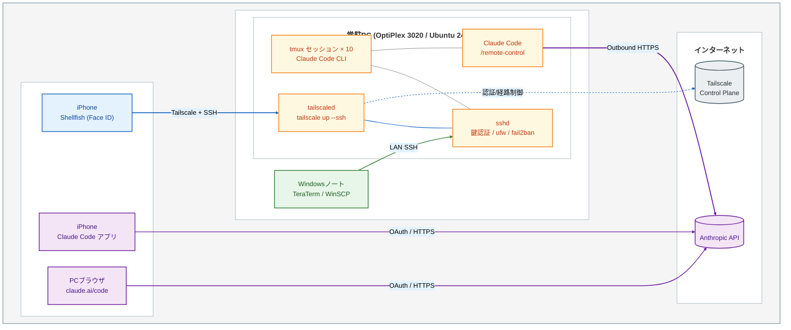

## TL;DR

- 家にあった中古 x86 デスクトップ(合計5,000円で動く状態)を Ubuntu 24.04 LTS + ヘッドレス運用で常駐化し、Claude Code CLI を tmux で **10セッション前後** 常時動かしています。
- TLP + thermald + powertop + カーネル起動パラメータの省電力チューニングで、**idle 15〜18W / 平均運用 18〜22W** に収まりました。
- 電気代は **月約520円**(自宅の2026年3月電気料金明細から算出した実効単価 36円/kWh ベース)。
- 外出先からは **Tailscale 経由の SSH (Shellfish)** と **Claude Code の `/remote-control`** を使い分けています。どちらか片方だけでは実運用が閉じません。
- sshd / ufw / fail2ban でひと通りの hardening を入れ、鍵は Face ID / ACL で守る構成にしています。

## はじめに

想定読者は以下を念頭に書きました。

- Claude Code を常駐運用したいが、VPS を借りるほどの用途ではない方
- 自宅サーバーに興味はあるが、電気代と常時稼働の面で踏み切れていない方
- 外出先(スマホ・別端末)からも自宅と同じ Claude Code セッションに入りたい方
- 手元に余っている中古 PC の使い道を探している方
- 同じ構成を組むときに、先に同じ経路を通った人の設定値や詰まった点を参考にしたい方

書き手は半導体のデジタル設計を本業にしている新卒2年目です。常駐サーバーは個人の趣味レベルで、Web/クラウドは資格と個人開発で触っている段階です。本記事は「手を動かした結果」をそのまま書きます。

## 全体構成

接続ルートは3つあります。

1. **自宅LANのWindowsノート** → TeraTerm / WinSCP で SSH(鍵認証)
2. **外出先のiPhone** → Shellfish で Tailscale VPN 経由の SSH(鍵認証)
3. **iPhone / PCブラウザの Claude Code クライアント** → Anthropic API を経由して `/remote-control` 待ち受け中のPCに接続

1と2はシェルを直接叩く用途、3は Claude Code の対話セッションを継ぐ用途、という棲み分けです。後述するように **両者は補完関係** で、片方だけでは日常運用に隙間が出ます。



## ハードウェア

### 使った機体

| 項目 | 値 |
| --- | --- |
| 機種 | Dell OptiPlex 3020 SFF(Regulatory Model: D07S) |
| CPU | Intel Core i3-4130(Haswell, 2コア4スレッド, TDP 54W) |
| メモリ | 4GB(DDR3-1600) |
| ストレージ | HIDISC 2.5inch SATA SSD 128GB(SSD128G) |
| 電源 | 255W |
| GPU | CPU 内蔵iGPU(dGPU非搭載) |
| 運用 | ヘッドレス(モニタ非接続) |

### 経緯

Claude Code 常駐を前提に選んだ機体ではなく、**もともと別用途で買って余っていた中古デスクトップをそのまま転用**しています。本体をメルカリで 3,000円で入手したときはメモリが抜かれた状態で届いたので、手持ちの 4GB DDR3 を載せ、HIDISC の 2.5inch SATA SSD 128GB(SSD128G)を 2,000円で別途購入して換装しました。**起動できる状態にするまで合計 5,000円** です。

### 機種選びについての注意

OptiPlex 3020 SFF 固有の優位性を主張するつもりはありません。常駐 Linux 機として成立する候補は他にもいくつかあります。

- 中古のビジネス向け省スペースデスクトップ(Dell OptiPlex / Lenovo ThinkCentre Tiny / HP EliteDesk Mini 系)
- 新品の Intel N100 / N150 系ミニPC(idle 6〜10W 程度のモデルが多い)
- Raspberry Pi 5 + SSD(idle は最も低いが、本体+電源+ケース+ストレージで総額は上振れしやすい)

本記事で扱う構成手順(省電力デーモン、カーネル起動パラメータ、sshd / ufw / fail2ban の hardening、Tailscale、tmux 常駐)は、上のどれを選んでもそのまま転用できます。本記事の狙いは「特定の機種を推す」ことではなく、**常駐 Linux 機 + Claude Code という組み合わせが現実的に回る**ことを、省電力チューニング込みで示すことにあります。用途自体は Claude Code の常駐で、数値計算を走らせる使い方ではないので、**CPU 性能そのものよりも、静音・安定性・省電力のほうが効く** というのが個人的な実感です。

## OS とベースセットアップ

Ubuntu 24.04 LTS を選びました。理由は単純です。

- Ubuntu / Debian 系に慣れていた
- LTS なので常駐機の再セットアップ頻度を抑えられる

ヘッドレス運用にしたのは、**モニタを繋いでいる間はその分電力を食う**のと、遠隔アクセスしか使わないので単純に不要だからです。

最低限インストールしたパッケージは以下の5つです。この記事で触るのはおおむねこの範囲です。

```bash
sudo apt install openssh-server tmux ufw fail2ban
# Tailscale は公式手順でインストール
curl -fsSL https://tailscale.com/install.sh | sh
```

## 省電力設定

**Ubuntu 標準のままでも動きはしますが、idle で 3〜5W ほど削れます**。小さい差に見えますが、24時間 × 365日で積もると無視できない量です。

### 常駐デーモン

- **TLP**(AC / BAT プロファイル切り替えの中核)
- **thermald**(Intel 公式の熱制御デーモン)
- **powertop `--auto-tune`**(systemd 常駐で、起動ごとに適用)

```bash
sudo apt install tlp tlp-rdw thermald powertop
sudo systemctl enable --now tlp thermald
```

`powertop --auto-tune` は systemd unit として登録すると起動ごとに自動適用できます。

### カーネル起動パラメータ

`/etc/default/grub` の `GRUB_CMDLINE_LINUX_DEFAULT` に以下を追加します。

```
pcie_aspm=force intel_pstate=passive
```

- `pcie_aspm=force`: PCIe の Active State Power Management を強制ON。BIOS 出荷設定で無効のままの機体がある
- `intel_pstate=passive`: Intel P-state を passive にして、TLP 側のガバナ指定をそのまま効かせる

更新後は `sudo update-grub` の後に再起動が必要です。

### TLP カスタム `/etc/tlp.conf`

常時 AC 給電運用なので、`*_ON_AC` 側だけ書き換えます。

| 項目 | 値 |
| --- | --- |
| CPU_SCALING_GOVERNOR_ON_AC | powersave |
| CPU_ENERGY_PERF_POLICY_ON_AC | power |
| PCIE_ASPM_ON_AC | powersave |
| SATA_LINKPWR_ON_AC | med_power_with_dipm |
| RUNTIME_PM_ON_AC | auto |
| WOL_DISABLE | Y |
| NMI_WATCHDOG | 0 |

ポイントは、**AC 給電でも `powersave` ガバナを選んでいる**ことです。Claude Code 常駐で CPU がスパイクするのは数秒程度で、平時は idle 寄りに張り付きます。そのためパフォーマンス系ガバナは過剰で、`powersave` にしても体感は変わりませんでした。

### その他の細かい設定

- **CPU C-state**: state0〜state5 全有効(BIOS 側で制限が入っていないことだけ確認)
- **USB autosuspend**: 全デバイス auto(キーボード等を繋いでいないので副作用なし)
- **Ethernet Wake-on-LAN**: 無効(遠隔起動は Tailscale 経由の別経路で代替)

### 効いているかの確認

設定を入れただけで終わらせず、`powertop` で実測します。

- Tunables タブ → 各省電力項目が "Good" / "Bad" のどちらか

`powertop --auto-tune` を一度走らせると、Tunables のほとんどが "Good" で並ぶはずです。総消費電力(W)は powertop では直接は出ないので、必要ならワットチェッカーやスマートプラグで別途実測する形になります。

  
*powertop Tunables タブ(すべて Good 状態)*

## リモートアクセス3ルート

### 自宅LANのWindowsノート(TeraTerm + WinSCP)

- 鍵は **PuTTY 形式(.ppk)** を1つ作り、TeraTerm と WinSCP で共用する
- Windows 側の鍵保管は ACL で利用ユーザー限定にする(Everyone 読み不可)

### 外出先のiPhone(Shellfish)

- Shellfish の内蔵鍵生成で ED25519 を発行し、公開鍵を PC の `~/.ssh/authorized_keys` に追記
- **Face ID で鍵のアンロックを守る**(盗難時の最終防衛線)

### Tailscale で LAN 外からも同じ鍵が通る

PC 側で `sudo tailscale up --ssh` を有効化しておくと、Tailnet 内のデバイスから Tailscale IP に向けてそのまま SSH できます。通常の sshd に Tailscale が被さる形になるので、**LAN で使っていた鍵と設定がそのまま通用する**のが便利なところです。

iPhone も Windows も Tailscale クライアントを入れるだけで、鍵や設定を環境ごとに分岐させずに済みます。外出先からのアクセスで個別のサーバーに追加で穴を開けない設計にできるのは、hardening の観点で大きい利点だと感じます。

## セキュリティ hardening

### sshd の設定

`/etc/ssh/sshd_config.d/99-hardening.conf` に以下を置き、元の `sshd_config` は触らない運用にしています。

```
PasswordAuthentication no
PubkeyAuthentication yes
PermitRootLogin prohibit-password
```

### ufw(ファイアウォール)

LAN 帯と `tailscale0` インターフェースからの 22/tcp だけ許可、それ以外は deny にします。

```bash
sudo ufw default deny incoming
sudo ufw allow from 192.168.x.0/24 to any port 22 proto tcp
sudo ufw allow in on tailscale0 to any port 22 proto tcp
sudo ufw enable
```

外部から Tailnet に入っていないデバイスは、sshd に到達すらできません。

  
*sudo ufw status numbered の出力*

### fail2ban(総当たり対策)

sshd jail を `maxretry=5 / findtime=10m / bantime=1h` で有効化しています。Tailscale 経由のみの運用ではふだん発火しませんが、**ufw に穴が開いたときの最終防壁**として入れる位置づけです。

  
*sudo fail2ban-client status sshd の出力*

## tmux で開発環境を永続化する

Claude Code CLI を **10 セッション前後** 常駐させています。tmux に入れておくことで、SSH クライアントを落としても、iPhone と Windows を切り替えても、**同じセッションに戻れる**のが大きな利点です。

```bash
# セッションを作って中で Claude Code CLI を起動
tmux new -s project-a
# デタッチ: Ctrl-b d
# 再接続: tmux attach -t project-a
```

  
*tmux ls の出力(常駐セッション一覧)*

セッション名はプロジェクト名をそのまま使っているだけで、ペイン分割は場当たり的です。まだ自分のなかでも定型化はできていません。**「一度作ったセッションを消さずに残しておける」というだけで、iPhone と Windows を行き来するときの体験は大きく変わる** というのが、現時点で実感している tmux の一番大きい利点です。

## Claude Code `/remote-control` と SSH の使い分け

2026年2月に GA した Claude Code の `/remote-control` を使うと、**インバウンドポートを開けずに、外からスマホアプリや Claude.ai のブラウザで Claude Code セッションを操作できます**。

動き方は次の通りです。

1. PC 側の Claude Code セッション内で `/remote-control` と打つ
2. セッション **右下のステータスに `remote-control on` のような表示が出る**(URL や QR は出ません)
3. claude.ai/code のブラウザ、または公式スマホアプリのセッション一覧に、**オンライン中のPCが緑ドットで現れる**ので、それを選んで接続する
4. 認証は Claude.ai の OAuth。アウトバウンドHTTPS だけで成立し、インバウンド開放は不要

  
*PC側 Claude Code セッションで /remote-control 実行後の表示*

  
*スマホ側 Claude Code アプリの接続画面*

### SSH/tmux と `/remote-control` の使い分け

| やりたいこと | SSH + tmux | `/remote-control` |
| --- | --- | --- |
| 任意のシェルコマンド実行 | できる | 不可(Claude Code 内の範囲のみ) |
| Claude Code **新規セッション作成** | できる | 不可(既存セッションへの接続のみ) |
| 対話的ピッカー(`/mcp` 等) | できる | 不可 |
| Claude Code セッションのチャット履歴同期 | 手動 | 自動 |
| ネットワーク切れからの自動再接続 | 無し | あり |
| スマホアプリへの通知 | 無し | あり |

特に「**新規セッション作成と対話的コマンドはアプリでは動かない**」という制約が実運用で効くので、外出先でも iPhone に Shellfish を入れたままにしています。新規 Claude Code セッションを立ち上げたい、対話的コマンドを叩きたい、という瞬間は Shellfish → tmux に入り、それ以外の対話継続は `/remote-control` で拾う、という使い分けに落ち着きました。

## 消費電力と月額試算

実測値のサマリです。

| 状態 | 消費電力 |
| --- | --- |
| 真の idle | 15〜18W |
| 平均運用(Claude Code 常駐中) | 18〜22W |
| ツール実行時のスパイク(数秒) | 40〜55W |

電気料金の単価は **自宅の2026年3月電気料金明細を契約電力量で割って算出した実効 36円/kWh**(契約プランと燃料費調整込みで丸めた値)を使います。

- 月額: 20W × 24h × 30日 × 36円/kWh ≒ **約520円**
- 年額: 約 6,200円

比較すると次のようになります。

| 構成 | 月額目安 |
| --- | --- |
| VPS(同等スペック帯) | 1,500〜2,500円 |
| AWS EC2 t3.medium の常時稼働 | 3,000〜8,000円 |
| 本記事の自宅ホームラボ | **約520円** |

運用負荷と引き換えに、**VPS の 1/3〜1/5、EC2 の 1/6〜1/15** に収まっています。

## なぜこの構成で足りるのか

Claude Code は、ローカルで重い推論を回しません。主要処理は Anthropic API 側にオフロードされ、ローカルは「API からの指示を受けてファイル操作とツール呼び出しを実行する」側にまわります。結果として、常駐時の load average はおおむね 0.2〜0.5 程度に収まっています。

CPU 性能より効くのは、

- 常時ネットワークに繋がっていること
- 再起動せずに動き続けること
- 電気代が積もらないこと

の3点です。Claude Code 常駐というワークロードは **スパイク耐性よりも低消費の持久戦に近い性格**だと感じていて、その方向にリソースを寄せた(省電力を詰めた 20W 前後の常駐機)という形で今の構成に落ち着いています。

## 詰まった所

構築中に自分が実際に引っかかった点を挙げておきます。細かいものばかりですが、同じ経路を通る方の参考になれば嬉しいです。

### WinSCP が裏でパスワード認証で繋がっていた

sshd hardening(`PasswordAuthentication no`)を入れる前のテスト中、Windows の WinSCP で接続できていたのですが、よく確認すると鍵認証ではなく**パスワードのほうで通っていました**。hardening を入れてから初めて気づき、鍵ペアを作り直して .ppk をロードし直して解決しています。**hardening を入れる前に「本当に鍵で繋がっているか」を一度確認する**のが確実だと感じました。

### iPhone Shellfish で同名鍵を複数生成していた

Shellfish 内で鍵を生成するとき、既存の同名鍵を上書きする形にならず、**同じ名前の鍵が3本共存している状態**になっていました。公開鍵を `authorized_keys` に登録するときにどれが有効な鍵かパッと見で分からず、一度すべて削除してから作り直しました。**鍵名には端末名や日付を入れて一意にしておく**のが無難です(筆者は `ShellFish@iPhone-19042026` のように日付入りに揃えました)。

### Tailscale がアプリではなくデーモンだという前提が抜けていた

初めて Tailscale を触るとき、「アプリを起動して画面で操作する」類のものだと勝手に思っていました。実際には `tailscaled` という常駐デーモンがバックグラウンドで動き、`tailscale` CLI で制御する形式です。iPhone 側にはアプリUIがあるのでその感覚を持ち込むと、サーバー側のセットアップで噛み合わなくなります。**サーバー側はCLI前提、クライアント側はアプリUIがあるものもある、という分担**を最初に押さえておくと混乱が少ないです。

## 続編

本記事公開後、常駐セッションを増やしすぎた結果 PC 全体が OOM で応答停止する事故を起こしました。原因究明と systemd cgroup v2 (user slice) での隔離・再発防止策は続編にまとめています。

- [Claude Codeの多重運用OOMをClaude自身と切り分けて、systemd user sliceで止めた記録(cgroup v2)](https://zenn.dev/marvelousu/articles/claude-code-oom-systemd-slice)

## おわりに

筆者は現在、この常駐機をベースに以下に取り組んでいます。

- Claude Code をより日々の作業の中心に据えた開発ワークフロー整備
- Raspberry Pi Pico でのベアメタル開発と、Claude Code 併用の検証
- Python + FastAPI を使った小規模な Web アプリ開発
- この常駐機の **本格的なホームサーバー化**(コンテナ運用・監視・バックアップなど)を段階的に検討中

同じような構成を組んでみたい方、中古 PC の使い道を探している方の参考になれば嬉しいです。
