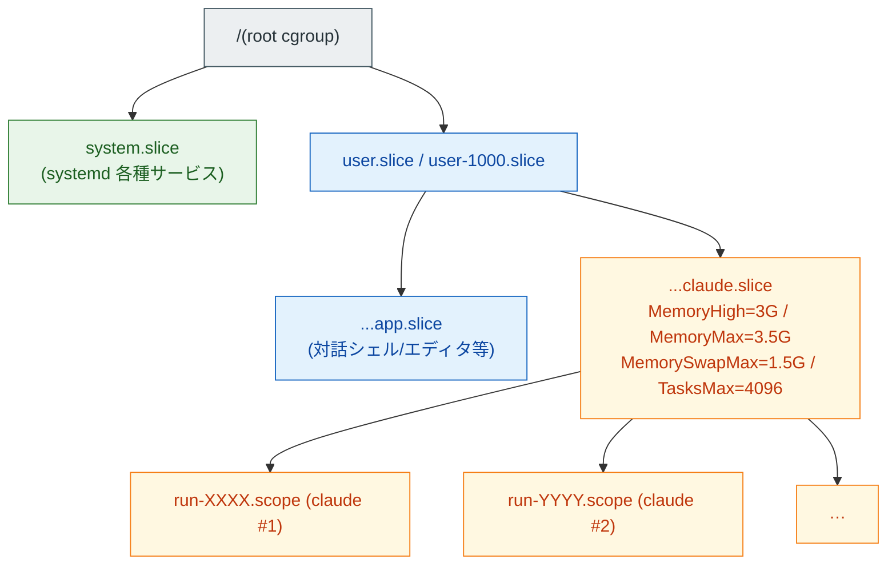

## TL;DR

- [前回記事](https://zenn.dev/marvelousu/articles/claude-code-homelab) の常駐機(OptiPlex 3020 SFF / 4GB / Ubuntu 24.04)で、tmux 上の Claude Code を **17 セッションまで増やした状態で OOM (Out Of Memory) が起きました**。PID 1 まで応答停止、SSH 全断、再起動で tmux セッションが全消失です。
- `journalctl` を Claude Code 自身に読ませて原因を絞り込み、systemd user slice (`claude.slice`)で囲い込む方針に決めました。当初は「8並列が引き金」と見ていましたが、実体は **17 セッション分の Node.js が idle で累積メモリを埋めていた** モデルでした。
- 初版設定(`MemorySwapMax=500M` / `CPUQuota=300%` / `TasksMax=1000`)は絞りすぎで 2セッションも起動できず、`MemorySwapMax` を 500M で塞いだことが大きく効いていました。
- 現行値は `MemoryHigh=3G` / `MemoryMax=3.5G` / `MemorySwapMax=1.5G` / `TasksMax=4096`(`CPUQuota` は撤去)。常駐数は **17 から 10 前後に絞って様子見中** です。
- 機体は依然 1台なので単一障害点は残ります。冗長化(副機 + Oracle Cloud ARM A1 witness + K3s/Proxmox)は **別記事で扱う予定** です。

## はじめに

想定読者は前回記事と同じ層を念頭に置いています。

- Claude Code を VPS ではなく自宅の常駐機で動かしている / 動かそうとしている方
- tmux 多重で複数のプロジェクトを跨いで Claude Code を同時に走らせている方
- メモリ 4〜8GB クラスの中古 PC を常駐サーバーにしていて、リソース管理に不安がある方
- systemd の user slice / cgroup v2 を実例で触りたい方

書き手は半導体のデジタル設計を本業にしている新卒2年目で、Web/クラウドや Linux 周りは資格と個人開発で触っている段階です。本記事も「実際に詰まって、実際に直した」記録をそのまま書きます。

## 本記事の位置づけ

前回記事では常駐機の構築と省電力チューニングを中心に書きました。今回は **常駐させた結果として実際に出た障害と、その隔離設計** が主題です。障害発生 → 原因分析 → 対策 → 運用実績の順に並べていますが、ログ解析や設定値の検討は Claude Code 自身に投げながら進めたので、各所で「Claude Code から返ってきた要点」を地の文に織り込んでいます。

副機の追加や HA クラスター(K3s / Proxmox / Oracle Cloud witness)、メモリ増設の判断は別記事で扱う予定です。本記事は「1台で安定して走らせる」までの記録です。

## 障害発生

### 症状の時系列

ある夜、外出先の iPhone から Shellfish で SSH しようとしたら **接続自体が確立しません**。Tailscale 越し、自宅 LAN 内の別端末からの SSH も全滅。`tailscale ping` は通るのに、`ssh` の TCP セッションは握れない、という状態でした。

ヘッドレス運用なのでモニタを繋ぐ手間を考え、結局 **電源ボタンの長押しで強制再起動** しました。仮にモニタとキーボードを繋いでいたとしても、PID 1 が詰まっている時点で新規プロセスの fork が成立しないので、`login` や `systemctl` などの対話的な復旧経路は通せません。コンソールに流れる kernel printk の観察と、Magic SysRq による安全な reboot(Alt+PrintScreen+s/u/b)ができる程度で、**この障害は構造的にモニタの有無では救えない** タイプでした。

再起動後は SSH が普通に通り、Tailscale も生きていましたが、tmux に attach しようとすると `no sessions` です。**走っていた 17 の tmux セッションがすべて消えていました**。Claude Code の対話履歴自体は各プロジェクトの `.claude/` 配下に残っていたので致命傷ではないものの、進行中の作業文脈は飛びました。

### 起動後の痕跡確認

落ちた直後に Claude Code を起動して、まず `journalctl` と `dmesg` を直近のブートに絞って読ませました。

```bash
# 直近1ブート前(落ちた時点)のカーネルログ
journalctl -k -b -1 --since "yesterday"

# OOM killer の発火履歴(直近1ブート前)
journalctl -k -b -1 | grep -iE "oom|killed process"

# systemd-oomd の振る舞い
journalctl -u systemd-oomd.service -b -1
```

ログを Claude Code に貼り付けて、PID 1 まで応答できなくなった理由をここから読める範囲で仮説立ててほしい、と投げました。返ってきた要点は次の通りです。

`oom-kill: invoked` のスタックが約30秒間隔で複数回出ていて、直前の `Mem-Info` では `free` が常に数十 MB、`SwapFree` が 0 近傍まで落ちている。swap thrashing でディスク I/O が飽和している、というのが第一仮説です。実際に kill されたのは `pipewire` / `wireplumber` 系で Claude Code 本体ではないこと、`systemd-oomd` のログに `Failed to kill ...` が並んでいて介入が失敗していること、もあわせて指摘がありました。

ここで「ヘッドレスのサーバーで pipewire が落ちても誰も困らないが、本来止めたかったのは Claude Code 側だ」という違和感が出てきました。`oom_score_adj` の状況を確認するため次のコマンドを走らせます(Claude Code が提案したものをそのまま使っています)。

```bash
for pid in $(pgrep -f "claude\|node\|pipewire\|wireplumber"); do
  echo "$(cat /proc/$pid/comm 2>/dev/null) pid=$pid adj=$(cat /proc/$pid/oom_score_adj 2>/dev/null)"
done
```

Claude Code(`node` プロセス)は `oom_score_adj=0`、`pipewire` / `wireplumber` は `200` でした。`oom_score_adj` は OOM victim 選定の要素のひとつで、最終的な選定は RSS 等を含む総合 badness で決まりますが、`adj` の差は無視できない補正として効きます。今回も実際に kill されたのは pipewire 系で、本来止めたかった Claude Code は対象から外れていました。

### 最初の見立てと実態のズレ

ここで一度立ち止まって、自分の見立てが実態と合っているかを Claude Code に見直してもらいました。当初は「Claude Code を 8 並列で走らせていた最中に OOM が起きた」と説明していたのですが、改めて事実関係を洗うとこの表現は粗かったことが分かります。

当時 tmux に常駐させていたセッション数は **17** で、実験的に少しずつ増やした結果でした。実際に対話していた "活動中" のセッションはせいぜい 3 程度で、残りは Claude Code を起動したまま idle で待機しています。Claude Code 内のサブエージェントや `WebFetch` 等のツール呼び出しはメインプロセス内で同期実行されるため、別プロセスとしてはカウントされません。MCP は有効化していたものの、当時動かしていた MCP サーバーはなく、別プロセスは出ていませんでした。

`pgrep -f claude` の瞬間値が一桁台に見えていたのを「並列で動いている」と読み替えていたのが最初の誤りで、実体は **「17 セッション分の Node.js ランタイムが idle で物理メモリを累積で埋めており、活動セッションのわずかな増分が swap 流入の引き金になった」** というモデルでした。

この見直しが後段の対策設計を決めました。並列数を絞るのではなく、**累積メモリの総量を slice で頭打ちにする** 方針に切り替え、`MemoryMax` / `MemorySwapMax` を主軸にした現行設定にたどり着いています。

## 原因分析

ここまでの仮説を整理します。原因連鎖は累積フェーズと破綻フェーズの 2 段階に分かれます。

**累積フェーズ:**

1. tmux に常駐していた 17 セッション分の Node.js が idle で約 3.0GB を累積
2. 標準サービスと合算で物理 4GB がほぼ飽和
3. 活動セッションの増分で swap thrashing が発生

**破綻フェーズ:**

4. PID 1 がメモリ確保で長時間ブロック
5. systemd-oomd の介入が複数回失敗 (Failed to kill)
6. カーネルの OOM killer が発動、pipewire 系が先に kill される
7. Claude Code (adj=0) は生存、圧迫が続き PID 1 応答停止
8. sshd 含む全サービスが応答不能

各論を順に追います。

### swap thrashing と PID 1 の応答停止

物理メモリ 4GB の機体で、tmux に常駐していた 17 セッション分の Claude Code(Node.js)が idle 時点で約 3.0GB を累積で維持していました。Claude Code CLI は Node.js 実装で、`ps -o rss,comm` で見ると 1 セッションあたり起動直後で 100〜150MB、idle で 150〜200MB、対話中で 250〜400MB です。Node.js の V8 GC は世代別で大きいヒープを保持しやすく、idle になっても RSS が素直に下がりません。これも今回の伏線でした。

ここに Ubuntu 標準のデスクトップサービス(GNOME 関連、pipewire、systemd-* 等)が乗ると、物理 4GB はほぼ常時、飽和近くまで埋まります。活動中のセッションが数百 MB 伸びた瞬間に swap 流入が止まらなくなって I/O が飽和し、ディスクが回りきらなくなります。並列処理が走ったというより、**累積で詰まっていたところに少しの増分で堰が切れた**、というのが実態でした。

決定的なのは **PID 1(systemd 本体)もメモリ確保が必要なタスク** だという点です。新規プロセスの fork や unit 状態の更新で確保が swap 待ちになると、PID 1 自体が応答停止します。PID 1 が止まれば sshd の accept ループも止まるので、外から接続できなくなります。「再起動しないと直らない」状態の本質はここにあります。

### systemd-oomd は何度も失敗していた

Ubuntu 24.04 の `systemd-oomd` は、PSI(Pressure Stall Information)を見て対象 cgroup に SIGKILL を送る仕組みです。監視対象は `ManagedOOMSwap=` / `ManagedOOMMemoryPressure=` を有効化した unit に限られ、デフォルトで全 cgroup を救ってくれるわけではありません。

今回のログには介入の痕跡こそありましたが、`Failed to kill ...` が複数回出ていて対象に SIGKILL を送り切れていませんでした。理由まではログから読み取れませんが、**介入が機能しない場合がある** ことは事実として残ります。「kill してくれる」ことを期待するより、追い込まない設計の方が筋が良いので、cgroup で入口側を絞る方針に切り替えます。

### oom_score_adj の偏り

カーネルの OOM killer は RSS と `oom_score_adj` などから合算した総合 badness が高いプロセスから順に kill します。Ubuntu 24.04 のデスクトップ系では pipewire / wireplumber が `adj=200` 程度で動いていて、ヘッドレス運用のこの機体では **「いてもいなくても困らない pipewire が先に kill されやすく、止めたかった Claude Code は残る」** という結果になっていました。

`pipewire` の adj を下げる方向もありますが、デスクトップ系サービスを残すかどうかの話に広がるので、ここは Claude Code 側に上限を入れて OOM killer の手前で止める方針にしました。

## 対策設計と試行錯誤

### 方針: systemd user slice で囲い込む

cgroup v2 をユーザー権限で利用できる仕組みが systemd の user slice です。 `~/.config/systemd/user/<name>.slice` を置き、`systemd-run --user --scope --slice=<name>.slice <cmd>` で起動するとそのスコープ配下に配置されます。

この仕組みのありがたい点は、

- **root 権限を必要としない**(ユーザー単位で `MemoryHigh` / `MemoryMax` / `MemorySwapMax` / `TasksMax` 等を絞れる)
- **既存の `~/.bashrc` や任意の起動経路に薄く挟める**(function 化してシェル側で吸収できる)
- **systemd-cgls で配置がそのまま見える**(運用確認が楽)

の三点です。



### slice ファイルの配置

`~/.config/systemd/user/claude.slice` を作成します(現行値)。

```ini
[Unit]
Description=Slice for Claude Code sessions (OOM prevention)
Documentation=https://github.com/anthropics/claude-code

[Slice]
MemoryHigh=3G
MemoryMax=3.5G
MemorySwapMax=1.5G
TasksMax=4096
```

`[Unit]` セクションは挙動には影響しませんが、`systemctl --user status claude.slice` 表示時に `Description` と `Docs:` として出てきて運用上分かりやすくなります。`[Slice]` 側がリソース制御の本体です。

ユーザー側 systemd を再読み込みします。

```bash
systemctl --user daemon-reload
```

### 起動経路: bash function で `claude` を上書き

`~/.bashrc` 末尾で `claude` コマンドを function 化し、必ず `systemd-run --user --scope --slice=claude.slice` 配下に置きます。

```bash
claude() {
  systemd-run --user --scope --slice=claude.slice -- /usr/local/bin/claude "$@"
}
```

`systemd-run --scope` は **インタラクティブな実行スコープ** を作って指定スライス配下に配置するモードで、`/usr/local/bin/claude` の標準入出力をそのままシェルに繋いだまま隔離できます。tmux セッション内で `claude` を起動すれば、各セッションがそれぞれ別 scope として `claude.slice` 配下に並びます。

### 初版設定の失敗 — `MemorySwapMax=500M` の影響が大きかった

最初に組んだ設定はこちらです。

```ini
[Slice]
MemoryHigh=2.5G
MemoryMax=3G
MemorySwapMax=500M
CPUQuota=300%
TasksMax=1000
```

意図としては「物理 4GB のうち 3G を上限、swap は 500M に絞って thrashing 自体を起こさせない、CPU は 3コア分まで」でした。これで起動すると **2セッション目からハングし、対話できなくなる** という挙動になりました。

`MemoryMax=3G` ならまだ 1 セッション 200MB 程度なので余裕があるはずなのに、2 セッション目で固まる理由が分かりませんでした。`top` の出力と slice の現状を Claude Code に渡して見てもらったところ、`MemorySwapMax=500M` が極端に小さいことを第一容疑として挙げてきました。Node.js は idle 時に持ち続けるヒープを swap に逃がす経路を頼ることがあり、これを 500M で塞ぐと物理メモリ側に張り付いたまま開放されず、新規セッションが入らなくなる、という説明でした。物理 + swap の合算では 3.5G あっても、swap 側を極端に絞ると「合算では足りるが物理側に詰まる」状況になりやすい、ということです。

`MemorySwapMax` を 1.5G に緩めたところ、10 セッション程度まで普通に立ち上がるようになりました。`memory.swap.current` / `memory.swap.events` の差分まで取った検証まではできていないので「主因と断定」ではありませんが、**今回の症状では `MemorySwapMax` の絞りすぎが大きく効いていた** と見ています。`MemorySwapMax` は thrashing を防ぐ天井として有効に効きますが、**Node.js のような言語ランタイムには idle 退避経路として 1〜2G 程度の余地を残す方が安定して動きます**。

`CPUQuota=300%` についても、2 コア 4 スレッド機(i3-4130)では実質的に上限を引いていない上、ハング再現中に `top` で CPU 使用率を見ても `claude.slice` は CPU で詰まっていません。ボトルネックは完全にメモリ側にあり、`CPUQuota` は副作用しか残らないので外しました。

ここで「`MemorySwapMax` で thrashing を防ぐつもりが、Node.js の idle 退避まで塞いでいた」という気づきを得ました。`TasksMax=1000` も、当時の常駐 17 セッション × Node.js のライブラリスレッドで足りなくなる場面があり得るので、`4096` に拡げました。常駐数を絞った今でも、現実的なマージンとして `4096` を維持しています。

### 現行設定と各値の意図

| 項目 | 初版 | 現行 | 意図 |
| --- | --- | --- | --- |
| `MemoryHigh` | 2.5G | **3G** | スロットリング開始点。普段の活動上限の目安 |
| `MemoryMax` | 3G | **3.5G** | ハードリミット。これ以上は OOM kill |
| `MemorySwapMax` | 500M | **1.5G** | swap 流入は許容しつつ、thrashing は天井で防ぐ |
| `CPUQuota` | 300% | **撤去** | 2コア4スレッドでは実質効かず、副作用のみ |
| `TasksMax` | 1000 | **4096** | 17 セッション × ライブラリスレッドでも余裕を持つマージン |

物理 4GB の機体に対して `MemoryMax=3.5G` は強気に見えますが、実際は **Ubuntu 標準サービスを差し引いた残り全部を Claude Code 用にあてがう** 設計です。Claude Code 以外の重い常駐は入れていないので、この機体ではこれが現実解でした。

### MemoryHigh と MemoryMax の使い分け

cgroup v2 のメモリ制御は段階的になっていて、

- `MemoryHigh`: 超えると **積極的に reclaim**(古いページを開放しに行く、I/O が増える)
- `MemoryMax`: ハードリミット。超えると **OOM kill 対象**

の2段階です。`MemoryHigh` だけだと OOM での予期せぬ kill は防げないし、`MemoryMax` だけだとハードリミットまで食いに行ってから kill されるので体感が悪い。**`MemoryHigh` を活動上限、`MemoryMax` を救命ライン** という二段構えにすると、運用中はほぼ `MemoryHigh` の手前で動いて、想定以上に伸びても `MemoryMax` で確実に止まる、という挙動になります。

## 動作確認と運用実績

### 配置確認

`systemctl --user status claude.slice` を叩くと、slice そのもののリソース消費状況と配下の scope 一覧が一度に見えます。

  
*systemctl --user status claude.slice の出力(Memory 行と CGroup 配下の scope 一覧)*

`Memory:` 行に `(high: 3.0G max: 3.5G swap max: 1.5G)` と表示されているのが **slice の制限が効いている証拠** です。`CGroup:` 配下に `claude-NNNNN-...scope` が並び、各 scope に PID が紐付いて見えます。`Tasks:` は claude.slice 配下の合計スレッド数で、`limit: 4096` の手前で安定しています。`memory.events` の `high` カウンタは別途参照します。

`systemd-cgls --user` でも同等のツリーが取れますが、slice 自身のメモリ実績を確認するなら `systemctl --user status` の方が速いです。各 scope の詳細を見るときは `systemctl --user status run-XXXX.scope` を叩けばさらに細かい実績が出ます。

```bash
systemctl --user status run-r0123abc...scope
# Memory: 187.4M (high: 3.0G max: 3.5G swap max: 1.5G)
# Tasks: 28 (limit: 4096)
```

`high:` `max:` `swap max:` の表示は **slice 設定がそのまま継承されている証拠** です。ここが空欄になっていたら `claude.slice` 配下に入っていないので疑います。

### 数日運用後の観察値

導入から数日運用しての実績です。

| 指標 | 値 |
| --- | --- |
| 同時稼働セッション数 | 10前後(累積モデル理解後、17 から段階的に絞って様子見中) |
| `claude.slice` 合計 RSS(idle 時) | 約 2.6〜3.0GB |
| `MemoryHigh` 超え発生回数 | 0(`memory.events` の `high` カウンタで確認) |
| OOM kill 発生回数 | 0 |
| systemd-oomd 介入 | 0 |
| PID 1 応答停止 | 再発なし(SSH 切断ゼロ) |

`MemoryHigh=3G` の手前で安定していて、reclaim による I/O スパイクも観測できる範囲では出ていません。`memory.events` は次のように見ます。

```bash
cat /sys/fs/cgroup/user.slice/user-1000.slice/user@1000.service/claude.slice/memory.events
# low 0
# high 0
# max 0
# oom 0
# oom_kill 0
```

`high` カウンタが回り始めたら活動が想定以上ということなので、`MemoryHigh` を上げるか、セッション数を減らす判断材料になります。逆に言えば `high` が回らない範囲では常駐数を伸ばせる余地があり、当面は 10 前後で運用しつつ、再度 17 まで戻すかどうかは `memory.events` を見ながら判断する予定です。

## おわりに

ここまでの対策で、**少なくとも Claude Code 多重運用が原因の OOM 連鎖は再発しない構成** になりました。ただし、機体は依然として 1台のままなので、

- 物理機障害(電源/SSD/メモリ)
- ネットワーク切断(ISP/Tailscale 障害)
- 自分の設定ミスでブートできなくなるケース

は単一障害点として残ります。冗長化(副機 + Oracle Cloud ARM A1 witness による HA、K3s / Proxmox の比較、副機選定の中古 PC 市場事情)は **別記事で扱う予定** です。本記事の責務はあくまで「1台で安定して走らせる」ところまでで、現行設定はその目的を達成しています。

筆者は次回、副機選定と HA クラスター構築の検討プロセスを書く予定です。同じように Claude Code を自宅で多重運用していて、リソース管理に困っている方の参考になれば嬉しいです。
