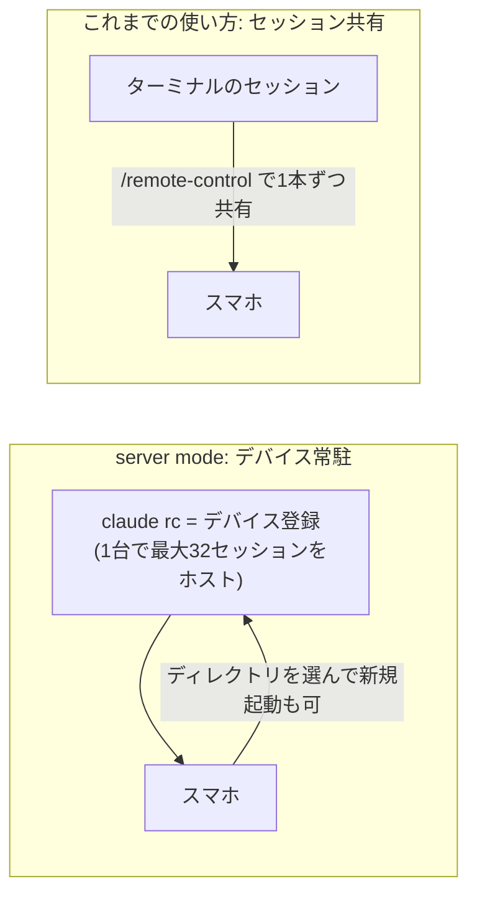

> Claude のスマホアプリの Remote Control に Devices 欄が加わり、`claude rc` で常駐させたマシンがデバイスとして並び、そこからディレクトリを選んでセッションを立てられるようになりました。手持ちの4台 (Windows 2台 / Linux / Mac mini) を全部登録して、公式ドキュメントに書いてあることと書いていないことを実機で確かめました。

## TL;DR

- `claude rc` を打つとそのマシンが**デバイスとしてアプリに常駐登録**されます。セッションを1本ずつ共有する方式とは別で、1デバイスで**既定32セッション**までホストするサーバーになります
- スマホ側は全デバイスのセッションが1つの一覧に並び、**デバイスとディレクトリを選んで新規セッションをスマホから起動**できます。これが 2026年8月21日の更新の目玉で、あわせて Remote Control は research preview を終えました
- 認証はサブスクリプションのみで、環境変数 ANTHROPIC_API_KEY が設定されていると起動できません。ほかに起動ディレクトリと常駐まわりで小さなつまずきがありました
- サーバーを止めても、そのサーバーが持っていたセッションは**約4時間以内なら同じディレクトリで `claude rc` を打ち直せば戻ります**。4時間を過ぎると `claude rc` は新しいサーバーとして立ち上がり、以前のセッションはその配下には戻りません。自動復帰は無いので、常駐運用するなら tmux などで自前の生存対策が要ります

## はじめに

私は普段、Claude Code を複数のマシンで使っています。手元のラップトップ (Windows) がメイン機で、ほかに Windows のサブ機、Linux の開発機、iOS ビルド用の Mac mini があります。メイン機以外はヘッドレスのサーバとして置いていて、SSH などで触る運用です。

外出先からスマホで使う運用は以前からやっていて、tmux に常駐させたセッションを1本ずつ Remote Control で共有し、新しいセッションが要るときはスマホの SSH クライアントで入って立てていました。動きはするのですが、常駐の維持・共有の登録・再起動後の復旧と、自前のスクリプトで支える部分が多いのが難点でした。

2026年8月21日の更新でスマホアプリの Code タブに Devices という枠が現れ、`claude rc` (server mode) で常駐させたマシンがデバイスとして並び、そこから新しいセッションを起動できるようになりました。公式の週次ダイジェスト ([Week 34](https://code.claude.com/docs/en/whats-new/2026-w34)) はこれを目玉機能の1つとして載せていて、同時に Remote Control が research preview を終えたとしています。server mode 自体は以前からある機能ですが、私はセッション単位の共有しか使っておらず、今回初めて触りました。公式ドキュメントの説明と実機の挙動を突き合わせながら、4台全部を登録してみました。

この記事の内容は Claude Code v2.1.241 で確認しています。後述の cross-session messaging は macOS/Linux が v2.1.224 以降、Windows ネイティブが v2.1.234 以降です。

## 何が変わったのか

私がこれまで使っていた Remote Control は、ターミナルで動かしているセッションを1本ずつアプリに共有する方式でした。server mode では**マシンそのものをデバイスとして登録し、そのマシンが複数のセッションをまとめてホストするサーバーになります**。スマホ側から見ると、共有されたセッションを覗きに行く形から、デバイスを起点にセッションを開く形に変わります。

公式ドキュメント ([Remote Control](https://code.claude.com/docs/en/remote-control)) の範囲に記載のある仕様は次のとおりです。

| 項目 | 内容 |
|---|---|
| 起動 | `claude rc` (`claude remote-control`)。プロセスはターミナルに常駐し、接続を待ち受ける |
| 容量 | 1デバイスあたり同時セッション既定32。`--capacity <N>` で変更可 |
| 認証 | サブスクリプション認証のみ。**API キーは非対応** |
| 停止後 | 同じディレクトリで `claude rc` を打ち直すと、止める前に持っていたセッションが戻る (約4時間以内)。過ぎると新しいサーバーとして立ち上がる |

アプリ側にはデバイスの枠ができて、登録済みマシンが並びます。

*Devices に登録済みマシンが並び、その下に全マシン横断のセッション一覧が続く*

セッション一覧はデバイスをまたいで1本に統合され、デバイス配下のセッションは各行にどのマシンのものかが表示されます。切断中のデバイスのセッションは Disconnected と出ます。この一覧はスマホアプリ専用ではなく、claude.ai (web) 側の Remote Control の一覧にも同じデバイスが出ます。

## これまで自作していた層と、置き換わった範囲

スマホから使うためにこれまで組んでいたのは、だいたい次の3層です。あくまで私の組み方ですが、複数マシンの Claude Code を外から使っている方は、常駐は tmux、共有はセッションごと、というだいたい似た構成に落ち着いていると思います。

| 層 | これまで (自作) | server mode + Devices |
|---|---|---|
| セッションの常駐 | tmux の中で起動し、SSH 切断で死なないよう keepalive を組む | 変わらず自前 (`claude rc` 自体を tmux で維持する) |
| スマホへの共有 | セッションごとに `--remote-control` を付けて登録する | デバイス配下で立てたセッションは登録不要で一覧に出る。既存のローカルセッションを外から触るときは従来どおりセッションごとに登録 |
| 再起動後の復旧 | 共有中セッションを台帳に保存し、一括で resume + 再共有するスクリプトを自作 | サーバー停止後約4時間以内なら、同じディレクトリで `claude rc` を打ち直すと配下のセッションごと戻る。過ぎると新しいサーバーとして立ち上がり、以前のセッションはその配下には戻らない (会話自体はローカルに残るので、個別に開いて共有し直すことはできる)。自動復帰は無い |

置き換わったのは真ん中の層ですが、**範囲はデバイス配下で新しく立てたセッションに限られます**。スマホから起動したセッションや、サーバーが最初に作るセッションは何もしなくても一覧に出ます。一方で、tmux で動かしている既存のローカルセッションをデバイス配下に入れる手段は無く、そちらを外から触るときは今も従来どおりセッションごとに `--remote-control` を付けています。いちばん下の常駐の層も自前のままで、再起動後に各マシンで `claude rc` を立て直す手順も残っています。

## セットアップ

アプリの Devices 欄で Add device を押すと、実行するコマンドが表示されます。

*デバイスの追加はここから*

*案内どおり、対象マシンのターミナルで claude rc を打つ*

対象マシンで `claude rc` を実行すると、そのマシンがデバイスとして一覧に現れます。登録はこれで終わりで、4台とも一発で通りました。

補足が2つあります。Remote Control はサブスクリプション認証専用なので、**環境変数 ANTHROPIC_API_KEY が設定されているマシンでは起動しません** (公式ドキュメントにも unset してから起動する旨の記載があります)。うちでは Windows サブ機がこれに当たり、キーを消してから起動する小さなラッパーを挟みました。また、Claude Code を新しいディレクトリで初めて起動すると「このフォルダのファイルを信頼しますか」という確認が出て、ふつうは一度答えれば次回から聞かれませんが、ホームディレクトリ直下だけはこの回答が保存されず毎回聞かれます。そのため常駐のルートはプロジェクト用ディレクトリにしています。

常駐させる部分は工夫が要ります。`claude rc` はフォアグラウンドで動き続けるプロセスなので、**SSH を切れば止まりますし、マシンを再起動しても自動では戻りません**。最初は素のターミナルで動かしていたところ、メイン機のサーバーが翌日に気づかないうちに止まり、見つけたときには4時間の復帰期限を過ぎてデバイスごと一覧から消えていました。それ以降はメイン機を tmux の中で起動する形に変え (Windows は WSL の tmux から claude.exe を起動)、ほかのマシンも同じ形に揃えているところです。再起動後の自動復帰は未解決で、いまは手で立て直しています。

## デバイスを選んでスマホから新規セッションを起動する

私の使い方がいちばん変わった部分です。一覧のデバイスを開くとそのマシンの詳細が出て、ディレクトリを選んで New session を押すと、そのマシン上で新しいセッションが起動します。

*「1 of 32 active sessions」の表示どおり、1デバイスで32セッションまでホストできる*

これまでも新規セッション自体はスマホの SSH クライアントから立てられましたが、SSH で入ってコマンドを打つ手順が要りました。それがデバイス選択とボタンだけになり、外出先で思いついた調べものを家の Windows 機のプロジェクトディレクトリで走らせる、という流れがアプリ内で完結します。似た流れは Claude Code の開発者が3月の時点でも紹介していました ([該当ポスト](https://x.com/bcherny/status/2032578639276159438)) が、**アプリの Devices 欄からマシンとディレクトリを選んで起動する導線が入ったのは今回**です。執筆時点のリファレンス側のドキュメント ([remote-control](https://code.claude.com/docs/en/remote-control) / [mobile](https://code.claude.com/docs/en/mobile)) にはこのアプリ側の操作の説明がまだありません。ドキュメント側にあるのは、`--spawn` オプションの説明でリモートから要求されて作られるセッションに触れている程度です。

## セッション間メッセージング (cross-session messaging)

デバイス常駐化と同じ世代で、セッション同士がメッセージを送り合う cross-session messaging という機能も Claude Code 本体に入りました ([公式ドキュメント](https://code.claude.com/docs/en/cross-session-messaging))。セッション側に ListAgents と SendMessage という2つのツールが用意されていて、届く相手を一覧してから名前宛でテキストを送る、という素朴な作りです。同一マシン内は直接、マシン間は双方の Remote Control 接続を経由して届くので、**受け側のマシンにポートを開ける必要がありません**。実質的に「手持ち全マシンの Claude セッションをつなぐバス」になっています。

受け側は idle でもかまいません。**メッセージを受けたセッションはその場で起きて、新しいターンとして処理を始めます**。送る側から見ると「寝ているセッションに仕事を頼める」ことになります。手元の実測では、idle のセッションに Bash 実行を1つ頼んで完了するまで同一マシンで3〜5秒でした (そのセッションへの初回送信だけは20秒台)。マシン間でも6〜12秒で、体感は同一マシンとほぼ変わりません。

ポーリングも常駐ウォッチャーも無しでこれが動くのは、従来自作していた仕組みからすると大きな変化です。いまはこれを土台に、エージェント間の連携基盤を作り直して運用しています。

## おわりに

これまで自作で支えていた層のうち、新しく立てるセッションについては共有登録が要らなくなりました。既存のローカルセッションを外から触る場面ではセッションごとの登録が残るので、置き換わったのは一部です。スマホ側でいちばん変わったのは新規セッションの起動で、外出先で思いついた作業なら SSH を開かずに済むようになりました。

一方で常駐の維持はまだ手作業が残ります。サーバーが止まってから4時間を過ぎると以前のセッションを配下に戻せなくなるので、死活監視か自動再起動を1時間以内の間隔で入れたいところです。マシンを再起動すると4台ぶんの `claude rc` を tmux ごと立て直す作業も残っています。スマホ発の新規起動のように公式ドキュメントに無い挙動も使っているので、この記事の内容はバージョンが進めば変わる可能性があります。

（動作確認: Claude Code v2.1.241。スクリーンショットは iOS の Claude アプリ、2026-08-24 時点のものです）
