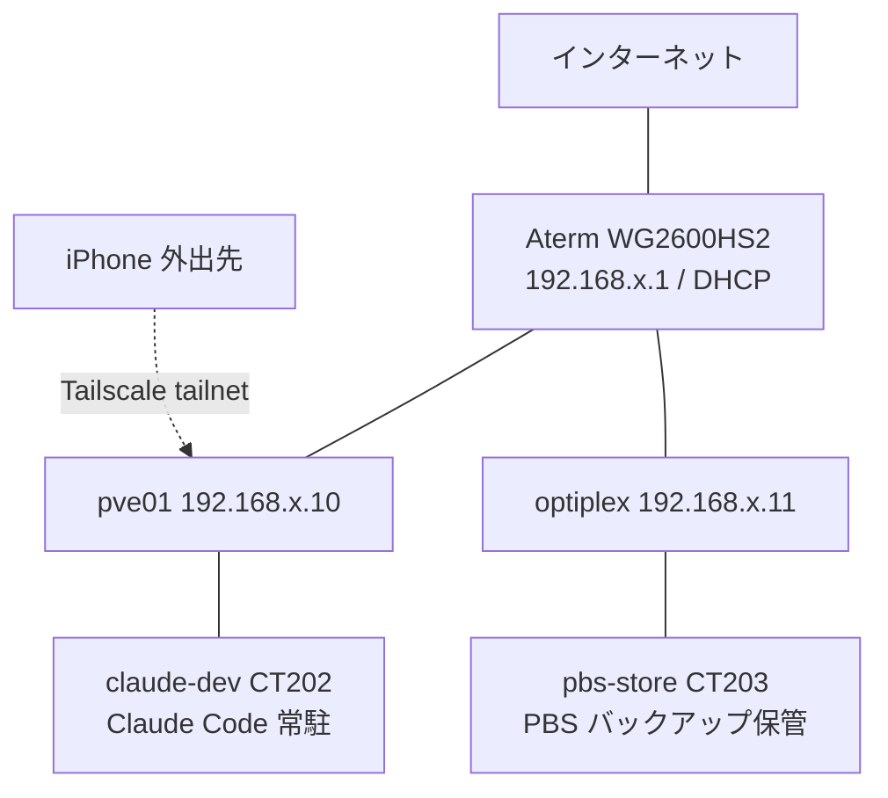
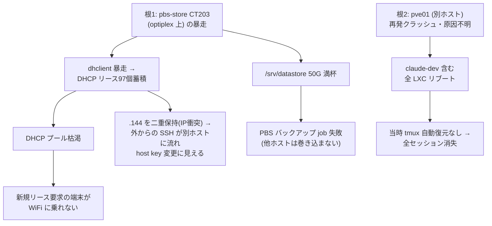

## TL;DR

- 飲み会の帰り道、スマホの Claude アプリでセッションが全部切断＝**自宅サーバ (Proxmox) がホストごと落ちていた**
- 同時に **DHCP プール枯渇**で、新規に IP を取る端末は WiFi に乗れない（既存 IP のサーバ群は生存）
- 外出先から SSH で **Claude セッションを 1 つ立て、切り分けと復旧を任せた**。約 1 時間で復帰。手を動かしたのは Claude で、私は検知と破壊的操作の go/no-go を握る役回り
- 真因は **独立した 2 つ**：pbs-store の dhclient 暴走（DHCP 枯渇＋IP 衝突）と、別ホスト pve01 の再発クラッシュ（原因不明）。両者に因果は無く、同じ夜にたまたま重なって 1 つの障害に見えていただけ
- 効いたのは冗長化ではなく、**障害ドメインの外に管理経路を 1 本（Tailscale）持っていた**こと。新規参加クライアントは IP をもらえず不可でも、既に IP を持って動くノードへ外から入る分には成立する、という非対称性に救われた

## はじめに

自宅に Proxmox の小さなサーバを置いて、Claude Code を tmux で常駐させています。外出中でもスマホの Claude アプリから、走らせているセッションの様子を見たり指示を足したりできる、という運用です。基盤構成そのものは [自宅ホームラボを月500円で運用している話](https://zenn.dev/marvelousu/articles/claude-code-homelab) に書きました。その常駐環境が、外出先にいる間にホストごとクラッシュし、家のネットワークも別系統で不調になりました。

ある夜、飲み会の帰り道に「さっき頼んでた件どうなったかな」とスマホを開いたら、それが入口になりました。その日は昼から散発的に調子が悪く切り分けの途中だったのですが、夜に一気に全部が落ちました。外出先からできたのは、SSH で Claude セッションを 1 つ立て、そこに切り分けと復旧を任せることだけでした。

想定読者:

- 自宅サーバ / homelab を外から触る経路を用意している、または検討している人
- Proxmox + LXC で開発機を常駐させていて、「ある日全部落ちる」のが怖い人
- AI エージェント (Claude Code 等) を常駐させ、外出先からその死活を見ている人

## 全体構成

構成は次の通りです。

| ホスト / コンテナ | 役割 |
|---|---|
| **pve01** (192.168.x.10) | Proxmox VE 9.1。LXC を数本 + VM を載せている主機 |
| **optiplex / pve02** (192.168.x.11) | もう 1 台の Proxmox ノード |
| **claude-dev** (CTID 202 / pve01) | Claude Code・Codex を tmux で常駐させている開発用 LXC |
| **pbs-store** (CTID 203 / optiplex) | Proxmox Backup Server。`/srv/datastore` に他コンテナのバックアップを保管 |
| **Aterm WG2600HS2** (192.168.x.1) | 家庭用ルータ兼 DHCP サーバ |

ネットワークは単一の `/24` サブネット。DHCP プールはおおむね `192.168.x.100`〜`200` です。



外から自宅に届く経路は 2 つあります。

| 経路 | 用途 | 今回の役割 |
|---|---|---|
| Claude アプリ | 接続中セッションの死活を一覧で見る | これで異常に気づいた |
| Tailscale + iPhone Secure Shellfish | tailnet 越しに SSH し、Claude セッションを 1 つ立てる | この 1 セッションに復旧を任せた |

## 何が起きたか

飲み会の帰り道、スマホの Claude アプリを開きました。普段はここに、常駐させているセッションが複数並んでいます。それが、**どれも接続が切れ、全部落ちていました**。

これが、1 つのセッションが落ちたのではなく全部が同時に落ちていた状況だったので、それぞれが独立に死んだというより、載せているホストごと落ちたと判断し、最初から「セッションの問題」ではなく「ホストの問題」として動きました。実際このときの claude-dev は、tmux セッションを再起動後に自動復元しない設定だったため、**ホストが 1 回再起動しただけで、走らせていたセッションは全部消えていました**。

後で分かりますが DHCP プールが枯渇していて、**新しく参加する端末は WiFi(L2)には繋がっても IPv4 アドレスを取れず、LAN 内通信ができない**状態でした（既に IP を保持していたサーバ群は通信を継続）。**「開発機が落ちた」と「手元の端末が LAN に乗れない」が同時に起きていました**。この時点では別件か同根か分かりませんが、結論を先に言うと **別件 — 独立した 2 つの根がたまたま重なっただけ**でした。

私は外にいるので LAN はそもそも足場にできず、外部からの管理経路は Tailscale + SSH に寄せて他はファイアウォールで閉じてあります。既存リースや静的 IP で外向き通信が残っているノードへは、モバイル回線から tailnet 越しに届きます。

ただし Claude アプリからは、落ちた既存セッションに入り直すことも、新しいセッションを立てることもできませんでした。そこで iPhone の Secure Shellfish から Tailscale 越しに **Proxmox ホスト (pve01) へ SSH し、そこで Claude セッションを 1 つだけ立ち上げて**、あとはその 1 セッションとの会話で対応を進めました。以降に出てくる `.144` への SSH は、この tailnet 経由の入口とは別の、LAN アドレスを指定した接続です。

インシデント対応で実際に手を動かしたのは、ほぼ Claude でした。私がやったのは、セッションを 1 つ立てて状況を伝え、出てくる仮説と実行されようとしている手を見て、破壊的な操作を承認するかどうかを判断することです。スマホの小さい画面で自分でコマンドを打ち回ったわけではありません。手を動かすのは AI、検知と判断と go/no-go を握るのが人間、という分担でした。このあとの切り分けも復旧も、すべてこの 1 セッションとの会話の中で進みました。

## 詰まった所

真因に行き当たるまで見立てが何度か覆りました。前半はその日の昼に追っていた別件 (散発的な停止) の回り道、後半が夜・外出先での本命です。

### 昼の回り道 1: NAT セッション切れだと思った

その日は昼から Claude が散発的に止まっており、最初の手がかりは API 接続エラー `errno: 0` でした。

```
ConnectionRefused / errno: 0 / syscall: 不明
```

OS レベルの本物の `ECONNREFUSED` なら `errno: -111`、`syscall: "connect"` が出るはずですが、それが出ていません。HTTP クライアント (undici) がソケット異常を内部的に "ConnectionRefused" に丸めただけ、と読めます。そこから「ルータの NAT セッションタイムアウトで、長時間アイドルの keepalive が切られた」と仮説を立て、対策を 3 つ入れました。

```bash
# 1. /etc/hosts に API の IP を pin
# 2. TCP MTU probing 有効化 (sysctl)
# 3. iptables で MSS clamp
```

全部見当違いで、**3 を入れた瞬間に Claude API への通信が完全に止まりました**。即座に全部ロールバックしました。「念のため」で hosts pin や MTU/MSS 系を入れると、それ自体が新しい障害になります。`errno: 0` を見て NAT 切れだと確信したのが早すぎました。

### 昼の回り道 2: ハングして見えただけ

ロールバック後、別セッションで「処理中のまま進まない」が再発しました。プロセスを見ると:

```
main thread: I/O 待ち (do_epoll_wait)
TCP fd → API:443  最終受信 数秒前 / 受信バイト数 累積中
```

ハングではなく、**API ストリームから低レートで受信し続けている**状態でした。最大強度の thinking が有効で、重い生成は普通に 15〜30 分かかります。UI のカウンタ更新が間引かれて固まって見えるだけで、TCP レベルでは確実に流れていました。長時間 "thinking" は、`ss -ti` でソケットの最終受信時刻と受信バイト数を見れば、生死が分かります。

### 夜・本命 1: コンテナが作り直された?

夜になって状況が変わります。今度は散発ではなく、全部が落ちていました。外から復旧しようと SSH した瞬間に弾かれます。

```
WARNING: REMOTE HOST IDENTIFICATION HAS CHANGED!
Offending ED25519 key ... known_hosts:14
```

host key が変わっています。生存している LAN 側ノードから ARP を引くと、その IP の MAC は Proxmox 系の OUI でした。「作り直したか?」と自問しても、何もしていません。ここで「**昨日から、スマホや別の端末が WiFi に繋がらなくなっていた**」という、別件に見えていた事実が思考に乗ってきます。これが伏線でした。

### 夜・本命 2: IP 衝突に行き当たる

Proxmox に入ると、pve01 は一度落ちて再起動済みで **claude-dev は上がっていました**（ただし tmux は戻っていない）。その claude-dev は `192.168.x.144/24` を持っているのに、外から LAN アドレス `.144` を指定して SSH したときに見えた MAC は、claude-dev のものと全く別物でした。

→ **同一サブネット上で 2 台が `.144` を主張する IP 衝突**でした。

衝突相手の MAC をコンテナ設定から逆引きすると、**pbs-store (CTID 203)** に行き着きます。pbs-store の eth0 を見て固まりました。

```
inet 192.168.x.145/24                      eth0  (primary)
inet 192.168.x.104/24 secondary dynamic    eth0
inet 192.168.x.122/24 secondary dynamic    eth0
... (中略、全部で 97 個) ...
inet 192.168.x.144/24 secondary dynamic    eth0  ← これ
inet 192.168.x.200/24 secondary dynamic    eth0
```

**DHCP プールのほぼ全域を、たった 1 つのコンテナが専有していました。** DHCP リース 97 個は、通常運用では絶対に出ない数字です。ARP の不一致を見た時点で「このサブネットで誰がこの MAC を持っているか」を全コンテナ走査していれば、もっと早くここに来られました。

## 真因 — 独立した 2 つの根が、同じ夜に重なった

別々に見えた症状をたどると、根は 1 つではなく **2 つ、しかも互いに独立**でした。両者がこの夜たまたま重なったため、1 つの大きな障害のように見えていただけです。図にするとこうなります。



### 根 1：pbs-store（optiplex 上の CT203）の暴走

- dhclient が長期稼働の間に `secondary dynamic` アドレスを **97 個**まで積み上げ、`192.168.x.0/24` の DHCP プールをほぼ専有していた（`ip addr` で確認）
- 結果、新しくリースを取りに行く端末は IP をもらえず WiFi に乗れない。既に IP を保持していたノードは通信を継続
- `.144` を pbs-store も保持していたため、外から `.144` への SSH が pbs-store に流れ、別ホストの host key を見て「変わった」ように見えた（IP 衝突）
- 並行して `/srv/datastore`（PBS のバックアップ保管庫）が **50G で満杯**。影響は PBS のバックアップ job 失敗で、これ自体は他ホストを巻き込まない

### 根 2：pve01（別ホスト）の再発クラッシュ

- claude-dev（CT202）を載せている pve01 は、**数日おきにクラッシュを繰り返していた**（間隔は直近ほど詰まっていた）。原因はまだ突き止められていなくて、softdog かメモリか電源か、という感じ
- その 1 回が claude-dev をリブートし、当時 tmux は自動復元しない設定だったので、走らせていた全セッションが落ちました。これが「全部落ちていた」の正体です
- pbs-store は pve01 ではなく optiplex 上なので、**このクラッシュとは無関係です**

この 2 つは「pbs-store のディスク満杯が pve01 を落とした」という関係**ではありません**（そもそも別ホストだし、pve01 が落ちる理由は別件でまだ未解明）。たまたま同じ夜に、根 1 の症状（WiFi・IP 衝突）と根 2 の症状（全セッション落ち）が同時に出たので、1 つの障害に見えていただけです。

### なぜ pbs-store だけが 97 個も溜めたのか

dhclient は普通、1 インターフェースに有効アドレスが 1 つに収まります。今回そうならなかったのは、たぶん次が噛み合ったから（家庭用ルータの中身までは追えないので、ここは状況証拠からの推測です）。

1. **Aterm（家庭用ルータの DHCP）が lease 状態を保てず崩れた**。「昨日から WiFi が繋がらない」というユーザ報告の時期と、症状の出始めがほぼ一致していた
2. **更新要求に Aterm が応じず（NAK かタイムアウトかは未確認）、dhclient が DISCOVER に降格して別の空き IP を受理**。renew のたびに新しい IP を取りに行く状態に
3. **`dhclient-script` が、今回の環境ではある遷移で旧 IP を消さず新 IP を足すだけになっていた**っぽい。消えない旧 IP が `secondary dynamic` として残り続けた

実際、修復後に単発で動かした dhclient は 1 個で安定したし、溜まるペースも約 2.4 時間に 1 個（一般的な lease/2 と同オーダー）、全部 `secondary dynamic`、プロセスも 1 つだけ。状況証拠はこの線で揃っています。

ここには、根 2 が絡んだ皮肉があります。**他のコンテナ（claude-dev 等）は pve01 上**で、pve01 がクラッシュするたびに再起動され、eth0 がリセットされて蓄積がその都度消えていました。**pbs-store だけが安定した optiplex 上**で長期連続稼働だったため、ここにだけ溜まり続けました。根 2 の弱さが、皮肉にも pve01 上のコンテナを"自動清掃"し、被害を pbs-store 1 台に寄せていた、という構造です。

復旧時、pbs-store をリブートしようとすると `Disk quota exceeded` で pre-start hook が破綻し、それすら通らない状態でした。

## 復旧 — スマホから承認しながら直す

ここでいう「復旧」は、claude-dev に再接続でき、pbs-store の異常リースを解消し、バックアップ用 CT を起動可能に戻すところまでです。pve01 の再発クラッシュの原因特定そのものは残課題です。

その範囲の復旧シーケンスは次の通りです。これらは、立ち上げた 1 つの Claude セッションが実行しました。私がやったのは、各手を実行させる前の承認と、実行後の観測です。

```bash
# 1. 誤って受け入れた wrong-host の host key を消し、known_hosts を復元
ssh-keygen -R 192.168.x.144
cp ~/.ssh/known_hosts.bak.<日付> ~/.ssh/known_hosts

# 2. pbs-store の暴走 DHCP リースを全解放、IP を flush
pct exec 203 -- pkill -9 dhclient
pct exec 203 -- ip addr flush dev eth0
pct exec 203 -- rm -f /run/dhclient.eth0.pid /var/lib/dhcp/dhclient.eth0.leases

# 3. ディスク満杯で起動できないので最小限だけ拡張 (ZFS pool に空きあり)
pct resize 203 rootfs +5G

# 4. クリーン再起動 → 単一リース取得
pct reboot 203
```

なお、これらは対象コンテナ内の SSH ではなく Proxmox ホストから `pct exec` で叩いているので、対象の eth0 を空にしても自分の経路は切れません。

`ip addr flush`、`pct resize`、`pct reboot` はいずれも、外から、スマホ越しにエージェントへ実行させるには相応に怖いコマンドです。承認する側で効いた規律:

- **破壊的操作はすぐ実行させず、一拍置いて自分で確認してから承認する**。host key を消す前、ディスクを resize する前に、必ず「これで何が起きるか」を自分で把握してから OK を出しました。SSH の接続先確認（known_hosts）に関わる操作は特に念入りに確認しました
- **ロールバック可能な順序で承認する**。hosts pin は即戻せる、known_hosts はバックアップから復元できる、`+5G` の拡張は ZFS pool に空きがあり仮に戻せなくても許容範囲、という順で組ませました
- **一括で承認せず「次の最小実験」を 1 つずつ**。スマホ越しに大技を一括 OK しません。1 手やらせて観測、を繰り返しました

5 分後、手元の ARP キャッシュが自然失効し、`.144` が本物の claude-dev に更新されて LAN SSH が復活し、pbs-store もクリーンなリースを 1 つだけ取り直しました。

## なぜ Tailscale 1 本で助かったのか

今回いちばん効いたのは、派手な冗長構成ではなく、**家の LAN に新規参加しなくても、外から生きているノードへ届く経路を 1 本持っていた**ことでした。

DHCP プールが枯渇すると、新しく IP をもらう必要がある端末は LAN に乗れません。「家の LAN に新規参加する」やり方は塞がれます。一方 Tailscale は WireGuard ベースの overlay ネットワークで、各ノードが直接、または届かなければ relay 経由で tailnet に参加します。ルータの DHCP が枯れていても、ノードが既に IP と外向き到達性を保っていれば、モバイル回線から tailnet 越しに届きます。**新規参加クライアントは IP をもらえず不可、しかし既に IP を保持して動いているノードへ外から入る分には成立する**、というこの非対称性に救われました。

これは「サービスを落とさない」ための可用性とは別の話です。要は、**外部からの管理経路を、障害ドメインの外に 1 本逃がしておく**ということです。ノードを冗長化していても、入る経路が「家の LAN に乗ること」前提だと、その LAN に新規参加できなくなった時点で外からは手が出せません。逆に経路さえ 1 本生きていれば、復旧そのものは (今回のように Claude に任せる形であっても) 進められます。

## 残課題

現時点で潰し切れていないもの:

- **PBS の prune / GC ポリシー設定**：そもそも 50G 満杯を起こさないため。`keep-daily / keep-weekly / keep-monthly` + GC スケジュール。今回の根本にいちばん近い宿題
- **pve01 のクラッシュ原因特定**：クラッシュ間隔が詰まっている件。メモリ (memtest)、温度、電源を疑う。`journalctl --boot=-1` を毎回保存する仕組みも要る
- **dhclient 蓄積の予防**：原因は上記の通り判明済み。インフラ系ホストは静的 IP に寄せる／lease 数（`inet` が 2 以上）を監視する／DHCP をルータから分離する、で再発を断つ
- **「異常を早く知る」導線**：今回の気づきは「たまたまアプリを開いた」だった。死活監視からの能動通知に寄せる

なお「再起動後に tmux セッションが戻らないので手で立て直す」点については、その後セッションを自動復元するよう設定して解消済みです。

## おわりに

技術的には、独立した 2 つの根（pbs-store の dhclient 暴走と、別ホスト pve01 の再発クラッシュ）が、たまたま同じ夜に重なっただけの、単純な話でした。それでも、**サーバが落ち、手元の端末も家の WiFi に乗れない状態を、飲みの帰り道にスマホ 1 台で外から直せました**。

それを成立させたのは派手な構成ではなく、家の LAN に新規参加しなくても外から届く経路を 1 本持っていた、という地味で事前的な一手でした。そしてもう半分は、その細い経路の先で、切り分けと復旧の手をほぼ Claude に任せられたことです。経路が生きていても、スマホ 1 台で自分で全部たどって直すのは正直しんどく、実際に手を動かせる相手がいなければ詰んでいました。私がやったのは状況を伝えて go/no-go を出すことだけです。同じように自宅サーバを外から運用していて「外にいる間にサーバが落ちて、手元の端末も家の WiFi に乗れない、となったらどうするか」を一度も試していない方の、棚卸しのきっかけになれば嬉しいです。次にやるのは派手なことではなく、上の残課題を 1 つずつ潰すことです。
