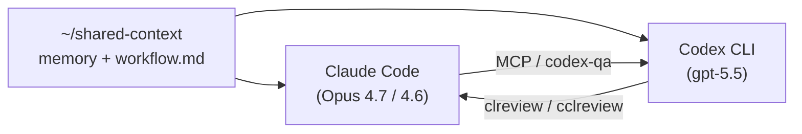

## TL;DR

- 元々は **Claude Code がメイン、Codex CLI がクロスレビュー** の位置づけで運用していた
- 最近 Codex CLI のデフォルトモデルが gpt-5.5 になり、Claude Opus 4.7 / 4.6 と並べると実装の精度・速度で Codex 側が体感で勝る場面が増えたので、**メインを Codex に反転** (`approval=never` + `sandbox=danger-full-access`、自宅 Linux 常駐機の trusted 環境限定) して運用し始めた
- 世間でも Claude が優勢な時期と Codex が優勢な時期が交互に来るので、**「乗り換える」のではなく「都度メインを動かせる」仕組み**にしておきたかった
- そのために Claude / Codex 双方から参照する `~/shared-context/` (memory / workflow) を共通基盤にし、**双方向のクロスレビュー導線** (Claude → Codex は MCP / `cross-model-review.sh` / `codex-qa`、Codex → Claude は `clreview` / `cclreview`) を揃えた
- Claude ユーザー視点で Codex 環境を組むと、auto-memory や skills 活用の運用熟度など **Claude が運用基盤として担っていた部分**が現状の Codex 側ではまだ薄く、`workflow.md` の手動 protocol や handover ドキュメントで補った(一方で hooks の Bash matcher は Codex のほうが先に整備された等、両方向の差分あり)

## はじめに

Codex CLI 自体は前から触っていました。Claude Code (Opus 4.7 / 4.6) を AI agent CLI のメインに据えつつ、**Codex CLI は gpt-5.4 系の頃からクロスレビュー専用**として併走させていた、というのが直近の構成でした。具体的には、重要な変更 (認証・暗号・割込 等) を実装したあとに `cross-model-review.sh` (Claude のスクリプト経由) や Claude skill `/codex-qa` で Codex に独立レビューを投げる、という使い方です。

最近、Codex CLI (本記事執筆時点 0.125.0 / 0.128.0) のデフォルトモデルが gpt-5.5 になり、Claude Opus 4.7 と並べて触ると、実装の精度・速度で Codex 側が体感で勝る場面が増えてきました。世間の評価でも、ある時期は Claude が優勢、別の時期は Codex が優勢、と短いサイクルで入れ替わっています。**「どちらか一方をメインに固定する」よりも、その時に勢いがあるほうにメインを軽く動かせる構造**を作っておきたい、というのが本記事の動機です。

そこで Linux 常駐機の AI agent CLI 構成を以下のように組み直して、運用し始めました:

- 共有 memory / workflow を `~/shared-context/` に集約し、Claude / Codex 両方から参照
- 双方向のクロスレビュー導線 (Claude ⇄ Codex) を揃えて、メインを反転してもレビュー文化が続くように
- Codex メイン時は実装を Codex に、`/spec` インタビューや memory 整形のような Claude が得意な部分は Claude を補助に

想定読者:

- Claude Code をメインで使っていて、Codex CLI に乗り換える / 併用するか迷っている人
- AI agent CLI を複数試行していて、共有 memory / workflow を跨ぎで運用したい人
- 双方向クロスレビュー (Claude ⇄ Codex) を組みたい人
- AI agent CLI の世代交代に振り回されない自分用ハーネスを作りたい人

Codex は急速に機能追加されているので、**数ヶ月後には本記事の前提が古くなる可能性が高い**ことも先に注記しておきます。本記事の観察は Codex CLI 0.125.0 / 0.128.0 + gpt-5.5 時点のものです。

## 全体像

`~/shared-context/` (共通 memory + workflow) を土台にして、Claude Code と Codex CLI の双方からそこを参照する形にしています。レビュー方向は両方向に通っていて、メインを反転しても同じ場所を見続けます。

設定 repo は 4 つに分けて、それぞれ git で管理しています:

| repo | 役割 |
|---|---|
| `~/.claude/` | Claude Code 固有 (CLAUDE.md, settings.json, commands/skills/agents) |
| `~/.codex/` | Codex CLI 固有 (config.toml, AGENTS.md, hooks, agents, prompts) |
| `~/dotfiles/` | shell / tmux / Codex AGENTS.md (Linux) を集約、複数マシンへ symlink |
| `~/shared-context/` | 両 CLI が参照する memory / workflow |

## 切替コストを下げる設計

「メインを軽く動かせる」は、3 つの工夫の積み重ねで成立しています。

### 1. shared-context で memory / workflow を共通化

`~/shared-context/` (private GitHub repo `agent-shared-context`) を Claude Code / Codex CLI 両方の共通基盤に置いています。

- `workflow.md` — 共通の workflow 原則 (実装 / コミュニケーション / コード品質 / クロスレビュー / 機微情報 / memory 等)
- `memory/<type>_<topic>.md` — 命名規則 `user_` / `feedback_` / `reference_` / `project_` の 4 種
- `memory/MEMORY.md` — 索引

Claude の auto-memory はデフォルトでは `~/.claude/projects/<project>/memory/` に書き込みますが、その場所を symlink で `~/shared-context/memory/` に向けることで、両 CLI が同じディレクトリを参照する構成にしています。Codex は手動書込み protocol で同じディレクトリを更新します。**メインがどちらでも同じ場所を見続ける** のが要点です。

### 2. 各 CLI の固有指示を最小化 + 同型ペアで揃える

Claude `~/.claude/CLAUDE.md` と Codex `~/.codex/AGENTS.md` は両方とも 60 行以内、章立ても揃え、先頭で `~/shared-context/workflow.md` を参照します。固有差分だけ各ファイルに残す形:

- Claude 固有: slash commands / skills / hooks / subagents / Plan Mode
- Codex 固有: profiles / sandbox / hooks / subagents / prompts

その上で、両 CLI で「同じ操作の対称ペア」を用意しています:

| 種類 | Claude | Codex |
|---|---|---|
| 機密パス保護 hook | `settings.json` の `PreToolUse` (`Edit\|Write`) | `hooks.json` + Python (`Edit\|Write\|apply_patch\|Bash`) |
| code / security review subagent | `agents/*.md` | `agents/*.toml` |
| 仕様策定 | `/spec` skill | `cspec` prompt template |
| 計画 | Plan Mode | `cplan` + `--profile safe` |
| 実装レビュー | `/codex-qa` skill | `creview` prompt template |
| 別セッション継続 | (handover を手動作成) | `cctx` prompt template |

実装スタイルは違っていますが (Claude は skill / slash command / shell hook、Codex は prompt template + bash alias + Python hook)、操作概念が同じなのでメインを反転したときに頭の切替コストがほぼゼロです。

### 3. branch 分割 + dotfiles 集約 で複数 OS 対応

Codex config repo (`~/.codex/`) は OS で設定が大きく違うので、Linux=`main` / Windows=`windows-main` の **branch 並行運用** にしています (Trust paths / plugins / AGENTS.md スタイルなどが異なる)。両 branch は merge せず、共通改善 (hook 強化 等) は手動で両方反映、drift detection スクリプトを `~/.codex/docs/` に置く運用です。

シェル設定・tmux・Codex AGENTS.md (Linux 側) は `~/dotfiles/` に集約 + symlink で配り、`cplan` / `cspec` / `creview` / `cclreview` / `cctx` / `cdebug` の bash alias もそこで管理しています。新マシンでも dotfiles を clone + `install.sh` で symlink が一斉に張られます。

## 役割分担 (Codex メイン × Claude Code 補助)

| 役割 | Codex (主) | Claude (補) |
|---|---|---|
| 日常の実装・調査 | ◎ | △ |
| code review (一般) | ◎ | △ |
| memory 整形 / MEMORY.md 索引更新 | × | ◎ auto-memory + 整形 |
| `/spec` 相当のインタビュー | △ (`cspec` prompt) | ◎ 対話 skill |
| 計画 / Plan | △ (`cplan` + `--profile safe`) | ◎ Plan Mode |
| クロスレビュー受け | △ | ◎ |

**Codex をメインに置く理由**: gpt-5.5 の実装精度・速度、`fast`/`review`/`safe` profile 切替の軽さ、`approval=never + sandbox=danger-full-access` で操作摩擦なし、`codex resume`/`fork`/`/side` での session 操作の直感性。

**Claude を補助で残す理由**: auto-memory による memory 自動更新、Plan Mode の edit 抑制 + 5 phase 構造、`/spec` skill の対話深度、Codex 実装に対する独立レビューの受け側 (`clreview` / `cclreview`)。Claude が運用基盤として担っている部分は Codex で完全代替が難しいので、消さずに役割分担で残すのが現実解です。

:::message alert
**安全側の注記**: `approval=never + sandbox=danger-full-access` は、自宅 Linux 常駐機 + 自分の作業ディレクトリに trust path を絞った前提で使っています。外部リポをそのまま開いたり、信頼できないコードを取り込む場合は `--profile safe` (read-only) や `approval_policy = "on-request"` に切り替える運用です。Codex 公式 docs も project-wide な `danger-full-access` を untrusted repo で使うことは推奨していません。
:::

## 双方向クロスレビュー

ここが本記事の核です。「双方向で対称化したこと」が「メインを動かしても運用が続く」最大の収穫だと思っています。

### Claude メイン → Codex レビュー (既存導線)

「Claude メイン + Codex レビュー」時代に整備していた既存導線。本記事の出発点はここ:

- **`~/scripts/cross-model-review.sh`** — `--quick` / `--full` で起動 (現在はどちらも gpt-5.5)、ファイル単体・git diff 入力に対応、レポートを保存し、Critical 検出時 exit code 1
- **公式 `codex review --uncommitted|--base|--commit`** — 軽量、保存・exit code 不要なら
- **Claude MCP (`mcp__codex__*`)** — Claude セッションから対話的に Codex を呼べる
- **Claude skill `/codex-qa <target>`** — gpt-5.5、`context: fork` でメイン context を消費しない、auto-trigger 条件あり

メインを Claude にしている間、これらの導線は普通に運用できていました。

### Codex メイン → Claude レビュー (新規導線)

メインを Codex に反転すると、レビュー方向も逆になります。それまで「Claude → Codex」一方向だった導線を、対称化するのが本記事の核心:

- **shell 直: `clreview <target>`** — 現在の git status / staged diff / unstaged diff を prompt に組み立てて、headless `claude -p` を呼ぶ
- **Codex prompt 経由: `cclreview <target>`** — Codex セッション内から「Claude にレビュー投げて結果を整理する」用途

`clreview` の設計判断:

- **Codex 側 MCP server は未設定** (`codex mcp list` で確認、Claude 側は connected) → Codex → Claude は CLI ベース実装にする判断
- **diff truncate 5000 行**: トークン爆発抑制
- **read-only**: Claude CLI を `-p` (print mode) + 許可ツールを `Read` / `Grep` / `Glob` のみに制限し、`Edit` / `Write` / `MultiEdit` / `NotebookEdit` を `disallowedTools` で禁止して呼ぶ
- **`claude()` systemd wrapper をバイパス**: headless `claude -p` の stdin が systemd-run --pipe / --scope で reliable に渡せず、`~/.npm-global/bin/claude` を直接呼ぶ運用 (副作用: claude.slice 配下では走らない。この詳細は別記事で深掘り予定)

### 構造化レビュー: Critical / High / Medium / Low

クロスレビューの結果は **Critical / High / Medium / Low** の 4 段階で出してもらう運用にしています。Critical / High から優先的に潰し、Medium / Low は時間に余裕があれば対応、という時間配分が安定します。1 round で潰しきれる粒度なら 1 round、残るなら何 round か繰り返すスタイル。

### 仕様策定で特に効果が大きかった (Anemora での実例)

[個人開発のゲームプロジェクト Anemora](https://zenn.dev/marvelousu/articles/anemora-hd2d-time-frame) で本格運用してみて、**双方向クロスレビューが特に効果を発揮したのは仕様策定のフェーズ** でした。

Stage 1 (CONCEPT.md、最終 435 行) を 1 日で詰めたとき、独立レビュアーを 2 系統用意して走らせました:

- **1-A**: 別の Claude セッション (主担当の Claude とは context 完全分離) でレビュー
- **1-B**: `/codex-qa --quick` (Codex CLI、`context: fork` でメイン context は消費しない)

主担当 (Claude) で v1 草案を書く → 1-A / 1-B の両者からレビューをもらう → 反映して v1.1 → 再レビュー、というラウンドを 3 回 (v1.0 / v1.1 / v1.2) 回して仕様を煮詰め、最終 v1.3 で軽微修正してクローズしました。途中で Codex が指摘した Critical 2 件はリセット仕様と境界遷移ルールで、いずれも実装段階に行ってから直すと痛い類だったので、仕様段階で Critical を潰せたのは大きかったです。

その後の Stage 3 (Vertical Slice) では Codex を実装メインに置き、ADR (Architecture Decision Record) ごとに Codex 自身のレビューを 1 round 回す運用に。例えば ADR-0002 (Time Frame ポータル) で 11 件、ADR-0007 (UI フレームワーク) で 10 件の指摘が反映されました。**仕様 → 実装の流れ全体に同じ構造化レビューが効く**、というのが実運用で得た手応えです。

### 双方向化が「メイン切替を軽くする」理由

- **レビュー文化はメインを動かしてもそのまま続くべき**
- メイン側 = 実装、サブ側 = 独立レビュアー、という非対称を残しつつも **方向だけ反転できる** 設計
- Codex セッション内のレビュー依頼は `cclreview` の 1 コマンドで完結、Claude セッション内のレビュー依頼は `/codex-qa` の 1 コマンドで完結
- どちらが優勢な時期でもレビュー導線は同じなので、メインを動かしたときに「レビューだけで詰まる」ことが無くなる

## Claude ユーザーが Codex 環境を構築して感じたこと

### Claude にあって Codex には現時点では薄いもの

- **auto-memory**: Claude は会話中の判明事実を自動で `~/shared-context/memory/` に書き込み、`MEMORY.md` 索引も更新する。Codex には `memories` feature 自体は存在するが experimental で off (best-practice doc でも `Adopt with caution` 扱い) → `workflow.md §7` で「Codex は手書き → 後続の Claude セッションで整形」protocol を明文化
- **skills の運用熟度**: 両者とも skill frontmatter の `description` ベースでマッチして auto-trigger する仕組みを持っている (例として、本記事のクロスレビュー導線で Claude 側に置いている `codex-qa` skill は、frontmatter の auto-trigger 条件で発動するように定義。Codex 側も `~/.codex/skills/` 配下に置いた skill が同じく `description` マッチで auto-discover される仕組み)。違いは運用面: Codex は best-practice doc で「skill discovery には context budget が乗るので、頻用 skill のみ追加」と明記されており、本構成ではまだ Codex 側 skill 化を進めず、prompt template + bash alias (`cplan` / `cspec` / `creview` 等) で運用、頻度を見て skills 化判断中
- **subagents の独立並列起動**: Claude の Explore / Plan / general-purpose subagent は context fork で並列起動でき、メイン context を消費しない。Codex も `multi_agent` (CLI 標準機能、stable) で `explorer` / `worker` / custom subagent の並列起動は可能だが、現状は code review / security review のような明示的に呼ぶ用途中心の運用に留めている

### Codex のほうが先に整備された / 強い箇所

- **profiles 切替**: Codex は `fast` (gpt-5.4-mini, low) / `review` (gpt-5.5 high+detailed) / `safe` (read-only) を 1 コマンドで切替、model + reasoning + sandbox + approval が profile に連動する。Claude は profile 概念がなく、都度 slash command や config で変える
- **Bash hook matcher**: Codex hook は `Edit | Write | apply_patch | Bash` 全カバー (Codex 自身の cross-review で「Bash 抜け」を High 指摘 → 後付け追加)。Claude hook は現状 `Edit | Write` のみで、`Bash(*)` 全許可下のシェル経路保護が後手 — この一点では Codex のほうが先行している

### 留保

ここまでの観察は Codex CLI 0.125.0 / 0.128.0 + gpt-5.5 時点のものです。`memories` の experimental 解除や skills auto-trigger の整備で **数ヶ月後にはこの章の前提が古くなる可能性** が高いです。

## 中間の感触

運用し始めたばかりですが、Anemora で本格的に Codex メイン + 双方向クロスレビューを回した範囲で、現時点の手応えを書いておきます:

- **Codex の実装精度・速度はかなり良い**。並列で複数セッション動かしても安定している (Anemora は A1=Localization / A2=Doc / A3=Test / A4=Audio / A5=Public-facing の 5 並列で進めています)
- **Limits (rate limit / 利用枠) が Claude より緩く感じる**。Claude のメイン運用だと長尺タスクで枠を食い切って `/compact` や次セッションへの handover が頻繁になっていましたが、Codex Pro 側はそれより余裕があります (Anthropic / OpenAI の課金プランも違うので単純比較は難しいですが)
- **クロスレビューは仕様策定で一番効いた**。実装より、CONCEPT.md / SPEC.md / ADR のような「方向を間違えると後で痛い」文書で、Critical / High が出てくれるのが大きい
- **役割分担は「実装=Codex / 設計対話・memory整形・Plan Mode=Claude」が落ち着きどころ**。Plan Mode はやはり Claude のほうが構造化されていて、複雑な実装の章構成や設計対話を固めるフェーズで効いています

## おわりに

AI agent CLI は世代交代が早く、半年単位で「どちらが優勢か」が入れ替わる時代に入ってきました。**そのたびにメインを乗り換えるのではなく、両方を残しつつ勢いがあるほうにメインを軽く動かせる構造**を作っておくのが、現時点では一番リスクが低いと感じています。

本記事で組み直した構成のうち、特に **双方向クロスレビューの対称化** は効きました。レビュー文化はメインを動かしてもそのまま続くべきで、Codex セッション内のレビュー依頼は `cclreview` の 1 コマンド、Claude セッション内のレビュー依頼は `/codex-qa` の 1 コマンドで完結します。

Claude ユーザー視点で見た Codex の運用基盤の差分は、Codex のロードマップ次第で埋まっていく可能性が高いです。本記事は 2026 年春時点で組み直したスナップショットとして残しておきます。設計ノウハウの深掘り (hook 整備 / `claude -p` の stdin 罠 / `approval=never + danger-full-access` の運用設計 / branch 並行運用 等) は、運用が一巡してから別記事で扱う予定です。
