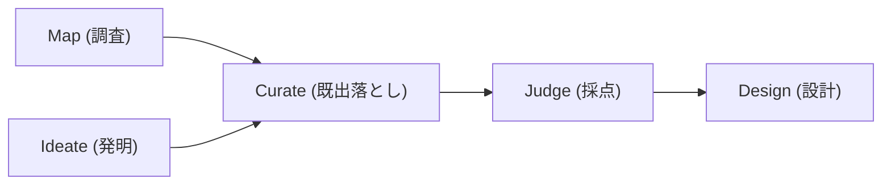

> Claude Code の dynamic workflows、いわゆる ultracode は、通常のセッションよりずっと多くのトークンを消費します。この記事は、架空のお題で 5 段のパイプラインを何度も回し、トークン・コスト・実時間・品質を実測して、どこを変えるとどれだけ安くなるかを 1 つずつ切り分けた記録です。最終的に勧める構成と、効くと思って外した施策まで書きます。

## TL;DR

- 効く順に 3 つのレバーがあります。**単価を下げる** (工程ごとにモデルの価格帯を変える)、**数を減らす** (採点を 1 体にまとめる)、**キャッシュを温める** (同じ文脈を時間的に近く反復する)。この 3 つを重ねた最も安い構成で、コストが Opus 換算で約 68%、実測の請求額で約 74% 落ち、実時間も約 46% 短くなりました。品質を守る推奨構成では、削減幅はこれより少しだけ小さくなります
- 発明役と採点役のモデル選びが質とコストの分かれ目でした。**発明と採点は Sonnet を既定に勧めます**。Sonnet は非自明な重複も Opus 並みに見抜き、着想の質も Opus と並び、3 モデルで最も安定し、単価は Opus の 0.6 です。**Haiku は採点に向きません**。明白な重複は落とせますが、既存機能の組み合わせに過ぎない非自明な重複を、指示しても見抜けませんでした
- 計測には落とし穴があります。`totalTokens` は何度回しても変動係数 0.7% 未満と堅牢ですが、実際の請求額はキャッシュの温度しだいで 2 割近く動きます。さらに混成モデルのトークン数は新トークナイザの影響で作業量の比較に使えません。横断比較は Opus 換算トークンを主に見ます
- 「繰り返す文脈を先頭に置いて共有キャッシュさせる」という定番のテクは、**並列で同時に走るエージェントには効きません**。同時発火するため、各体が自分の文脈を個別にキャッシュ書き込みするからです

先に断っておくと、測ったのはアイデア出しの作業です。コストを下げるレバー、つまりモデルの使い分けやバッチ化、キャッシュの温めは用途を問わず効きますが、どの工程にどのモデルを置けるかという質の結論は、この用途での話です。開発のようにコードを書かせる作業では、安いモデルで足りる範囲が変わりえます。

## dynamic workflows と ultracode

dynamic workflows は 2026 年 5 月に Claude Opus 4.8 と同時に公開されたプレビュー版の機能です。正式版ではなく、利用には対応バージョンの Claude Code と有料プランが要ります。プロンプトに `workflow` という語を入れるか、セッションに `/effort ultracode` を設定すると、Claude が JavaScript の取りまとめスクリプトをその場で書き、分離されたランタイムが背景で多数のエージェントを並列に走らせます。

押さえておくと読みやすい性質を並べます。

- 本稿の時点では、1 回の実行で起動できるのは最大 1,000 体、同時に走るのは最大 16 体です。超えた分はスロットが空くのを待って順に走ります
- 中間結果はスクリプトの変数に保持され、最終結果だけがセッションに戻ります。途中の大量の出力でメインの文脈を汚さずに済みます
- `/workflows` で実行状況をフェーズやエージェント単位までたどれて、一時停止や停止もできます
- 取りまとめスクリプトの中では、全部を待ち合わせてから次へ進む `parallel()` と、各案を待ち合わせずに流す `pipeline()` を使い分けます

そして本題に直結する性質がもう 1 つあります。**トークン消費が通常のセッションよりかなり大きく膨らむ**ことです。Anthropic も公式に、通常よりずっと多くのトークンを使うと明記しています。だからスケールさせる前に、どこにお金がかかっていて、どこを削ると効くのかを実測で押さえておきたくなります。

## 何を「コスト」と呼ぶか

数字を出す前に、何を測っているかを揃えます。今回は 3 つの層で見ました。

1 つ目は `totalTokens` です。各実行のジャーナル `workflows/wf_<id>.json` にランタイムが集計する値で、これを一次の指標にします。中身の違うお題で何度回しても変動係数は 0.7% 未満、基準構成では ±0.27% に収まり、極めて再現性が高い値でした。

ここに 1 つ罠があります。サブエージェントの生ログ `agent-*.jsonl` を行ごとに足し上げると、トークン数は大幅に過大になります。同じメッセージが複数行に記録されて二重に数えられ、各ターンが文脈の全文を含むのでターンをまたいで足すと文脈を何度も数えるからです。数字を出すときはジャーナルの `totalTokens` を使います。

2 つ目は型別の課金内訳です。各エージェントのログを `message.id` で重複排除し、入力・キャッシュ書き込み・キャッシュ読み出し・出力に分けて、公式単価をかけて実際の請求額を出します。単価は次の通りです。

| モデル | 入力 | キャッシュ書き込み | キャッシュ読み出し | 出力 |
|---|---|---|---|---|
| Opus 4.8 | $5 | $6.25 | $0.50 | $25 / 100万トークン |
| Sonnet 4.6 | $3 | $3.75 | $0.30 | $15 / 100万トークン |
| Haiku 4.5 | $1 | $1.25 | $0.10 | $5 / 100万トークン |

ここで注意が 2 つあります。1 つは、実際の請求額がキャッシュの温度で激しく動くことです。同じ構成でも、初回の冷えた状態と、直前に同じ文脈を流して温まった状態とで、キャッシュ書き込みと読み出しの内訳が入れ替わります。基準構成の実測額は ±18% ほど振れました。もう 1 つは、Opus 4.7 以降が新しいトークナイザを使っていて、同じテキストでも最大で 35% ほどトークン数が増えることです。つまりモデルを混ぜた構成どうしで `totalTokens` を比べると、作業量の差とトークナイザの差が混ざってしまいます。

そこで横断比較には 3 つ目、Opus 換算トークンを使います。入力単価の比は Opus : Sonnet : Haiku が 5 : 3 : 1 なので、各モデルのトークンに 1.0 / 0.6 / 0.2 の重みをかけて足し直した値です。キャッシュの温度にもトークナイザにも左右されにくく、構成どうしのコストを安定して比べられます。

最後に、構造の核になる発見を 1 つ。**エージェント 1 体には約 20〜23k トークンの固定の床があります。** 単発・単一ターンの小さな採点でも約 20k を消費します。中身はサブエージェントのシステムプロンプト、基本ツール群、ワークフローの足場、構造化出力の仕組みです。この床があるので、トークンの数を削る最大のレバーは「体数を減らす」こと、コストを削る最大のレバーは「体ごとの単価」と「キャッシュの温度」になります。床の正体は後で実測で確かめます。

ちなみに、レート上限に達して構造化出力が途中で切れた壊れた実行はすべて捨て、最後まで完走した 24 本のクリーンなデータだけを使っています。

## 実験のしかた

お題は架空の観葉植物ケアのリマインダーアプリで、やらせた作業は、このアプリに足す新機能のアイデアを広く出して厳しく絞ることです。姉妹記事でゲームの新案を探させたのと同じ形を、使い捨ての題材でやり直しました。この作業を選んだのは、多エージェントが本当に向くのが「広く発散して機械的に絞る」形だからです。1 体で済む小さな修正に多エージェントは過剰で、母集団を広げて閾値で切り落とすアイデア出しのような作業でこそ価値が出ます。新しさや重複の検出という分かりやすい質の軸があるぶん、安いモデルがどこで崩れるかも測りやすい題材でした。

これに対して、調査・発明・選別・採点・設計の 5 段パイプラインを 1 本だけ組み、`args` のノブだけを変えて 1 つずつ変数を切り分けました。

採点段には、実ワークロードでいう「既存機能のリスト」の代役として、約 5k トークンの機能カタログを全採点者に渡しています。品質を測る回だけは、候補と設計対象を固定して全実行に同じ入力を渡し、変えるのはモデルだけにしました。生成のばらつきを排除して、モデルの違いだけを取り出すためです。Opus を 2 回回して自己ばらつきの床を作り、Sonnet と Haiku の差がそれを超えるかで判定します。

## 安くするレシピ

効いた順に並べます。

### 単価を下げる — 工程ごとにモデルの価格帯を変える

最大のコスト削減は、工程ごとにモデルの価格帯を変えることでした。深さの要る選別と設計は Opus に残し、それ以外の広く浅い工程を安いモデルに寄せます。入力単価は Opus を 1.0 として Sonnet が 0.6、Haiku が 0.2 です。ただし発明と採点はモデルによって出来が変わるので、どのモデルに置くかは後の節で詰めます。

実測では、選別と設計だけ Opus に残し、調査・発明・採点をまとめて Haiku に落とした最も安い置き方で、Opus 換算で約 61%、実測の請求額で約 65% コストが下がりました。これは単価を最大限まで下げた構成で、品質を考えた配分は後の節で示します。トークンの「数」自体はほとんど変わりません。下がっているのは単価です。混成構成なので `totalTokens` はトークナイザの影響を受けますが、Opus 換算で見れば素直にコストの低下として読めます。

では、このモデルの割り当てはどこで変えるのか。dynamic workflows に設定画面はなく、すべては取りまとめスクリプトの中で決まります。各エージェントの呼び出し `agent()` に `model` を渡す形で、`agent(prompt, { model: 'haiku' })` のように書きます。スクリプトは Claude がその場で書くので、自分で効かせるには、トリガーのときに「調査は Haiku、採点は Sonnet、設計は Opus で」と方針を伝えて書かせるか、スクリプトを自分で書いて渡すかの 2 通りです。なお `agent()` にモデルを渡さないと、メインのループのモデルをそのまま継承します。基準構成は全 15 体が Opus 4.8 でした。安くするには各工程で明示する必要があります。

### 数を減らす — 採点を 1 体にまとめる

トークンの数そのものを最も削るのは、採点を 1 体ずつの並列から、1 体がまとめて採点するバッチに変えることでした。採点を 6 体から 1 体にすると、固定の床 20k を 5 体ぶん、それに機能カタログのキャッシュ書き込みを 5 回ぶん消せます。トークンは 33% 減り、実測の請求額も 39% 下がりました。この回はすべて Opus なので、トークナイザの交絡がなくクリーンに比べられます。

実時間はほぼ変わりません。採点フェーズはもともと最も遅い 1 体で律速されていて、カタログの入力処理も 1 回で済むからです。33% のトークン削減を、速度を犠牲にせずに得られます。ただしバッチの件数を増やしすぎると、1 体が逐次に吐く出力が並列 1 体の時間を超える交差点があり、そこから先は遅くなります。

なぜ並列で「体数を減らす」がここまで効くのかは、次のキャッシュの話とつながります。

### キャッシュを温める — 同じ文脈を時間的に近く反復する

実際の請求額を最も大きく動かすのは、キャッシュの温度でした。キャッシュには 2 種類あります。新しく書き込むキャッシュ書き込みは単価が高く、既存を読み出すキャッシュ読み出しはその約 12 分の 1 で安いです。同じ文脈を時間的に近く反復すると、2 回目以降はその文脈が安い読み出しで賄われます。

配置を変えて測った別の小実験では、同じワークフローが冷えた初回で $1.07、完全に温まった状態で $0.33 でした。約 3.2 倍の差です。カタログを置く・置かない、前に置く・後ろに置くといった違いより、温度のほうが桁違いに支配的でした。

運用としては、似たエージェントを 1 本のワークフローの中・近い時刻にまとめるのが有利です。逆に、別のワークフローを多数同時に起動すると競合で遅くなります。4 本同時に走らせたときは、各フェーズが 15〜40 秒ぶん水増しされました。同じ種類のエージェントは 1 本に固めるほうが、キャッシュも温まってコストでも実時間でも得をします。

### 効くと思って外したこと — 並列ではプレフィックス整列もカタログ削りも脇役

ここまでで効かなかった施策も書いておきます。直感的には、繰り返すカタログを各採点者の文脈の先頭に共有プレフィックスとして置けば、最初の 1 体が書き込んだキャッシュを後続が読み出して安くなりそうに思えます。

ところが**並列で同時に走るエージェントでは、これが成立しません**。配置を変えて型別の内訳を実測しました。

| 配置 | 条件 | totalTokens | キャッシュ書き込み | キャッシュ読み出し | 実測 |
|---|---|---|---|---|---|
| 前・カタログあり | 冷 (1 本目) | 128,166 | 128,144 | 102,066 | $1.07 |
| 後・カタログあり | 温 (2 本目) | 127,349 | 67,104 | 183,654 | $0.71 |
| カタログなし | 温 (3 本目) | 119,205 | 58,959 | 155,406 | $0.63 |
| 前・カタログあり | 温 (並列) | 128,096 | 4,978 | 225,162 | $0.39 |
| 後・カタログあり | 温 (並列) | 126,951 | 3,833 | 225,162 | $0.33 |

冷えた初回の「前・カタログあり」を見ると、キャッシュ書き込みが 128,144 で、これはおよそ 6 体 × 21k です。6 体は同じシステムプロンプトとカタログのプレフィックスを持っているのに、各自がそれをフルに書き込んでいます。個別に見ても 6 体すべてが約 21,400 で揃っていました。共有が効いているなら 1 体だけ高く他は低いはずですが、そうなりません。**並列のエージェントは同時に発火するので、先頭が作ったキャッシュを後続が読むという節約が起きない**のです。さきほどの「1 体 20k の固定床」の正体は、まさに冷えた状態で体ごとに実際に払うキャッシュ書き込みでした。

温まった状態では配置は無関係でした。前でも後ろでも書き込みは 4〜5k に落ち、読み出しは同値、請求額も $0.33〜0.39 にそろいます。温めてしまえばカタログはどちらの配置でも安い読み出しで賄われ、差は消えます。

だから「採点者にカタログを再注入しない」という施策が効くのは、カタログがキャッシュ書き込みされている時、つまり冷えている時か、二度と繰り返さないユニークな文脈の時だけです。温めて反復する運用では、カタログは安い読み出しになるので削っても効果は小さく、全体の 4% ほどでした。正しい一般化はこうです。**並列で効くのは、体数を減らすことと、同じ文脈を温めて反復することの 2 つ。プレフィックスの整列が効くのは逐次に走らせる時だけ**です。

### ターンを絞る

最後に小さなレバーとして、調査段の Web 往復を止める手があります。コストへの寄与は固定の床に対して限界的で、2.5% ほどでした。ただし実時間には効きます。調査フェーズが 49 秒から 19 秒へ、30 秒短くなりました。

## 合わせ技の結果

以上を重ねた構成を、それぞれ 6 本ずつ温度をそろえたプールで取り直しました。壊れた実行を除いた 24 本ぶんのクリーンなデータです。

| 構成 | totalTokens | Opus 換算 | 実測 | コスト削減 |
|---|---|---|---|---|
| 基準 | 332,327 ± 909 | 332,327 | $2.07 ± 0.37 | — |
| 単価を下げる | 313,242 ± 1,948 | 130,690 ± 430 | $0.73 ± 0.04 | −61% (換算) / −65% (実測) |
| 数を減らす | 221,354 ± 1,320 | 221,354 | $1.26 ± 0.07 | −33% / −39% |
| カタログ削り | 322,681 | 322,681 | — | −4% (換算) |
| 調査の Web 停止 | 327,194 | 327,194 | — | −2.5% (換算) |
| **合わせ技** | 199,652 ± 1,049 | 107,954 ± 569 | $0.53 ± 0.03 | **−68% (換算) / −74% (実測)** |

`totalTokens` の変動係数は 0.7% 未満で、各構成の単発推定もすべて 6 本の区間に収まりました。結論は数字として安定しています。実測の請求額は基準で ±18% と最も振れますが、これはキャッシュの温度由来なので、横断比較は Opus 換算を主に、実測額を従に見ます。なお、この表の合わせ技は発明と採点も Haiku に落とした最も安い置き方で、後で示す品質重視の推奨構成は、削減率がこれより少し小さくなります。

実時間も測りました。クリーンに比べられるのは単独実行どうしだけです。

| | 調査 | 発明 | 選別 | 採点 | 設計 | 全体 |
|---|---|---|---|---|---|---|
| 基準 | 49 | 15 | 37 | 54 | 17 | 174 秒 |
| 合わせ技 | 19 | 10 | 26 | 19 | 16 | 93 秒 |

表のフェーズ値は各段でいちばん遅い 1 体の時間、全体は実測した総時間です。フェーズ間のわずかな受け渡しのぶん、単純な足し算とは数秒ずれます。基準の 174 秒が合わせ技で 93 秒、約 46% 短くなりました。短縮の主因は、調査の Web 停止で 30 秒と、採点を Haiku のバッチにして 35 秒でした。この実時間は採点まで Haiku に落とした合わせ技での実測です。設計は Opus のままなので変わりません。トークンとコストに最適な構成が、同時にほぼ 2 倍速いという結果でした。

合わせ技の請求額の内訳を見ると、コストの大半は Opus に残した選別と設計の工程が占めます。安いモデルに落とした工程はもう数のうえでは効いていて、コストの床は Opus を残した工程が決めます。

## どのモデルをどこに置くか

ここまでのコストの話は、品質を測ってからでないと結論にできません。質的な工程を安いモデルに落とすと出来がどう変わるかを、入力を固定して測りました。まず採点から見ます。

採点で一番難しいのは、新しさの判定です。中でも、既存の 2 機能を組み合わせただけの「非自明な重複」を見抜けるかが分かれ目でした。同じ候補群を各モデルに採点させ、ルーブリックに「重複は減点せよ」と書く・書かないも振って、効いている変数を切り分けました。

| 候補 (重複の種類) | Opus | Sonnet | Haiku |
|---|---|---|---|
| 明白・逐語の重複 A | 18 / 12 | 12 / 4 | 25 / 8 / 15 / 15 |
| 明白・逐語の重複 B | 28 / 8 | 12 / 4 | 42 / 42 / 25 / 32 |
| 中程度・既存ログのUI化 | 52 / 38 | 52 / 28 | 62 / 62 / 42 / 42 |
| **非自明・既存2機能の交差** | **38 / 34** | **28 / 18** | **72 / 62 / 72 / 52** |

数字は「指示なし / 指示あり」、Haiku は各 2 回です。読み取れたのは、効いている変数は指示ではなく**重複の自明さとモデルの判別力**だということでした。明白な逐語の重複なら、Haiku も指示なしで低く採点できて Opus に近づきます。ところが非自明な重複、つまり既存の共有タスクリストとケア履歴の交差に過ぎない候補を、Opus は 34〜38、Sonnet は 18〜28 と正しく床打ちしたのに対し、**Haiku は指示を入れても 52〜72 と落とせませんでした**。

これは各セルを 15 回ずつ取り直しても変わりませんでした。非自明な重複に対する平均は Opus が 27.5、Sonnet が 10.6、Haiku が 52.7 で、Haiku は中央値で Opus より 25 点高く、ばらつきも約 5 倍でした。Haiku が非自明な重複を見抜けないのは、統計的にも確かな質の欠陥です。

一方、Sonnet の性格はこう整理できます。

| | 明白な重複 | 非自明な重複 | 良案の序列 | 再現性 | 採点単価 (Opus 比) |
|---|---|---|---|---|---|
| Opus | 床打ち | 床打ち (34-38) | 細かく付く (72-82) | 高 | 1.0 |
| Sonnet | 床打ち | 床打ち (18-28) | 一律 72 に圧縮 | 最高 | 0.6 |
| Haiku | 床打ち | 見抜けない (52-72) | 粗い | 低 | 0.2 |

Sonnet は非自明な重複も Opus 並みに床打ちし、3 モデルで自己再現性が最も高いです。弱点は、良い候補のスコアを一律 72 に圧縮してしまい、良案どうしの細かい序列付けでは Opus に劣ることだけでした。

採点だけでなく、発明が生む着想の質も測りました。固定の指示文から各モデルに案を出させ、その質を 1 モデルあたり 30 回、Opus が伏せて採点した平均は、Sonnet が 65.3、Opus が 62.2、Haiku が 54.1 です。Sonnet と Opus はほぼ並び、統計的な差はありませんでした。落ちるのは Haiku で、新しさではなく具体性と実現性がそれぞれ 10 点ほど低い。着眼は悪くないのに、詰めが甘いのです。だから発明も、機械的な下調べと違って安いモデルには任せきれません。

最終の設計は Opus に残します。実装に響くエッジケース、たとえば夏時間やタイムゾーンによる誤検知、配信済みと真の無発火の区別といった細部の詰めで、Opus がいちばん深く拾うからです。

ここから推奨が決まります。

- **既定は、調査を Haiku、発明と採点を Sonnet、選別と設計を Opus** に置き、採点はバッチにします。発明と採点はどちらも質的な判断なので Sonnet に、調査は角度を出すだけで下流が審査するので Haiku で低リスクです。新しさと重複の選別が目的なら、採点は Sonnet 一択です。良い候補の細かい順位まで欲しい時だけ採点を Opus にします
- **採点を Haiku に落とすのは勧めません**。明白な重複しか出てこない採点に限れば最安ですが、一般のアイデア選別では非自明な重複を取りこぼします

コストの実測で約 7 割という削減は、発明も採点も Haiku に落とした最も安い構成の値です。品質を考えた推奨では、発明と採点を Sonnet に上げます。採点はバッチで 1 体なので上げてもコスト増はごくわずかですが、発明は複数体あるので Sonnet にするとコストは少し戻ります。それでも請求額の主成分は Opus に残した選別と設計なので、**推奨構成の削減率は最安より小幅に小さくなる程度で、依然として大きく下がります。** 質を落とさずに済むぶん、ここは妥当なトレードオフです。

## 改善の手順

自分のワークフローを安くするには、効く順に次の手をあてていくのが早道です。

- **工程ごとにモデルを割り当てる**。調査は Haiku、発明と採点は Sonnet、選別と設計は Opus。`agent()` にモデルを渡さないと全部 Opus を継承するので、各段で明示する
- **採点をバッチにする**。1 体がまとめて採点すれば、固定の床とカタログの書き込みを体数ぶん落とせる
- **キャッシュを温める**。似たエージェントを 1 本のワークフロー・近い時刻にまとめ、別のワークフローを多数同時に起動しない
- **上限のガードと試走**。`budget.total` と `budget.remaining()` で上限を切り、本番の前に小さく回して基準の数字を取る
- 暗黙の基準はルーブリックに書き出す。ただし非自明な重複は、明示しても Haiku には見抜けない

## おわりに

dynamic workflows のコストは、3 つのレバーで素直に動きました。**単価を下げる、数を減らす、キャッシュを温める。** 最も安い置き方では、コストが Opus 換算で約 68%、実測で約 74% 落ち、実時間も約 46% 短くなりました。品質を守るには発明と採点を Sonnet に上げるので削減幅は少し戻りますが、コストの主成分は Opus に残した選別と設計なので、それでも大きく下がります。安く回すことと、着想や重複検出の質を保つことは、工程ごとにモデルの価格帯を選び分けることで両立しました。

多エージェントを実際の制作にどう使ったか、そして「面白いの判定」だけは機械化できなかった話は、[Claude Code の dynamic workflows で 38 体の AI にゲームを探させた記事](https://zenn.dev/marvelousu/articles/claude-dynamic-workflows-game-ideation)に書いています。どの工程を安いモデルに任せられるか、非自明な重複は安いモデルでは見抜けない、という今回の線引きは、そちらの「最後の収束は人間に残った」という話とそのままつながります。
