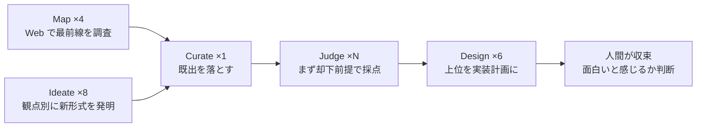

> Claude Code の dynamic workflows を使って、数十体のエージェントに「世界初のゲーム体験」を探索させました。本記事は、実際に書いた取りまとめスクリプト、回したときの数字、うまくいった点と外した点を記録したものです。最終的にどの方向で作り始めたかも書きます。

## TL;DR

- Claude Code の dynamic workflows を、実装やレビューではなく新しいゲームのアイデア探索に使いました。広く案を出して厳しく絞る形がアイデア出しに向くと考えたからです
- 組んだのは調査・発明・選別・採点・設計の 5 段パイプライン。各段の出力は JSON Schema で固定し、ある回はエージェント 38 体で 19 案に絞り、16 案通過、6 案を設計まで進めました
- 一番の学びは失敗から。「客観的な世界初か」を機械に判定させる設計は通過ゼロに終わり、判定軸を「体感として前代未聞か」に作り替えました
- 多エージェントは案を広げて機械的に絞るまでが強く、何を面白いと感じるかという最後の収束は人間に残りました

## はじめに

普段は HD-2D 探索アドベンチャー [Anemora](https://zenn.dev/marvelousu/articles/anemora-hd2d-time-frame) を、AI を中心にした個人開発で作っています。ただ Anemora はグラフィックの作り込みや HD-2D 化のような重い作業が続く局面が多く、腰を据えて長く付き合う作品だと考えています。その合間に、もっと手軽に作れて短く出せる小さなゲームやアプリ、ツールも並行して出していくつもりで、まずは次に何を作るかを探すところから AI に手伝ってもらえないかと考えました。

ちょうど Claude Code に dynamic workflows が入ったので、1 体のチャットで壁打ちするのではなく、数十体のエージェントに別々の角度から案を出させて、別の数十体に厳しく評価させる、という形を試しました。これは dynamic workflows の試用と、新しいゲームのアイデア探索を兼ねた思索の記録です。

なお、探索の引数やエージェントへのプロンプトには、自分の情報や既存プロジェクトの情報を一切入れていません。安全面の扱いは後ろのコストとガードの節でまとめます。

## dynamic workflows とは

dynamic workflows は 2026年5月に Claude Opus 4.8 と同時に公開されたプレビュー版の機能です。正式版ではなく、利用には対応バージョンの Claude Code と有料プランが要ります。プロンプトに `workflow` という語を入れるか `/effort ultracode` をセッションに設定すると、Claude が JavaScript の取りまとめスクリプトをその場で書き、分離されたランタイムが背景でエージェントを動かします。

要点を整理します。

- 1 回の実行で起動できるのは最大 1,000 体、同時に走るのは最大 16 体です。超えた分はスロットが空くのを待って順に走ります
- 中間結果はスクリプトの変数に保持され、最終結果だけがセッションに戻ります。途中の大量の出力でメインの文脈を汚さずに済みます
- `/workflows` で実行状況をフェーズやエージェント単位までたどれて、一時停止や停止もできます
- トークン消費は通常のセッションより大きく膨らみます。スケールさせる前に小さく回して目安を取るのが無難です

向き不向きもあります。LLM の判断で厳密な真偽や数値一致を保証する用途、たとえばバイト列の一致や厳密な計測には向きません。確率的な判断を多段に重ねると再現性が落ちるからです。1 体で済む小さな修正に持ち出すのも過剰です。逆に、独立した観点からのレビューや反証探し、大規模な規約スキャン、機械的な移行、調査、そして今回のアイデア探索のように、広く探して束ねて絞る作業には素直にはまります。

## なぜアイデア出しに多エージェントを使ったか

アイデア出しを 1 体のチャットでやると、最初に出た方向に引っ張られがちです。多エージェントにする狙いは 2 つでした。

1. 発散の幅を出すこと。角度を分けて別々のエージェントに発明させれば、1 つの会話では出てこない方向まで母集団が広がります
2. 発散と評価を分離すること。案を出すエージェントと、それを厳しく評価するエージェントを分ければ、自分で出した案を自分で甘く評価するなれ合いを構造的に断てます

この 2 つを素直に形にすると、次の 5 段のパイプラインになりました。

## 組んだパイプライン



### フェーズ1: 調査と発明を同時に走らせる

最初のフェーズでは、2 種類のエージェントを同時に走らせました。片方は Web を調べて、いまどんな AI ネイティブなゲームや実験がすでに存在するかを 4 つの角度から地図にする偵察役です。もう片方は、新しい動詞、新しい勝利条件、新しい対戦相手、新しい題材といった 8 つの観点で、それぞれ 5 案ずつ新しいゲーム形式を発明する役です。

dynamic workflows には複数の組み方がありますが、ここはあえて全部を待ち合わせる `parallel()` にしました。次の選別フェーズが、全部の案と全部の地図をまとめて見る必要があるからです。

```js
const firstBatch = await parallel([
  ...MAP_ANGLES.map((a, i) => () =>
    agent(mapPrompt(a), { label: `map:${i}`, phase: 'Map', schema: MAP_SCHEMA })),
  ...LENSES.map((l) => () =>
    agent(ideaPrompt(l), { label: `ideate:${l.key}`, phase: 'Ideate', schema: IDEA_SCHEMA })),
])
const candidatesRaw = firstBatch
  .slice(MAP_ANGLES.length).filter(Boolean)
  .flatMap((s) => s.ideas || [])
```

調査役を入れたのは、後段で既存例との衝突を減らすために、すでにあるものを知っておく必要があったからです。発明だけさせると、エージェントはすでにあるものを平気で新発明として出してきます。

### 出力を JSON Schema で固定する

各フェーズの出力は、自由文ではなく JSON Schema を渡して形式を固定しました。スキーマを渡すとエージェントは構造化出力として返すよう求められ、検証は実行環境の側で行われます。こちらで本文をパースして失敗する手間が消えます。

採点フェーズのスキーマはこうしました。

```js
const JUDGE_SCHEMA = {
  type: 'object',
  properties: {
    isNewGameForm: { type: 'integer', minimum: 1, maximum: 5 }, // 新しい「種類」のゲームか
    worldFirst:    { type: 'integer', minimum: 1, maximum: 5 }, // 誰もこれを遊んでいないか
    fun:           { type: 'integer', minimum: 1, maximum: 5 }, // 本当に面白く反復に耐えるか
    soloBuildable: { type: 'integer', minimum: 1, maximum: 5 }, // 一人で作って試せる最小版にできるか
    depth:         { type: 'integer', minimum: 1, maximum: 5 }, // 一発ネタでない深さがあるか
    passes:        { type: 'boolean' },
    killReason:    { type: 'string' },
    pitch:         { type: 'string' },
  },
  required: ['isNewGameForm','worldFirst','fun','soloBuildable','depth','passes','pitch'],
}
```

### 基準を全プロンプトに注入する

発明・選別・採点・設計のすべてのプロンプトに、同じ基準の文字列を頭に差し込みました。ありふれた道具、既存ジャンルの変種、チャットボット、AI を貼っただけの普通のゲームは却下、というかなり手厳しい基準です。同じ基準を全工程で共有させると、エージェントごとに評価軸がぶれるのを抑えられます。

### 採点はまず却下前提で並列に

採点は案ごとに別エージェントへ並列で投げ、プロンプトの冒頭で「まず却下を既定にせよ。たいていのものは世界初でも新形式でもない。そう言い切れ」と指示しました。閾値も明示し、複数の軸がすべて高得点のときだけ `passes` を真にしています。

```js
const judged = await parallel(candidates.map((c, i) =>
  () => agent(judgePrompt(c), { label: `judge:${i}`, phase: 'Judge', schema: JUDGE_SCHEMA })
    .then((v) => v
      ? { c, v, score: v.isNewGameForm + v.worldFirst + v.fun + v.soloBuildable + v.depth }
      : null)
))
const passing = judged.filter(Boolean).filter((x) => x.v.passes)
```

発明役と採点役を分け、採点役を厳しめに振ったことで、面白そうな雰囲気だけの案がかなり落ちました。

### 設計と取りこぼし対策

最後に上位案だけを設計フェーズに渡し、一人が今月から作り始めて、最初の 1 週間で実際に遊べる最小の形は何か、まで具体化させました。設計エージェントが落ちても全体を止めないよう、落ちた枠は採点までの情報で埋める作りにしています。返り値には勝者だけでなく、次点、却下理由の例、見つけた空白地、統計も載せ、後から人間が読み返せる形にしました。

## 実際に回した結果

最初に回したのは、AI ネイティブな新しい表現や知性の形式を探す版でした。この回はエージェントが合計 38 体動き、提案された案を 19 案まで絞り、そのうち 16 案が基準を通過し、上位 6 案を設計まで進めました。通過した代表例です。いずれもエージェントが提案したものです。

- **Provenance**: 読者がどこで滞留しどこを読み返したかを観察してから、既読の章を遡って改稿する小説。連続性を保ったまま、初読には無かった伏線を後から仕込む
- **Liar's Theater**: 複数のエージェントが作者にも分からないように私的に共謀して犯人と表向きの話を決め、プレイヤーは数日ぶんの会話ログの矛盾を突いて嘘を崩す
- **The Disagreement**: 相容れない美学を持つ 2 体が 1 枚のキャンバスを奪い合う。調停も決着もなく、膠着そのものが作品になる

次に、対象をゲームに絞った版を回しました。この第 1 弾では 8 案から 4 案が通過しましたが、ここで私が全部に「どこかで見た」と却下を出しました。AI 刑事を尋問する案も、崖の縁の人間を会話で鎮める案も、既存作の祖先をすぐ名指せてしまったからです。

## ここで効いたこと・外したこと

ツールの組み方として、振り返って効いたのは次の点でした。

- 発明役と採点役の分離。同じモデルでも、役割とプロンプトを分けてしまえば、なれ合わずに自分の案を厳しく見ます
- 出力形式の固定。本文をパースしないので、集計、並べ替え、閾値判定がただの JavaScript で書けます
- 待ち合わせは必要な場所に絞る。全件をまとめて見る選別の前で調査と発明を待ち合わせ、採点と設計は案ごとに並列で走らせて、落ちた案だけを取りこぼす形にしました

外したことのほうが、学びは大きかったです。

### 「客観的な世界初」を機械に判定させようとして空振りした

途中で、似た既存作を 1 つでも名指せたら失格、という別バージョンの探索を、最大 24 観点・144 案の規模で回しました。専用の祖先ハンターのエージェントに片端から照合させたところ、通過した案はゼロでした。

これは設計の誤りでした。あらゆる創作は既存の要素の組み換えなので、祖先ゼロは原理的に達成できません。囲碁も将棋も何かの変種だと言えてしまいます。正しい判定軸は、学者が分解できないかではなく、プレイヤーが体感として前代未聞と感じるか、でした。多エージェントに任せられるのは前者の機械的な照合までで、後者は別の評価として人間に残ります。

### 言葉を足切り条件にすると発想が歪む

もう 1 つの失敗は、自分が口にした言葉を抽出して、採点の足切り条件に固定してしまったことです。たとえば「無限の可能性」という緩い言い回しを、エージェントが数学的な無限や崇高といった硬い制約に過剰に解釈し、案が一方向に歪みました。「感動」も、畏怖や崇高ではなく、本当は衝撃と歓び、人に見せたくなる楽しさのことでした。

教訓として、判定軸を言葉でガチガチに縛らないほうが、結果的に良い母集団が出ます。これはプロンプト設計の話であると同時に、何を最適化させているかを取り違えると、多エージェントは全力で間違った方向に走る、という話でもあります。

## コストとガード

dynamic workflows のトークン消費はかなり大きくなります。Anthropic も公式に、通常のセッションよりずっと多くのトークンを使うと明記しています。実際、エージェント 38 体で回したこの回は、ワークフローの実行ログに残る totalTokens の値で、総トークン約 100 万でした。最初の 1 回は小さく回して目安を取り、消費を抑える運用も別途試しているところです。

それから、探索のプロンプトには自分の情報や既存プロジェクトの情報を一切入れない方針にしています。一度、別の調査で自分の文脈を引数に織り込んでしまい、多数のエージェントや Web 検索の文脈へ広がったことがありました。これで完全に漏れを防げるわけではありませんが、該当語を含むツール呼び出しを止める補助線として、PreToolUse フックを入れています。探索自体が一般的なトピック語だけで完結する設計なら、ガードに引っかからずに回ります。

## 探索の出口 — 最後の収束は人間に残った

ここまでで分かったのは、多エージェントは案の母集団を広げて機械的に絞るところまでは確かに強い、ということです。一方で、結局どれを作ると自分が面白いのか、という最後の収束は、何度回しても人間に残りました。判定軸を作り替えたのも、却下を出したのも、最終的に方向を決めたのも人間です。

最終的に作り始めたのは、エージェントが出した案そのものではなく、探索の途中で自分が掴んだ動詞でした。「めくる」と「ラベル」を軸にした一人称 3D のパズルです。すべての物には、正体と性質を表す隠れたラベルの束があり、それをめくって剥がし、貼り、差し替えることで世界を物理的に作り変えます。中身は LLM を使わない、純粋な決定論パズルとして組んでいます。

もう一方は、AI を機構そのものに組み込む試みで、こちらも仕様を進めています。冤罪の容疑者の視点で AI 刑事の尋問をしのぐ、立場を反転させたゲームです。真実や状態、勝敗は決定論の背骨が持ち、LLM は発話を事実に照らして解釈する役と、台詞に味をつける役だけに絞っています。真偽の判定はあくまでコードが下す、という線は崩しません。

どちらも、腰を据えて作る Anemora とは別の、合間に手軽に進める小さな制作枠として置いています。

## おわりに

dynamic workflows をアイデア探索に使ってみて、はっきりしたのは役割分担でした。多エージェントで一斉に走らせるやり方は、広く案を出す発散と、既出を落として閾値で足切りする機械的な収束に効きます。逆に、何が面白いかという価値判断と、体感として新しいかという新規性の評価は、ツールに肩代わりさせようとするほど歪みました。そこは人間に残し、ツールには母集団づくりと足切りを任せる、という線引きが、いまのところ一番しっくりきています。

同じ AI 中心の個人開発については、[制作支援ツールをその場で組む話](https://zenn.dev/marvelousu/articles/anemora-dev-tools) や [人間が手放さなかった3つの仕事](https://zenn.dev/marvelousu/articles/anemora-human-work) でも書いています。今回の探索から作り始めたゲームについては、形になってきたらまた別記事で書く予定です。
