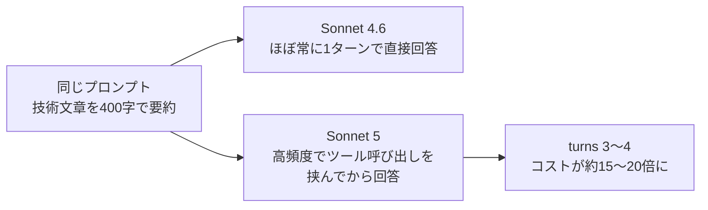

> 本記事では、今週GAされた Claude Sonnet 5 が愛用していた Sonnet 4.6 の上位互換になっているのかを、同じプロンプト・同じ採点基準・日本語だけで実測して確かめてみました。

## TL;DR

- 今回試した簡単なタスクの範囲では、**正答率は4.6と5でほとんど差がつきませんでした** (コーディング・論理パズル・長文検索)。
- 一方で**コストとターン数は5のほうが重く**、とくにコーディングで顕著でした。
- 書くだけのタスクでも5は余計なツール呼び出しを挟み、**コストが跳ねました**。
- 検証作業そのものを5にやらせた体感でも4.6より扱いにくく、率直に言って**期待外れ**でした。

## はじめに

私が Sonnet 4.6 を気に入っていた理由は、その安さと速さのわりに賢い、というコスパの良さでした。なので Sonnet 5 にも、4.6の使い勝手はそのままに一段賢くなった上位互換を期待していました。実際に乗り換える価値があるのか、条件を揃えて測ってみました。

## 公式で何が変わったか

Sonnet 5 は Sonnet 4.6 をそのまま置き換えられる位置づけで、モデルIDを `claude-sonnet-5` に変えるだけで動きます。ただし中身はいくつか変わっています。

| 項目 | Sonnet 4.6 | Sonnet 5 |
|---|---|---|
| コンテキスト窓 | 1Mトークン (ベータ) | 1Mトークンが既定かつ上限 (小さい版はない) |
| 最大出力 | 128k (Batch APIで300kまで拡張可) | 同左 |
| thinking | 未指定なら思考なし。手動 `budget_tokens` は非推奨 | 未指定でも adaptive thinking が既定でON。手動 `budget_tokens` は廃止 (400エラー) |
| サンプリングパラメータ | 変更可 | temperature/top_p/top_k を既定値以外にすると400エラー |
| effort | 既定 `high` (実務上は `medium` 推奨) | 既定 `high` (そのまま推奨)。`xhigh` が新規追加 |
| 価格 | $3 / $15 (100万トークンあたり入力/出力) | 導入価格 $2 / $10 (2026年8月31日まで) → 以降 $3 / $15 (4.6と同額) |
| トークナイザ | 従来型 | 新トークナイザ。同じテキストでも約30%多くトークンを消費 |
| セキュリティ | - | Sonnet系で初めてリアルタイムのサイバーセキュリティ・セーフガードを搭載。該当時は通常のHTTP 200で `stop_reason: "refusal"` を返す |
| Priority Tier | 対応 | 非対応 |

見た目上いちばん大きいのはコンテキスト窓の扱いです。以前は1Mトークンが別枠のベータ機能でしたが、Sonnet 5 では既定かつ唯一の選択肢になりました。一方で新トークナイザにより同じ文章でもトークン消費量が増えるため、**1Mトークンで収まる実際の文章量は以前より減ります**。

価格面では、標準価格の $3/$15 自体は4.6と変わりません。ただしトークナイザの変更で同じ文章が約30%多いトークンになる以上、**標準価格に戻った9月以降は同じ作業でも実質的にやや高くつく**計算になります。導入価格 ($2/$10、標準よりおよそ3分の1安い) はこの増加分をおおむね相殺する水準になっているので、少なくとも8月末までの移行はコスト面で中立に近い、という理解が正確そうです。

adaptive thinking が既定ONになった点も実務上の影響が大きいです。今まで「明示的に指定しない限り思考しない」だったのが逆転し、明示的に切りたい場合は `thinking: {type: "disabled"}` と指定する必要があります。

(出典: [What's new in Claude Sonnet 5](https://platform.claude.com/docs/en/about-claude/models/whats-new-sonnet-5), [Effort](https://platform.claude.com/docs/en/build-with-claude/effort), [Pricing](https://platform.claude.com/docs/en/about-claude/pricing))

## 検証条件

公式の変更点だけでは、実際の使い勝手やコストがどう変わるかは分かりません。そこで、答え合わせのしやすい簡単なタスクを何種類か用意し、両モデルに何度も投げて正答率とコストを実測しました。何をどう揃えたかは以下の通りです。

- 比較軸は Sonnet 4.6 → 5 の変化1本に絞りました。
- `claude -p --model <model> --strict-mcp-config --output-format json` という形でCLIから両モデルを直接呼び分けています。加入中のサブスクリプション経由で、APIキー直叩きではありません。
- 測定内容はすべて日本語で統一しました。プロンプト・出力・採点、どれも日本語以外のデータは使っていません。
- 正誤判定はテストコード (コーディング)、または答えの数値・キーワード一致 (パズル・Needle) で機械的に行い、目視の主観評価は使っていません。
- いずれも単発で答え合わせできるタスクです。もっと大規模な実務コーディングや、長時間の自律エージェント的な使い方は今回は測っていません。

カテゴリは4つです。

| カテゴリ | 内容 | 例 |
|---|---|---|
| コーディング | 自作のバグ入りタスク4種、各40回 | 四則演算の評価器で、優先順位の実装ミスにより `1+2*3` が `7` でなく `9` になるバグを直させる |
| 論理パズル | 自作2セット、各40回 | 「公正な6面サイコロを3個振り、出た目の最大値が5以上になる確率を既約分数で求めよ」 |
| 日本語 Needle-in-a-Haystack | 約18万字のハイスタック、各12回 | 業務メモに紛れ込ませた「サブシステムのオーバーライドキー」を検索させ、承認者が後に異動した部署まで答えさせる |
| 技術文章の要約ライティング | 2セット、各20回 | 「Sonnet 5のeffortパラメータについて400字で要約して」のようなお題 |

## 結果1：正答率は全カテゴリで互角

| カテゴリ | 4.6 | Sonnet 5 |
|---|---|---|
| コーディング (4種 × 40) | 100% | 100% |
| 論理パズル (2種 × 40) | 100% | 100% |
| Needle-in-a-Haystack (n=12) | 100% | 100% |

自作した範囲のタスクでは、両モデルとも全問正解でした。ここで注意したいのは、これは5と4.6の実力が同じという意味ではない点です。今回のタスクが両モデルにとって簡単すぎて、**どちらも天井に張り付いているだけ**とも言えます。もっと難しい問題やもっと大きいサンプル数でないと、細かい実力差は見えません。

裏を返せば、**この程度の易しいタスクでは、Sonnet 5 に乗り換えて精度が上がる場面は見当たりませんでした**。難しいタスクで5が伸びる可能性は否定しませんが、それは今回の測定範囲の外です。

## 結果2：コストとターン数にはっきり差が出た

正答率と違い、コスト面では差が出ました。

| カテゴリ | 4.6 中央値コスト / ターン数 | Sonnet 5 中央値コスト / ターン数 |
|---|---|---|
| コーディング (n=160) | $0.117 / 5.0 | $0.179 / 6.5 |
| 論理パズル (n=80) | $0.134 / 1.0 | $0.134 / 1.0 |
| Needle (n=12) | $0.128 / 中央値25.2秒 | $0.171 / 中央値40.9秒 |

論理パズルは1ターンで即答するタスクで、コストもターン数も4.6と5でほぼ同じでした。一方コーディングは、同じ100%正解でも Sonnet 5 の方がターン数で1.5回分、コストで5割ほど多くかかっています。バグを直す過程がより慎重・反復的になっている可能性があります。Needle も5の方が遅く・高コストですが、新トークナイザで同じ文章のトークン数が増えることを踏まえれば説明がつきます。

同じ答えにたどり着くのに、**5のほうが遠回りで割高**、というのが全体を通した傾向でした。

## 結果3：書くだけのタスクなのに5はツールを呼びたがる

技術文章を要約して書くだけの、本来なら1ターンで完結するはずのタスクで、明確な挙動差が出ました。

| セット | 4.6: 複数ターン化した割合 | Sonnet 5: 複数ターン化した割合 |
|---|---|---|
| セット1 (1M文脈・トークナイザの話題) | 0% (0/20) | 45% (9/20) |
| セット2 (adaptive thinking・effort・価格の話題) | 5% (1/20) | **95% (19/20)** |

複数ターンになった回は、コストが1ターン回答の $0.07〜0.09 から $1.38前後まで跳ね上がっていました。1ターンで答えた場合の文字数・コストは両モデルでほぼ同水準 (例: セット2は4.6が983字/$0.14、5が851字/$0.085) だったので、**出てくる文章そのものが変わったのではなく、書く前に何か確認しに行く頻度が大きく変わっていました**。

しかも、話題が Sonnet 5 自身の仕様に近いほど (セット2) 発生率が上がっています。全部のケースを個別に追ったわけではないので断定はできませんが、adaptive thinking が既定ONになったことと合わせて、Sonnet 5 は本来ツールが要らない場面でも自発的に動く傾向が Sonnet 4.6 より強いと考えるのが自然です。コスト予測を立てる上では、**たまに1ターンのはずが3ターンになる**という挙動を織り込んでおく必要があります。

## おわりに

今回のような簡単なタスクの範囲では、正答率で4.6と5に差はありませんでした。ですが同じ精度を出すのに5はコストもターン数も余計にかかり、書くだけのタスクでも勝手にツールを呼びに行きます。Claude Code を日常的に使っている分には気づきにくい違いですが、コストを細かく見ると小さくない差です。

この記事の検証作業自体も、途中まで Sonnet 5 に手伝わせていました。ですがコストが高いうえにこちらの指示の意図を汲んでくれない場面が多く、**使い心地は正直最悪で、途中で Sonnet 4.6 に戻しています**。期待していたのは4.6の安くて賢いところをそのまま伸ばした上位互換でしたが、**実際は正答率が互角のまま割高で扱いにくくなっており、いまの自分の用途で5に乗り換える理由はなさそう**です。
