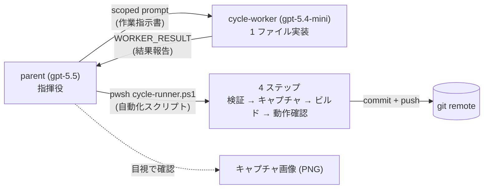

> 本記事は、個人開発中の HD-2D 探索アクションアドベンチャー **Anemora** の制作で組んでいる、Codex CLI のサブエージェント運用パターン「Cycle」の設計と数値結果を扱います。AI 協働のセッション間同期については先行記事 ([Codex CLIの同期設計](https://zenn.dev/marvelousu/articles/codex-cli-sync-design)) を参照してください。

## TL;DR

- 1 つの実装サイクルを「`parent` (gpt-5.5) が手順書を書く → `cycle-worker` サブエージェント (gpt-5.4-mini) が 1 ファイル (+ 明示した関連ファイル) を実装 → 4 フェーズのバッチで自動 commit/push」という形に固定しました
- per-thread のトークン消費が **約 36.7M → 約 6.0M(約 1/6、84% 減)** に下がりました(Anemora 関連 348 スレッド、`state_5.sqlite` 直照会)
- 連続自走時間も伸びました。最長 **22.5 時間連続で動き続けたラン** があり、私がレビュー用に別プロンプトを差し込んだのが切れ目です。抽象度の高いゴールならさらに長く回せます
- workers サブエージェント自体は移行前から使っていました。境界の本質は「workers を導入した」ではなく「**使い方を再設計した**」ことです
- 全部の自動チェックが通っても、見た目の欠陥が残るケース (後述) はそのまま残ります。**自動チェックは目視確認の代わりにはなりません**
- 配布キットを GitHub で公開しています: https://github.com/marvelousu/codex-cycle-kit

## 1. 何を変えたか

先行記事 [Codex CLIの同期設計](https://zenn.dev/marvelousu/articles/codex-cli-sync-design) の時点でも、`parent` (gpt-5.5) + `worker` 数体の並列運用は既に組んでいました。ただし `worker` 側にも gpt-5.5 を割り当て、ある程度のサイズのタスクを 1 回で渡していたので、1 セッションあたりのトークン消費が大きく、失敗時のリカバリも手作業中心で `parent` の手が空かないという規模の壁にぶつかりました。そこで、「役割編成」「手順書」「1 Cycle の形」の 3 点を同時に変えました。

### 1.1 役割編成 (モデルの振り分け)



- `parent` (gpt-5.5):重い意思決定、手順書の作成、キャプチャ画像の確認、コミット内容のレビューを担当します。実装はしません
- `cycle-worker` (gpt-5.4-mini):メインのファイル 1 つと、許可リスト形式で明示した関連ファイルだけを編集する小型ワーカーです。helper メソッドを 1 つ追加し、既存の呼び出し側に 1 行でつなぐのが基本パターンです
- `cycle-runner` (PowerShell):検証 → キャプチャ → ビルド → 動作確認の 4 フェーズを順に回し、全部通れば commit + push まで進む自動化スクリプトです

### 1.2 「手順書」の定義

`parent` が `worker` に渡す scoped prompt (作業指示書) の項目を埋めて固定形にしました。

| 項目 | 中身 |
|---|---|
| authored file | 編集対象のメインファイル、1 つ |
| 関連ファイル | 編集して良い範囲を明示する。ワイルドカードは使わない |
| 実装内容 | 2〜6 行で具体的に書く (「helper メソッドを追加して X 呼び出し側に 1 行入れる」レベル) |
| Validate / Capture メソッド名 | 検証 / キャプチャ用のメソッド名。`WORKER_RESULT` (結果報告ブロック) に入れて返させる |
| Project gates | プロジェクト固有の規律ゲートを毎回再掲する |
| やってはいけないこと | commit / push / バッチ起動 / テスト追加 / 範囲外編集の禁止 |

このテンプレを `~/.codex/skills/cycle-start/` に skill として置き、`parent` セッションから `/skill cycle-start` で呼び出します。

### 1.3 1 Cycle の形

1 cycle = 1 ファイル (+ 関連) 実装 + 1 commit + 1 push + 1 screenshot + 1 devlog (開発記録の md ファイル、Anemora では `docs/devlog/` 配下に置いている) を 1 単位にしました。

```
[parent]  /skill cycle-start で scoped prompt 生成
   ↓ multi_agent.spawn(cycle-worker)
[worker]  1 ファイル + 関連ファイルを編集 → WORKER_RESULT を返す
   ↓
[parent]  pwsh cycle-runner.ps1 を起動
   ↓ validate → capture → build → smoke → commit + push
[parent]  キャプチャ画像を目視で確認
```

`parent` の手元には「作業指示書の項目を埋める」「キャプチャ画像を目視で確認する」の 2 点だけが残ります。なお `cycle-runner` は `-SkipPush` を付けると push を抑制して commit までで止められます (詳細は次節)。

### 1.4 なぜ push まで自動にしたか

各サイクルの完了時に push まで自動で進めるのをデフォルトにしたのは、AI が私の眠っている間や外出中にも回り続けるので、**後で各サイクルを遡れる証跡**と、**スマホから GitHub で進捗を眺める遠隔監視**を兼ねる、という個人開発の事情です。チーム開発で PR レビューが前提なら、`cycle-runner` に `-SkipPush` を渡せば push を切って commit までで止められます。

## 2. 壊さず回すガードレール (4 層)

サブエージェントに任せても暴走しないよう、4 つのガードレールを置きました。

1. **編集スコープ = 1 + N の許可リスト**:`worker` はメインのファイル 1 つと、明示列挙された関連ファイルだけを編集します。ワイルドカード (glob) は渡しません。これが破られると 1 サイクルの追跡ができなくなります
2. **「helper メソッド + 1 行接続」の実装パターン**:既存の呼び出し側のリファクタ、メソッドの改名、新しいトップレベル構造 (class / module / service) の追加は禁止です。これらは `parent` の領分です
3. **`WORKER_RESULT` 契約**:`worker` は最後に `authored_file / side_effect_files / validate_method / capture_method` をコードブロックで返します。`cycle-runner` はこの 4 つで起動します
4. **スコープ拡大の申告経路を残す**:`worker` がスコープ内で実装できないと判断したら、`status: scope_widen_required` を理由付きで返します。これがないと、処理能力の足りない `worker` が黙ってスコープを広げ、コスト削減が崩壊します

## 3. 結果

数値は Codex CLI の内部状態 DB `~/.codex/state_5.sqlite` の `threads` テーブルを直接 SELECT して集計しました。Anemora 関連 348 / 410 スレッド (85% カバー、`first_user_message` と `cwd` の文字列フィルタ) を対象にしています。

### 3.1 Era 別の 1 スレッドあたりトークン平均

| Era | 期間 | スレッド数 | 合計トークン | **平均 / スレッド** |
|---|---|---:|---:|---:|
| Era1 (以前の運用) | 2026-05-04 〜 05-18 | 約 168 | 約 6.16 G | **約 36.7M** |
| Era2 (Cycle 運用) | 2026-05-19 〜 05-23 | 約 180 | 約 1.08 G | **約 6.0M** |

平均トークン消費が **約 36.7M → 約 6.0M (約 1/6、84% 減)** になりました。スレッド数 (= サイクル数) は Era2 でむしろ同等以上に出ているので、「数を減らして合計を下げた」のではなく、「1 サイクルあたりが本当に軽くなった」結果です。

なお、`worker` サブエージェント自体は Era1 から既に使っていました (`agent_role='worker'` の初出は 2026-05-05、プロジェクト 2 日目)。ただし当時は `worker` も gpt-5.5 で動かし、大きめのタスクを 1 回で渡していたため、出発点がもともと高めだった点には注意してください。84% 減という数字はこの高い出発点からの相対値で、はじめから軽量モデルでサブエージェントを回しているプロジェクトでは削減幅は小さくなります。Era 境界の本質は workers を導入したことではなく、その**使い方を再設計**したことです。

Era 境界はキッパリ切れているわけではなく、Fast VS 公開 (2026-05-18) を契機に 05-19 〜 05-20 の数日で段階的に移行しました。1 日ベースで見ると、05-17 の平均 30.1M が翌 05-18 で 3.5M、05-19 で 4.4M、05-20 で 6.5M、と急減しています。

### 3.2 因果分解

1 サイクルあたりのトークン減は、おおむね次の 4 つに分けられます (内訳の数値配分は厳密に計測していないので、寄与の方向です)。

- 1 サイクルで触るファイルを 1 つ + 関連ファイルに絞ったことで、他のファイルを横断して読み込むコストが消えた
- `worker` をほぼ全部 gpt-5.4-mini に乗せ、長い文脈を扱える重いモデル (gpt-5.5) は実装をしない `parent` の指揮役だけに専念させた
- 自由会話形式の QA をやめ、決まった検証メソッドを呼ぶ自動チェックに置き換えた
- 失敗時にスコープ拡大を申告する経路 (`scope_widen_required`) を `WORKER_RESULT` に組み込んだので、モデルの処理能力不足が暴走サイクルにならず、早い段階で表に出るようになった

### 3.3 連続自走時間

別の指標として「1 セッションが何時間連続で止まらなかったか」があります。Cycle 運用に乗せた後の最長記録は **22.5 時間** で、これは私がレビュー用のプロンプトを差し込んだ時点で区切れたものです。抽象度の高い指示 (たとえばグラフィック改善のような大きいゴール) を与えれば、原理上はサイクル列を切らずに連続実行できます。タイトルの「長時間連続自走」はこのあたりが根拠です。

## 4. 詰まった所

### 処理能力不足のとき、スコープ拡大の経路を畳まない

あるサイクルで、gpt-5.4-mini の `worker` に 2 回依頼しましたが、両回ともモデルの処理能力不足で失敗しました。2 回目の `worker` は途中までの実装を残していたので、`parent` 側でコンパイルが通らないリスクを修正し、サイクルをローカルで完了させて、ブランチを止めない判断を取りました。

教訓として、`worker` から `status: scope_widen_required` が返ったとき、あるいは途中までの実装が残ったとき、`parent` が引き取る規律を残しておく必要があります。スコープ拡大の経路を「再依頼すれば良い」と畳むと、処理能力の壁にぶつかった瞬間に詰まります。

### 自動チェックは全部通った、目視では NG

別の例として、§1.3 で説明した 4 ステップ (検証 → キャプチャ → ビルド → 動作確認) が全部通り、自動で commit と push まで完了したサイクルがありました。ところが `parent` 側でキャプチャ画像を目で確認すると、家の外観の影の入り方 (黒い壁面の周辺) に違和感が残っていました。次のサイクルでは先に確認用カメラの構図を調整してから、影の調整に戻る、という順番で判断しました。

**自動チェックは目視確認の代わりにはなりません**。検証メソッドが通ること、キャプチャ画像が出ること、これ自体は「絵柄が OK」ではなく「絵柄を判定する素材が揃った」だけです。最後の判断は `parent`、あるいは `parent` セッションを動かしている人間が下します。

### 配布キットの hardening について

配布キットの `cycle-runner` は良い骨格ですが、Anemora リポに投入したときには 5 つの修正 (失敗時の rollback 回避、commit パスの限定、バッチ引数渡し、プロセス完了待ち、失敗ログ生成) を入れる必要がありました。配布キットがそのままどんなプロジェクトでも動くという宣伝はしません。具体的なフラグや差分は配布リポ ([codex-cycle-kit](https://github.com/marvelousu/codex-cycle-kit)) の README を参照してください。

## 5. 再現用テンプレ (配布キット)

実物を配布キットとして GitHub で公開しています: **https://github.com/marvelousu/codex-cycle-kit**

最小構成として、skill だけ手元に入れる例:

```bash
git clone https://github.com/marvelousu/codex-cycle-kit.git tmp \
  && cp -r tmp/skills/cycle-start ~/.codex/skills/ \
  && rm -rf tmp
# Codex CLI 再起動 → /skill 一覧に cycle-start が出れば完了
```

`cycle-runner` は Unity Editor 既定ですが、`-BatchTool` で他のバッチコマンドに差し替えできます。フルインストール、非 Unity 系への適用、各フラグ、プロジェクト固有の規律ゲートの詳細はリポの README を参照してください。

## 6. 残課題

- **コミットメッセージの件名に BOM のような prefix が混じる**:`git log` で確認できます。devlog の `.md` ファイルの H1 行を BOM なしの UTF-8 として読む修正が、次の `cycle-runner` の修正で必要です
- **Unity のバッチ実行で関連ファイルが dirty 化する**:`-CommitPath` で誤 commit は防げますが、`parent` は実行後に dirty なファイルを手で片付ける必要が残ります
- **失敗時の処理**:`-NoRollback` で安全側 (リセットしない) に倒しましたが、作業ツリーは触らず devlog に構造化した失敗レポートを追記する方向が本来の終点です
- **目視確認は今のところ機械化しない**:前章の実例どおり、自動チェックが通っても見た目の欠陥は残り得ます。最後の目視確認を自動化する道は、今のところ取らない方針です

## 7. おわりに

ここまでが、Anemora の制作で 1 週間ほど続けてきた Cycle 運用の記録です。`parent` と `worker` の役割を「指揮 / 実装」に分け、1 サイクルを 1 ファイル (+ 関連) + 1 コミットに縮めただけのもので、AI 側の高機能化を待たずに依頼の出し方を絞っただけで結果が変わりました。同じく Codex CLI や Claude Code 系のサブエージェントを並列で動かしている方の参考になれば幸いです。

なお、この Cycle 運用で進めている Anemora 自体は、先日 [体験ビルドを公開しました](https://zenn.dev/marvelousu/articles/anemora-fast-vs-release)。現状、コア機能「時の窓」の体験というレベルですが、興味があればそちらもどうぞ。
