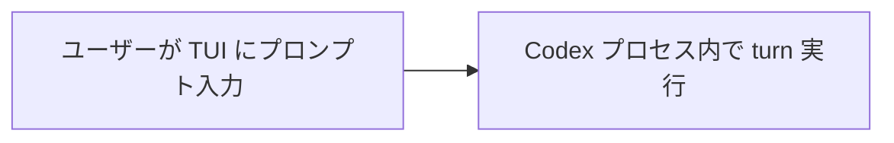
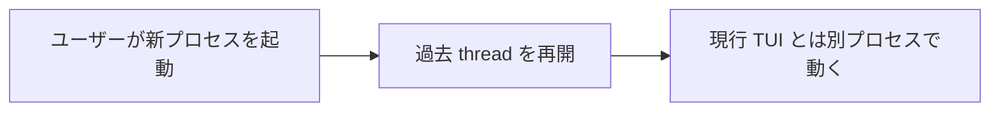
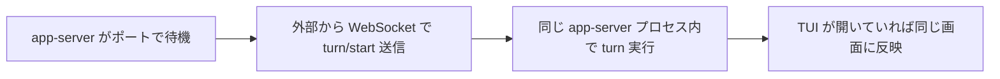
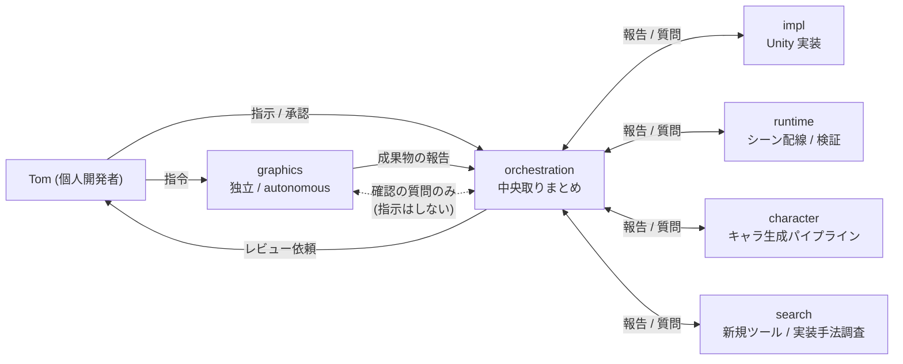

> 本記事は個人開発中の HD-2D 探索アクションアドベンチャー **Anemora** の制作中に組んだ、Codex CLI のセッション間同期の設計と運用を扱います。プロジェクトの紹介は先行記事 ([Anemora 紹介記事](https://zenn.dev/marvelousu/articles/anemora-hd2d-time-frame))、人間側の役割の振り返りは ([AIが手を動かす個人ゲーム開発で、人間が手放さなかった3つの仕事](https://zenn.dev/marvelousu/articles/anemora-human-work)) を参照してください。

## TL;DR

- **開いている Codex セッションに、 別の Codex から直接プロンプトを送り込める** PowerShell ツール (約 470 行) を、 Codex CLI の `app-server` モードの上に作りました
- それまでは「中央取りまとめ役の Codex が prompt を吐く → 内容確認しつつ別マシンの Codex CLI に手でペースト」 で回していましたが、 引き継ぎ書 (`~/notes/_handover/` 配下の状態記録 markdown) が **日 70 件超** に乗ったあたりから手で介在し切れなくなりました
- `send <thread> "..." --wait <sec>` で **「turn 完了まで待つ (= 人間レビュー点)」** と **`--wait` 無しで連打する (= 手放し自走)** を、 同じ送信面で切り替えられます
- 9 日間の引き継ぎ書推移は 5 → 89 → 12 → 7 → 21 → **76 (手動限界)** → **40 (道具導入)** → **86 (安定運用)** → 16 件。 6-7 日目で手動運用が限界化、 8 日目に道具経由で同等以上のスループットに乗りました
- graphics 領域だけは取りまとめ役の配下に置くと **報告も指示も双方向で届かないように見える状態が頻発し、 セッションの立て直しや task 分割の対策でも解決しなかった** ので、 独立 autonomous で走らせて「報告と確認の質問」 だけ取りまとめ役と繋ぐ構造にしました
- 本記事は **app-server API の網羅解説ではなく、 AI セッション運用で「同期点」 をどう作るかという話** です

## 0. 動機 — なぜ作ったか

Anemora の制作を始めて約 1 週間で、commit が 150 件強、引き継ぎ書 (`~/notes/_handover/` 配下に置いている AI セッション間の状態記録) が 300 件超、worker としての AI セッションは日によって 3〜5 並列に膨らんでいました。当初は、中央取りまとめ役の AI セッションが prompt を吐く → 私が画面で内容を確認 → 別マシン (Windows) の Codex CLI に手で渡す、という運用で回していました。手で介在するので内容を毎回確認できるという良さがありますが、規模が出てくると以下の不便が積もっていきます。

- 引き継ぎ書の数が日 70 件を超えると、 全部に手で介在するのは時間的に厳しい
- 一方で、 バックグラウンドで自走している worker の状況を **こちらから様子を覗きに行きたい** 場面や、 **直接細かい指示を入れたい** 場面はそれなりの頻度で発生する
- 「全部自動」 と「全部手動」 のどちらに倒しても回らず、 **自動 ↔ 手動を気軽に行き来したい**

両方をそのまま 1 つのツールで切り替えられるなら、 手元の運用がそのまま伸びる、 というのが本ツールを作った動機です。 ここから先は、 それでどう作ったか、 何ができて何ができないか、 現行の運用構造はどうなっているか、 という話です。

## 1. Codex CLI の app-server で「開いている Codex に外からプロンプトを流せる」

Codex CLI には `app-server` というモードがあります。これは OpenAI 公式の文書では VS Code 拡張のような外部クライアントから Codex を駆動するための WebSocket + JSON-RPC エンドポイントとして紹介されているもので、通常の TUI 操作とは別ルートで Codex を制御できます。

### 用語ミニ定義

| 用語 | 意味 |
|---|---|
| **app-server** | Codex CLI が立てる WebSocket サーバー。`codex app-server --listen ws://127.0.0.1:<port>` で起動 |
| **thread** | 1 つの会話セッションを指す ID (UUID 風)、`019e0ed6-5ca3-...` のような文字列 |
| **turn** | 1 ターン (= ユーザー 1 発話 + アシスタント 1 応答) の単位 |
| **JSON-RPC** | リクエスト / レスポンスを JSON で投げる軽量プロトコル |
| **引き継ぎ書 / handover** | Anemora プロジェクト固有の運用、AI セッションの一区切りごとに書き残す状態 markdown |
| **orchestration / worker** | 中央の取りまとめ役と、その配下で個別 task をこなす役 (後述) |

### 通常 / resume / app-server send の 3 パターン

**A. 通常 codex**



**B. codex resume**



**C. app-server + 外部 send**



ポイントは **app-server 経由のパターン** で、**「app-server を経由すれば、ユーザーが TUI で対話している現役セッションに対して、外部から JSON-RPC で turn を発火できる」** ということ。これは他の 2 つのパターンにはない性質です。ざっくり言えば、 **画面を開いたまま、別プロセスから「Enter を押したのに近い体験」 を外部から作れる** という形に近いです。

## 2. 自前ツールの設計

実装した PowerShell スクリプトは 1 ファイル / 約 470 行で、以下の 7 サブコマンドを持ちます。

| サブコマンド | 用途 |
|---|---|
| `new` | 一発で app-server 下に新規セッションを立ち上げる |
| `start <thread-id>` | 既存 thread に対して app-server を立て、Windows Terminal の新タブで TUI に接続 |
| `send <thread-id> <message> [--wait <sec>]` | 既存セッションに JSON-RPC で turn を送信。`--wait` 付きで turn 完了まで待機 |
| `list` | 管理中のセッション一覧 |
| `status <thread-id>` | 1 セッションの状態 (プロセス生存 / ポート listening) を確認 |
| `stop <thread-id>` | app-server プロセスを停止し、token / launcher を片付け |
| `init-check <thread-id>` | app-server に WebSocket で接続し、thread のロード状態を返す |

中身の設計をざっくり並べると (運用上の中心は `start` / `send` / `list` / `status`):

- **状態の永続化**: `~\.local\state\<tool>\sessions.json` に `thread_id ↔ port ↔ pid ↔ launcher パス ↔ resume 引数` を保存。 *(理由: プロセスを跨いで `list` / `status` / `send` を成立させたい)*
- **認証**: capability-token 方式で 32 byte CSRNG ベースのトークンを `--ws-token-file` 経由で Codex CLI に渡し、WebSocket 接続時に `Authorization: Bearer <token>` ヘッダで送る。 *(理由: ループバック接続限定 + セッションごとに別トークンで分離)*
- **空きポート**: `[System.Net.Sockets.TcpListener]::new([IPAddress]::Loopback, 0).LocalEndpoint.Port` で動的取得。 *(理由: 複数セッションが固定ポート衝突なしで並列に立つ)*
- **launcher 自動生成**: 各セッション専用の `launch-<thread>.ps1` を起こして、TUI 側で `codex resume --remote ws://... --remote-auth-token-env CODEX_REMOTE_TOKEN <thread>` を実行する形にしている。 *(理由: 同じ接続を任意のシェルから再現可能にする)*
- **TUI タブ自動オープン**: `wt.exe -w 0 new-tab --title "codex:<thread頭8桁>" powershell.exe ... -File <launcher>` で Windows Terminal に直接タブを開く。 *(理由: `start <thread-id>` 一発で「app-server + 接続 + 操作画面」 が揃う)*

このうち目立つのは launcher の自動生成と Windows Terminal タブ起動で、これで `start <thread-id>` を打つだけで、**app-server が裏で立ち、新しい Terminal タブに TUI が開き、外部から `send` を投げられる状態が一発で揃う** という体験になります。

## 3. 利点 3 つ — 「同期設計」とは何か

タイトルに「同期設計」 と書きましたが、これは技術用語の同期 (sync I/O 等) ではなく、 **「AI とのやり取りで『どこで一旦止まって確認するか』 をツール側で選べるようにする」** という意味です。 `send <thread> "..." --wait 300` なら「送って、 完了まで待って、 内容を確認してから次へ」、 `--wait` 無しなら「送って即次へ進む」。 同じ 1 つのコマンドで両方の流れが組めるところを、 本記事では「同期設計」 と呼んでいます。

3 つの利点を順に。

### ① ルーティングの自由度

中央の取りまとめ役のセッションから、その配下の worker セッションへ送る、という形にも組めるし、ユーザーが直接特定の worker セッションへ送る、という形にも組めます。同じツールが両方をカバーするので、用途に応じて経路を変えるだけで運用がそのまま回ります。

### ② 会話状態を持ったまま接続できる

これが「単にプロンプトを別セッションに渡す」だけのツールとの一番の違いです。app-server に接続している限り、TUI で見ているのと同じ thread に外から turn を流すので、**過去のやり取りも、現在の会話状態も、TUI を開けばそのまま確認できる**。Codex 側から見れば、ユーザーが手入力した turn と外部から `send` で送られた turn は、同じ thread の連続した turn として扱われます。

### ③ 「レビューついで」と「手放し連打」を切り替えられる

これが日々の運用で一番効きます。

```bash
# レビューを兼ねたい時 (人間が同期点を入れる)
codexctl send <thread> "次の task ..." --wait 300

# 手放しで自走させたい時 (送って即次へ進む)
codexctl send <thread> "次の task ..."
```

前者の `--wait 300` は、 送った turn が **`turn/completed` イベントを受け取るまで** CLI 側がブロックする (最大 300 秒)。 待っている間に対応する TUI タブを開けば実行中の流れも見えるので、 完了したタイミングで成果物を確認してから次の指示を組み立てる、 という運用になります。後者は送ったら即 return するので、複数 worker に backlog を流し込んで、ユーザーは別の判断に時間を使う、という運用が可能。

これまで手で介在していた場面で得られていた「内容を読みながら確認できる」 という体験は、`--wait` 付き send で同じことができます。コピーで担保していた「人が間に入る点」 を、明示的なフラグで再現できる形にしました。

### 実運用例

実際に動いている例を 2 つ。

**例 1: 中央取りまとめ役 → worker への task 振り分け**

取りまとめ役セッションから各 worker に `codexctl send <thread> "..."` で task を振ります。 worker は受け取った turn を消化し、 完了後に成果物のパスや報告 markdown を取りまとめ役に流す。これが日常運用の主流です (詳細な構造は §4 で扱います)。

**例 2: 独立目的のセッション ↔ 取りまとめ役の対話**

主たる task ループから外れた独立目的のセッションを立てるケース、 例えば **AI 関連ツールの採用検討セッション (3D モデル生成ツールの比較、 メカ実装手法の選定など)** や、 開発支援用の小道具を作るセッション、 などがあります。

こうしたセッションに「実装中、 仕様で迷ったら都度 orchestration に確認してください」 と伝えておくと、 セッション側から `codexctl send <orchestration> "..." --wait 300` を投げ、 orchestration が回答 turn を返し、 それを取り込んで作業を続ける、 という対話進行が成立します。codexctl の送信ルートを使えば、 誰からでも、 誰に対しても、 同じ方法で通せます。

## 4. 現行の運用構造

現在の運用構造はおおよそこういう形です。



役割の中身:

- **orchestration**: 全体の取りまとめ役の AI セッション。各 worker への指示振り分け、報告受け、まとめ
- **impl**: Unity の C# 実装と Scene 配線
- **runtime**: 実行時の振る舞い (Editor Play / Standalone 起動) の検証
- **character**: ドット絵キャラクターの生成パイプライン (下絵生成 → 仕上げ → import)
- **search**: 新しい AI ツールや実装手法の事前調査 (例: 3D モデル生成ツール、ゲームメカ実装のパターン検討)
- **graphics**: グラフィック改善の自走セッション。なぜ独立にしているかは §5 で

私 (ユーザー側) は orchestration には日常 task の指示を出し、 graphics に対しては私だけが指令を流す、 という構造です。

## 5. graphics だけ独立にした理由

graphics も最初は orchestration (取りまとめ役) の配下に置く形で運用していました。ところが、**配下にすると報告や指示が両方向で届かないように見える状態が頻発し、報告タイミングで作業が止まる現象が多発しました**。

観測された症状を並べると:

- worker (graphics) → orchestration への報告が orchestration 側に届いているように見えない
- orchestration → worker (graphics) への指示も同様に届いているように見えない
- 報告のタイミングで worker が待機状態に入り、 そのまま作業が止まる

原因は今のところ突き止められていません。同じ仕組みを使っている他の worker (impl / runtime / character / search) では同様の停止は起きていないので、 graphics 特有の何か (= 出力サイズ? turn の長さ? その他?) に引っかかっていそうですが、 特定できていません。あくまで現象としてそう **見える** 段階で、 原因の断定はしていません。

配下のまま動かす形でも何とか回せないかと考えて、 セッションを立て直したり、 task サイズを小さく刻んだり、 報告の頻度を下げたりも試しました。 ただ、 いずれの対策も根本的には解決せず、 立て直し直後はしばらく動くものの、 すぐ同じ症状が再発する、 というパターンが多かったです。

最終的に、 graphics は orchestration 配下から外して **独立 autonomous で走らせる** 構造に切り替えました。具体的には:

- **指令は私 (ユーザー) からだけ流す**。グラフィック改善のテーマや方針は私が直接 graphics セッションに渡す
- **orchestration → graphics への指示は流さない**。 他 worker からの干渉も入らない
- **graphics → orchestration への報告は一方的に流す**。 成果物の場所や進捗を orchestration に伝える
- **確認事項があれば、 双方向で質問だけはする**。 ただし「指示」 ではなく「問い合わせ」 として扱う

これで止まらなくなりました。

副次的な観察として、**配下に組み込まないほうが自走が止まりにくい** という運用則らしきものは感じています。 ただしこれは graphics 単独の事例で、 まだ十分に検証できていません。 今後 search や character でも同じ傾向が出るかは、 引き続き観察対象です。

## 6. 結果の数値 — 手で介在する運用が限界化した日と、同期設計が効いた日

日別の引き継ぎ書数の推移は以下のようになっています (プロジェクト開始日を 1 日目とする)。 なお、 ここでの「handover 1 件」 は task 完了 / 報告 / 判断待ち等を含むため、 厳密な成果量ではなく **「人間が介在する機会の近似値」** として読んでください。

| 日 | handover (件) | 何が起きていたか |
|---|---|---|
| 1 日目 | 5 | コンセプト議論 (取りまとめ役とユーザーの対話中心) |
| 2 日目 | 89 | Vertical Slice 実装ピーク。5 並列 worker が同時生成、取りまとめ役が逐次取りまとめ |
| 3 日目 | 12 | Stage 3 締め、起動不具合修復 |
| 4 日目 | 7 | Stage 4 入口、自律作業ガイドラインを起草 |
| 5 日目 | 21 | 第 1 章の設計開始 |
| **6 日目** | **76** | **シーン設計詳細化。1 日あたりの handover が再度 70 件超に乗り、手で介在するのが厳しくなり始める** |
| **7 日目** | **40** | **道具を導入。途中まで手で介在、途中から send 経由に切替** |
| **8 日目** | **86** | **安定運用。2 日目ピークに匹敵する量を、手放し + 確認の併用で処理** |
| 9 日目 | 16 | (本記事執筆時点で進行中) |

2 日目 (89 件) と 8 日目 (86 件) はどちらも 80 件超ですが、2 日目は「5 並列 + ユーザーは画面に張り付き」 で達成した量、8 日目は「`send` で配り、`--wait` で確認を差し込みつつ」 達成した量です。6 日目の 76 件で手で介在する運用の限界が見えて、7 日目に道具を入れて、8 日目で同等以上の量に乗った、という流れになりました。

2 日目の 89 件は「ユーザーが画面に張り付いていた日」 でもあり、再現可能性は低い。8 日目の 86 件は「ユーザーが別の判断に時間を使いつつ達成した量」 という違いがあります。

## 7. 残課題

現時点で残っている課題:

- **graphics 配下停止の原因不明**: §5 のとおり、なぜ graphics だけ配下で止まるかが分かっていない。orchestration ⇔ worker 間の特定のパターン (= 指示の長さ? 報告の頻度? 並列数?) で発生していそうだが、特定できていない
- **Codex CLI のバージョン依存**: app-server の JSON-RPC 仕様は公式 docs と GitHub repo に書かれているものの、Method 名やイベント名は内部 API 寄りで、CLI のバージョン更新で変わる可能性がある (執筆時点では Codex CLI `0.130.0` で動作確認)
- **エラーリカバリ**: 現状の `send` 失敗時の挙動はやや雑で、token 期限切れや app-server クラッシュからの自動復帰は実装していない (= 手で `stop` → `start` する)
- **自走中の品質ゲート**: `--wait` 無しで連打する自走運用では、AI が出す成果物の品質保証が orchestration 側に集中する。orchestration セッション側の判定能力が事実上のボトルネックになりつつあり、ここは別の論点として残っている

## おわりに

ここまでが、 個人ゲーム開発で AI agent CLI を複数並列に動かす形を約 1 週間続けてきた中で見えてきたことの記録です。 前半は手で介在する経路で、 後半は app-server 経由の `send` に切り替えた形で、 運用としてはひと続きの 1 週間でした。 ツール本体自体は数時間で出来上がりましたが、 配下の構造を整えたり、 graphics 領域だけ独立に切り出したり、 という運用側の調整は数日かけて少しずつ整っていきました。 似た規模で AI agent を並列運用している方や、 これから始めようとしている方の参考になれば幸いです。

## 参考

- Anemora 紹介記事 (先行記事): [Anemora — HD-2D 探索 ADV を AI 協働で個人開発する](https://zenn.dev/marvelousu/articles/anemora-hd2d-time-frame)
- Anemora 制作者目線の振り返り: [AIが手を動かす個人ゲーム開発で、人間が手放さなかった3つの仕事](https://zenn.dev/marvelousu/articles/anemora-human-work)
- OpenAI Codex 公式: [App Server](https://developers.openai.com/codex/app-server) / [Remote connections](https://developers.openai.com/codex/remote-connections) / [codex-rs/app-server (GitHub)](https://github.com/openai/codex/blob/main/codex-rs/app-server/README.md)
