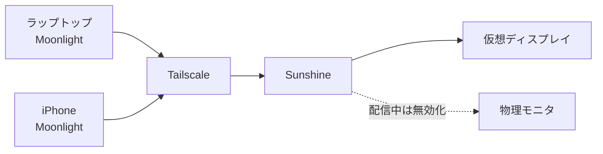

> 本記事では、リモートデスクトップのホストになれない Windows 11 Home のデスクトップを、モニタの電源を切ったまま手元のラップトップと iPhone から操作できるようにするまでを書きます。Sunshine と Moonlight を Tailscale 越しに組む構成と、ヘッドレスで運用して初めて分かったことをまとめました。

## TL;DR

- Windows 11 Home はリモートデスクトップの**ホストになれない**ため、PC ゲームを別の端末へ配信して遊ぶためのソフトである Sunshine (配信側) と Moonlight (受信側) を Tailscale 越しに使いました。クライアントは Windows のラップトップと iPhone で、宅内なら 1920x1080 の 60fps、体感の遅延はほぼありません。
- 導入して一番変わったのは、**SSH だけでは届かなかった作業ができるようになった**ことです。GUI アプリを動かして挙動を見ながらデバッグしたり、AI エージェントに作業を任せているときに出てくる確認ダイアログを手元から押したりできます。
- 物理モニタの電源を切ると、ケーブルは挿さっていても Windows からは抜かれたものとして扱われます。**配信する画面そのものが無くなる**ため、常設の仮想ディスプレイを1枚足すのがヘッドレス運用の前提でした。
- 構築自体は1日で終わり、時間を取られたのはその後でした。Web UI が HTTPS 専用という導入時のつまずきから、**自動ログオンや状態ファイルの残留といったヘッドレス固有の問題**まで6つあり、いずれも症状から原因が読み取りにくいものでした。

## はじめに

リビングのラップトップから、別室に置いたデスクトップ機を使いたくなりました。動機は2つあります。1つは、ゲーム開発のように GUI が要る重い作業を、ラップトップの発熱と電池を気にせず回したかったことです。もう1つは、ラップトップを持って外に出たあとも、デスクトップ側で動かしている作業を止めずに続けたかったことです。

最初に調べて詰まったのが、この機体が Windows 11 Home だったことです。Windows のリモートデスクトップは、接続する側は Home でも使えますが、**接続される側 (ホスト) になれるのは Pro 以上**です。Pro へのアップグレードを買うか、別の方法を探すかの二択になりました。

結果として選んだのが **Sunshine** と **Moonlight** の組み合わせです。手元の PC で動かしているゲームを別の端末へ配信して遊ぶためのソフトで、どちらもオープンソースです。デスクトップ全体を配信できるので、そのままリモートデスクトップとして使えます。導入してからは、モニタの電源を落としたまま 1920x1080 の 60fps で操作できています。

構築そのものは1日で終わりました。手こずったのはその後で、**モニタを消すと配信が成立しない**、**配信解像度が 800x600 に落ちる**、**自動ログオンが通らない**といった、ヘッドレス運用に固有の問題が順に出てきました。手順と一緒に、そこで分かったことを書きます。

対象の機体は Intel Core i7-10700 と GeForce RTX 2070 SUPER を積んだ Windows 11 Home のデスクトップです。以下、IP アドレスやホスト名は伏せてあるので、自分の環境の値に読み替えてください。

## なぜ Sunshine と Moonlight なのか

Sunshine は配信側 (ホスト) のソフトで、Moonlight は受信側 (クライアント) のソフトです。もともと NVIDIA GameStream の互換実装として作られたもので、Sunshine が画面をエンコードして流し、Moonlight が受け取って表示し、キーボードとマウスの入力を送り返します。

この構成にした理由は2つあります。

1つは前述のとおり、Windows 11 Home がリモートデスクトップのホストになれないことです。VNC 系という選択肢もありますが、画面全体を毎回転送する方式は 3D 描画を伴う作業には向きません。

もう1つは、GPU のハードウェアエンコーダを使えることです。RTX 2070 SUPER には NVENC という映像エンコード専用の回路が載っていて、これは CUDA コアとは別に用意されています。エンコードを専用回路に任せられるので、配信しながら重い作業を回してもエンコードのぶんの負荷がほとんど乗りません。

Parsec のような商用サービスも同じ領域にありますが、今回はアカウントを介さず自宅内で完結させたかったので、自前で立てられる Sunshine を選びました。

## 構成

| 役割 | 内容 |
|---|---|
| ホスト (配信) | Windows 11 Home / Core i7-10700 / RTX 2070 SUPER。Sunshine と仮想ディスプレイドライバを導入 |
| クライアント (受信) | Windows のラップトップと iPhone。どちらも Moonlight |
| 経路 | Tailscale で直結。宅内では実質 LAN 速度で、ping は 9ms 程度 |



Tailscale を挟んでいるので、宅内でも外出先でも同じ手順で接続できます。ポートを自宅のルータで開ける必要もありません。

## モニタを消すと配信するものが無くなる

ヘッドレス運用でまず突き当たるのがこれです。

Sunshine は、そのとき Windows につながっているディスプレイの内容を配信します。ところが Windows から見て**ディスプレイが1枚も無い状態では、配信する画面が存在しません**。モニタを物理的に外した場合はもちろんですが、やっかいなのは **モニタの電源を切っただけでも同じ扱いになる**ことです。HDMI や DisplayPort にはホットプラグ検出の信号があり、モニタの電源が落ちるとこの信号が失われるため、Windows はケーブルが抜かれたのと同じように扱います。

つまり、モニタの電源を落としたまま遠隔から使うには、物理モニタとは無関係に常設される画面が要ります。ここで使うのが仮想ディスプレイドライバです。ソフトウェア上でディスプレイを1枚増やすもので、物理モニタが何枚つながっているかに関係なく存在し続けます。

Sunshine 側は、この仮想ディスプレイを配信対象に指定して使います。

```ini
output_name = {ディスプレイの device_id}
dd_configuration_option = ensure_only_display
dd_resolution_option = auto
dd_refresh_rate_option = auto
```

`output_name` は配信するディスプレイの指定です。Windows では device_id を書きます。値は Sunshine のログに出る「Currently available display devices」の一覧から拾えます。

`dd_configuration_option` に指定した `ensure_only_display` は、公式ドキュメントでは「そのディスプレイが無効なら有効化し、他をすべて無効化する」と説明されています ([Configuration](https://docs.lizardbyte.dev/projects/sunshine/master/md_docs_2configuration.html))。配信を始めると仮想ディスプレイだけが有効になり、配信を終えると元のレイアウトに戻ります。

:::message
この設定を使うと、**配信中は物理モニタ側が消えます**。仕様どおりの動作で、故障ではありません。同じ部屋にいる誰かが物理モニタを見ている状況では使えない設定です。
:::

## 導入手順

### Sunshine を入れる

winget から入ります。

```powershell
winget install --id LizardByte.Sunshine
```

`SunshineService` というサービスが登録され、自動起動になります。47984、47989、47990 の各ポートで待ち受けます。

### ファイアウォールを Tailscale の範囲に絞る

既定のルールは同じネットワークからの接続を広く許してしまうので、Tailscale の範囲だけに絞ります。

```powershell
Set-NetFirewallRule -DisplayName Sunshine -RemoteAddress 100.64.0.0/10
```

`100.64.0.0/10` は Tailscale が使うアドレス範囲です。これで、同じ宅内 LAN につながっただけの端末からは届かなくなります。来客の端末や、家族が持ち込んだ機器を巻き込まないための設定です。

### 仮想ディスプレイドライバを入れる

[Virtual Display Driver](https://github.com/VirtualDrivers/Virtual-Display-Driver) のドライバ本体の zip を落として、適当なフォルダに展開します。`.inf`、`.cat`、`.dll` と設定ファイルの `vdd_settings.xml` が入っています。

署名証明書を信頼させてからインストールします。証明書を `LocalMachine\TrustedPublisher` に入れておくと、インストール時に確認ダイアログが出ません。

```powershell
devcon install <展開先>\MttVDD.inf Root\MttVDD
```

`devcon` は Virtual Display Driver の管理ツールの zip に同梱されています。やっていることは、デバイスマネージャの「レガシー ハードウェアの追加」と同じです。成功すると、ディスプレイが1枚増えます。


*インストール後のデバイスマネージャ。GPU の下に Virtual Display Driver が並ぶ*

### Sunshine の初期設定とペアリング

ブラウザで `https://<ホストのアドレス>:47990` を開き、ユーザー名とパスワードを作ります。


*Sunshine の Web UI。設定はすべてここから触れる。エンコーダ別のタブが並ぶのが特徴的*

続いてクライアント側に Moonlight を入れます。

```powershell
winget install --id MoonlightGameStreamingProject.Moonlight
```

Moonlight でホストの IP を指定して PC を追加すると PIN が表示されるので、それを Sunshine の Web UI の PIN タブに入力すればペアリング完了です。

ペアリングが済むと、Moonlight のアプリ一覧に **Desktop** という項目が出ます。これがデスクトップ全体の配信で、実質のリモートデスクトップです。


*ノート PC 側の Moonlight にホストのデスクトップが映っている状態。タイトルバーにホスト名が出る*

## ハマり所

構築中と運用開始後に詰まったところを6つ挙げます。どれも症状から原因が読み取りにくいものです。

### 1. Web UI がずっと読み込み中になる

47990 は TLS でしか待ち受けていません。`http://` で開くと平文の要求に何も返さないため、ブラウザは読み込み中のまま止まります。`https://` を明示してください。

疎通確認だけなら次のコマンドで足ります。

```bash
curl -sk https://<ホストのアドレス>:47990/
```

401 が返れば正常です。認証を求められている、つまりサーバは応答しています。

### 2. ログイン作成や PIN 送信が Internal Server Error になる

Web UI に localhost 以外からアクセスすると、画面は出るのに、ユーザー作成や PIN の送信だけが Internal Server Error で失敗します。CSRF 対策が効いていて、許可されていないオリジンからの送信を弾いているためです。

`sunshine.conf` に許可するオリジンを足してサービスを再起動すると通ります。

```ini
csrf_allowed_origins = https://<ホストのアドレス>:47990
```

公式ドキュメントでは「CSRF 保護のために追加で許可するオリジンのカンマ区切りリスト」と説明されていて、既定の localhost 系に追記される形になります。プロトコルとホストを含む完全な形で書く必要があります。

ホストのローカルで設定を済ませてしまえば起きない問題ですが、ヘッドレス運用だとそもそもホストの画面を見ていないので、最初にここで止まります。

### 3. 配信解像度が 800x600 になる

初回の配信でログを見たら `Desktop resolution [800x600]` の 30Hz でした。設定には `dd_resolution_option = auto` を書いてあるのに効いていない、と最初は考えました。

公式ドキュメントを読み直すと、この設定の説明は「クライアントが要求した解像度に変更する」で、続けて **Moonlight 側で「Optimize game settings」が有効なときに追加の解像度設定を行う**、と書かれていました。つまり無条件にクライアントへ追従する設定ではありません。この条件が揃わなければ、Sunshine は解像度の変更を要求せず、仮想ディスプレイは自分の既定モードのまま映ります。

そしてその既定モードが 800x600 の 30Hz でした。仮想ディスプレイの `vdd_settings.xml` には対応解像度の一覧が書かれていて、**その先頭が既定モードになります**。配布時の並びの先頭が 800x600 だったので、そのまま採用されていました。

対処は設定ファイルを直すことです。先頭を 1920x1080 の 60Hz にし、各解像度のリフレッシュレートを 30 から 60 に直しました。

反映にはドライバの読み込み直しが要ります。サービスの再起動やホストの再起動では変わりません。

```powershell
Disable-PnpDevice -InstanceId 'ROOT\DISPLAY\0000' -Confirm:$false
Enable-PnpDevice  -InstanceId 'ROOT\DISPLAY\0000' -Confirm:$false
```

これで `Desktop resolution [1920x1080]` の 60Hz、60fps、hevc_nvenc になりました。

なお、これはクライアントの解像度に自動で合わせているのではなく、**仮想ディスプレイ側の既定を固定して回避している**だけです。解像度の違うクライアントから使うときは考え直す必要があります。

### 4. 自動ログオンが通らない

ヘッドレス運用では、停電などでホストが再起動したときに、誰もログインしていない状態で止まると詰みます。サインイン画面のままだとログオン後に動くサービスが立ち上がらず、遠隔から手が出せません。そこで自動ログオンを有効にします。

Sysinternals の Autologon を使ったのですが、ユーザー名とドメインの組み合わせをどう変えても `The user name or password is incorrect` で弾かれ続けました。パスワードは合っています。

原因はレジストリのこの値でした。

```
HKLM\SOFTWARE\Microsoft\Windows NT\CurrentVersion\PasswordLess\Device
  DevicePasswordLessBuildVersion
```

既定値は 2 で、この状態では Microsoft アカウントのサインインに Windows Hello が必須になります。**パスワードによるログオン経路そのものが塞がれている**ため、正しいパスワードを渡してもログオン要求が必ず失敗します。0 に変更すると通るようになりました。

先に設定アプリを試す手もあります。アカウントのサインイン オプションにある「Microsoft アカウント用に Windows Hello サインインを求める」を切る方法です。ただしこの項目は環境によっては選べなくなっていることがあり、自分の環境ではレジストリ側を変えるまで解決しませんでした。

:::message alert
0 に変更すると、サインイン画面にパスワード入力の選択肢が戻ります。PIN はそのまま使えますが、セキュリティ設定を1段緩めていることは意識しておいてください。2 に戻すと自動ログオンも壊れます。
:::

ちなみに、有効化した後にレジストリを見ても `DefaultPassword` は存在しませんでした。パスワードは LSA の暗号化ストアに入るので、平文でレジストリに置かれるわけではありません。ドメイン欄にはコンピュータ名を、ユーザー名にはメールアドレスではなくローカルのユーザー名を入れる必要がありました。

### 5. Moonlight のホスト一覧が消える

Moonlight を `Stop-Process -Force` で終わらせたところ、次に起動したときにホストの一覧が空になり、いつまでも探し続ける状態になりました。レジストリには設定が残っているのに一覧に出てきません。

Moonlight は Qt で作られていて、終了時に設定を書き戻します。強制終了するとこの書き戻しが行われず、ホストの登録が失われます。

終了はストリーム中なら Ctrl+Alt+Shift+Q、コマンドからなら次のようにします。

```powershell
moonlight quit <ホストのアドレス>
```

壊れてしまっても、PC を手動で追加して PIN を入れ直せば元に戻ります。

### 6. 起動して10秒ほどで画面が消える

これはしばらく悩みました。ホストを強制的に電源断した後の再起動で、自動ログオンでデスクトップが出た約10秒後に画面が真っ暗になり、マウスを動かしても戻らなくなりました。ただし SSH は生きていて、コマンドはすべて通ります。マシンは動いていて、表示だけが失われている状態です。

原因は Sunshine が持っているディスプレイ構成の状態ファイルでした。`ensure_only_display` は配信中にディスプレイ構成を書き換え、配信終了時に元へ戻します。このとき、変更前の状態を `display_device.state` に保存しておいて、終了時にそれを見て復元します。

前回の配信が正常に終わらなかったため、このファイルには仮想ディスプレイだけが有効なトポロジが残っていました。サービスが起動するたびにその状態を処理しようとして、物理モニタが無効化されていたわけです。ログにも復元に失敗したエラーが残っていました。ログイン後10秒というタイミングは、サービスが立ち上がるタイミングでした。

復旧は SSH から3手で済みます。

```powershell
# 1. 仮想ディスプレイを無効化して物理モニタに強制的に戻す (ここで画面が復帰する)
Get-PnpDevice -Class Display |
  Where-Object FriendlyName -match "Virtual Display" |
  Disable-PnpDevice -Confirm:$false

# 2. サービスを止めて、残留した状態ファイルを退避する
Stop-Service SunshineService
Rename-Item <Sunshineの設定フォルダ>\display_device.state display_device.state.bak

# 3. 仮想ディスプレイを戻してサービスを起動する
Get-PnpDevice -Class Display |
  Where-Object FriendlyName -match "Virtual Display" |
  Enable-PnpDevice -Confirm:$false
Start-Service SunshineService
```

**画面が映らないからといって、マシンが落ちているとは限りません**。SSH が通るなら、疑うのは表示側の構成です。

## スリープ運用は諦めた

常時稼働のままだと電気代が気になったので、使っていない間はスリープさせて、必要なときに Wake-on-LAN で起こす運用を試しました。結論から書くと、この機体では成立せず、常時稼働に戻しました。

最初につまずいたのは、スリープの待ち時間を設定した瞬間に眠ったことです。

```powershell
powercfg -change standby-timeout-ac 60
```

60分後に眠る設定のつもりが、実行直後にスリープに入りました。無操作の時間は設定を入れる前から積み上がっていて、その時点ですでに60分を超えていたためです。**SSH でコマンドを流していても、Windows のアイドル判定には寄与しません**。リモートから作業していても、コンソールから見れば誰も触っていないことになります。

そこから Wake-on-LAN を撃ちましたが起きませんでした。ブロードキャスト、サブネット指定、ユニキャストと宛先を変え、ポートも 9 と 7 の両方を試して合計8発、どれも反応がありません。

このとき紛らわしかったのが ARP の応答です。同じネットワークの別マシンから見ると、眠っているはずのホストが応答を返していました。これは NIC の ARP オフロードという機能で、**スリープ中も NIC が代理で応答している**だけです。ARP が返ることは生きている証拠にはなりません。

真相はイベントログにありました。

| 時刻 | 内容 |
|---|---|
| 14:03:57 | スリープに入った |
| 14:04:03 | その6秒後に復帰処理が始まっている |
| 14:04:58 | 復帰処理を記録した直後にログが途切れている |
| 14:17:57 | 強制的に電源を切って再起動 |

つまり Wake-on-LAN で起きなかったのではなく、**勝手に起きて、復帰処理の途中でハングしていた**のです。切断された SSH 接続の TCP 再送がパターン一致で復帰条件を満たしたと見ています。復帰の途中で固まると、映像も入力もネットワークもすべて応答しなくなるので、物理の電源ボタン以外に手がありません。保険として仕掛けておいた自動起床のタイマも、この状態では当然効きませんでした。

遠隔で使うための機体が、一定の確率で電源ボタンを押しに行く必要のある状態になるのは割に合いません。自動スリープは断念し、恒久的な変更はディスプレイの電源を10分で落とす設定だけにしました。ディスプレイの電源が落ちても仮想ディスプレイは残るので、配信には影響しません。

再挑戦するなら、NIC と BIOS の更新を先に済ませ、復帰の実証を取ってからタイマを入れる順序にします。今回は順序が逆でした。

## iPhone から使う

iPhone にも Moonlight があります。手順は Windows のクライアントと変わりません。

1. iPhone で Tailscale の VPN を有効にする
2. Moonlight を入れ、ホストのアドレスを手動で追加する
3. 表示された PIN を Sunshine の Web UI で承認する

これでペアリングが済みます。アプリ一覧の Desktop を選べば、デスクトップ全体が映ります。

タッチ操作は次のように割り当てられています。

| 操作 | 動作 |
|---|---|
| 1本指でタップ | 左クリック |
| 2本指でタップ | 右クリック |
| 2本指でスライド | スクロール |
| 3本指でタップ | ソフトウェアキーボードの表示 |

初期状態では半透明のゲームパッドが画面に重なって邪魔なので、設定の On-Screen Controls を Off にすると消えます。


*iPhone を横向きにして接続したところ。画面比が合わないぶんは左右が黒帯になる*

Tailscale が入っていれば外出先からも同じ手順で入れます。自宅のルータには穴を開けていないので、外から見えているポートはありません。

## 現在の運用

| 項目 | 設定 |
|---|---|
| スリープ | なし (常時稼働) |
| ディスプレイの電源 | 10分で切る |
| 配信 | 仮想ディスプレイから配信。物理モニタは配信中のみ無効化 |
| クライアント | Windows ラップトップ、iPhone |
| 経路 | Tailscale |

使えていない機能もあります。**Moonlight にはクリップボードの共有がありません**。手元でコピーした文字列をホスト側に貼る、という操作ができないので、長い文字列はホスト側で完結させるか、別の経路で渡すことになります。ここは自前で受け渡しの仕組みを作ってみたので、いずれ別の記事にします。

## おわりに

モニタの電源を切ったままの遠隔操作は、仮想ディスプレイを前提に組めば問題なく動きます。詰まったところはどれも、症状と原因が離れているせいで探すのに時間がかかっただけで、分かってしまえば対処は一行から数行でした。

組んでみて一番変わったのは、SSH だけでは届かなかった作業ができるようになったことです。GUI アプリを起動して挙動を見ながらデバッグできますし、AI エージェントに作業を任せているときに出てくる GUI の確認ダイアログも、手元から押して先に進められます。CLI だけで触っていた頃は、画面が要る場面になった時点でその機体まで行くしかありませんでした。

一方で、スリープを挟んで省電力と両立させるところはできませんでした。遠隔で使う機体に、一定の確率で操作を受け付けなくなる設定を入れるわけにはいかないからです。ここは機体を更新するか、確実に復帰することを確かめられたときに考え直します。

同じ構成を組む人がいたら、**先に仮想ディスプレイを用意してから配信の設定に進む**のが早いはずです。物理モニタありきで組むと、モニタを消した瞬間に前提から崩れます。
