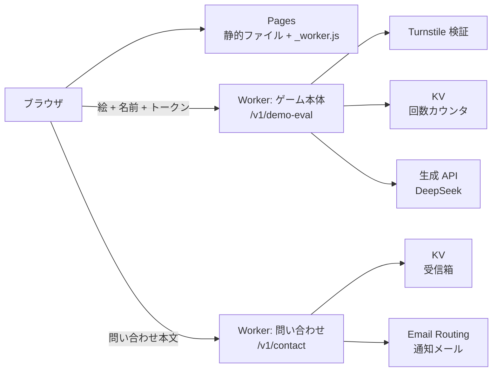

> 個人開発している Steam 向けゲームの公式サイトを Cloudflare で作り、2か月ほど運用しています。静的サイトは Pages、問い合わせフォームとブラウザ体験版は Worker と KV で、サーバーもデータベースも持たず、費用は無料枠に収まっています。Cloudflare の各製品をどう組み合わせたか、無料枠の上限をどう見たかをまとめました。

## TL;DR

- 個人開発ゲーム『ラクガキビースト』の公式サイトを Cloudflare Pages で作りました。日英2言語、静的 HTML/CSS/JS で、**ビルドもフレームワークも無し**です
- 問い合わせフォームとブラウザ体験版は **Worker 2本と KV だけ**で動いていて、サーバーもデータベースもありません
- 2か月運用して **Cloudflare の請求は $0.00** のままです。Pages、Workers、KV、Turnstile、Email Routing のいずれも無料枠の内側に収まっています
- 体験版は Turnstile と回数上限を Worker 側に置いて **外から叩かれても1日の AI 費用に上限がかかる**ようにし、問い合わせは KV に保存して自分宛てに通知するだけで、IP は保存しません

## はじめに

私は『ラクガキビースト』という、描いたラクガキがモンスターになってバトルするゲームを個人で作っています。ゲームの詳細は[紹介記事](https://zenn.dev/marvelousu/articles/rakugaki-beast-intro)に書いています。この記事で扱うサイトは公開していて、体験版もそのまま遊べます。

- 公式サイト: https://rakugakibeast.com/
- ブラウザ体験版: https://rakugakibeast.com/demo/
- Steam ストアページ: https://store.steampowered.com/app/5036050/

ゲームを世に出すなら、商業タイトルと同じ体裁を整えたいと思っていました。ストアページだけで済ませず、独自ドメインの公式サイトを作ることにしました。それに、どんなゲームを作っているのかと聞かれたときに、URL をひとつ渡せば内容が伝わるものがあると、その場で長々と説明しなくて済みます。

要件はサイトの仕様を決めた時点で次のように固めていました。

- 日本語と英語の2言語。ランディングのほかにプレスキット、ニュース、FAQ を置く
- ビルド無しの静的 HTML/CSS/JS。CMS もフレームワークも入れない
- 計測ツールも Cookie も使わない (同意バナーを出したくない)
- ブラウザで絵を描いて AI に読ませる体験版
- 問い合わせフォーム

ホスティングを Cloudflare にしたのは、ゲーム本体のバックエンドがすでに Workers で動いていて、ドメインも Cloudflare に置いていたからです。体験版はゲーム本体と同じ評価処理を呼ぶので、同じ基盤に載せるのが自然でした。

サイトの制作は、私が要件と確認を受け持ち、実装を AI に任せる形で進めました。初版は Claude Code で組みましたが、7月末に見た目を設計から作り直して以降は Codex に切り替え、現在の構成、見た目、実装はすべて Codex が起案して作ったものです。

## Cloudflare Workers と Pages について

Cloudflare を使ったことがない人向けに、この記事で出てくる5つの製品を先に説明しておきます。

**Workers** は Cloudflare のエッジで動く小さなサーバーです。HTTP リクエストを受け取って JavaScript か TypeScript で処理し、レスポンスを返します。常駐するプロセスは無く、リクエストが来たときだけ実行されます。

**Pages** は静的ファイルのホスティングで、HTML/CSS/JS と画像をアップロードするとそのまま配信されます。`_worker.js` というファイルを同梱すると、静的ファイルの手前に Worker を1本挟んで、一部のリクエストだけ自分の処理に差し替えられます。

**KV** は Workers から読み書きするキーバリューストアで、キーごとに有効期限 (TTL) を付けて書けます。

**Turnstile** は CAPTCHA の代替で、ブラウザ側のウィジェットがトークンを発行し、サーバー側 (ここでは Worker) がそのトークンを Cloudflare に問い合わせて検証します。

**Email Routing** は自分のドメイン宛てのメールを別のアドレスへ転送する機能です。転送先として検証済みのアドレスに対しては、Worker からメールを送ることもできます。

いずれも無料プランがあり、このサイトはすべて無料の範囲で動いています。関係する上限は次のとおりです (2026年9月時点の公式ドキュメントの値)。

| 製品 | この構成での役割 | Free プランの上限 |
|---|---|---|
| Pages | サイト本体の配信、pages.dev から本ドメインへの転送 | 静的ファイルの配信はリクエスト数・帯域とも無制限。1サイト 20,000ファイル、1ファイル 25MiB、デプロイ 500回/月 |
| Workers | 体験版の評価入口と問い合わせ受付 | 100,000リクエスト/日、CPU 時間 10ms/リクエスト、Worker 100個 |
| KV | 問い合わせの受信箱、体験版の回数カウンタ | 読み取り 100,000/日、書き込み 1,000/日、保存 1GB |
| Turnstile | 体験版の bot 対策 | ウィジェット 20個、検証回数は無制限 |
| Email Routing | 問い合わせの通知メール | 受信は無制限。検証済みの転送先への送信は無料で回数の枠にも数えられない |

Workers と KV の日次上限は 00:00 UTC にリセットされ、超えるとその操作が失敗します。問い合わせは後述のとおり IP 別 5件/時に絞っているので KV の書き込み枠には届きません。体験版は1回の生成で KV に2回書くため、300回/日の上限いっぱいまで使われても 600回で、こちらも枠の内側です。リクエスト数の方は、`_worker.js` を置いた Pages では静的ファイルへのリクエストも Worker を通るので、ページの表示もすべて Workers の 100,000/日に数えられます。

## 全体の構成

Pages に置いているのは静的ファイル一式と、pages.dev ホストへのアクセスを本ドメインへ 301 で送るための 20行ほどの `_worker.js` だけです。動く部分は Worker が2本あり、ひとつは問い合わせ専用、もうひとつはゲーム本体のバックエンド Worker で、そこに体験版用の入口 `/v1/demo-eval` を足しています。ダッシュボードの一覧にはもう1本 staging が並びますが、これはゲーム本体の検証用でサイトには関わりません。右の Usage はこの請求期間の課金額で、$0.00 のままです。

*一覧の右に、今日のリクエスト数と今月の課金額が出る*

KV も2つです。CONTACT_INBOX が問い合わせ Worker の受信箱で、EVAL_CACHE が本体 Worker のもの、体験版の回数カウンタもここに置いています。書き込みは月に100回ほどで、保存しているデータも 127kB です。

*ネームスペースは2つだけ。右はこの請求期間の読み書き回数*

デプロイは Git 連携にせず、手元から `wrangler pages deploy` を叩いています。Pages はデプロイごとにハッシュ付きのプレビュー URL を発行するので、まずそれを開いて目視し、問題がなければ本番ドメインに反映する、という手順にしたかったためです。Git 連携でも本番ブランチ以外はプレビューになりますが、本番ブランチへの push がそのまま公開になる形は避けたかったので、本番への反映も手元のコマンドで明示的に行っています。ひとつ上の一覧で Pages プロジェクトに No Git connection と出ているのは、そのためです。

*本番とプレビューのデプロイが並ぶ。プレビューは目視確認にだけ使う*

## 公式サイト

サイト本体はビルド無しの静的 HTML/CSS/JS です。CSS が5枚と JS が4本で合わせて 130KB ほど、あとは画像と動画です。`/` が日本語、`/en/` が英語で、体験版も含めて全ページを両方の言語で用意し、hreflang で相互リンクを張っています。計測ツールと Cookie を入れていないので、同意バナーはありません。

*PC 幅のファーストビュー。スクロールすると背景が寄り、タイトルと左右のビーストが外へ抜けていく*

*スマホ幅では同じ内容が縦に積まれ、メニューは右上のボタンに入る*

## 問い合わせフォーム

問い合わせは `/contact/` のフォームから Worker の `POST /v1/contact` に送り、**Worker は本文を KV に保存し、自分宛てに通知メールを1通送るだけ**です。通知は Worker の `send_email` バインディングで、送信元はこのドメインのアドレス、宛先は Email Routing の検証済みアドレスに固定しています。送信に失敗しても本文は KV に残っているので、その場合もフォームには成功を返します。受信箱そのものは手元から `wrangler kv` コマンドでキーの一覧と取得をして読みます。管理画面も管理 API もありません。

bot 対策は、人間には見えない隠しフィールドと、ページを開いてから送信までの経過時間の2つです。どちらかに引っかかったら、Worker は何も保存せずに `ok` を返します。エラーを返すと bot 側が学習するので、成功したふりをして捨てるほうが静かです。

レート制限は IP 別に 5件/時で、カウンタは KV に 1時間の TTL を付けて置いています。生の IP を使うのはこのカウンタのキーだけで、本文のレコードには入れていません。本文の方は 180日の TTL を付けているので、期限が来れば KV が勝手に消します。削除の運用もありません。

## ブラウザ体験版

体験版は `/demo/` で、512×512 の canvas に絵を描き、生成ボタンを押して名前を付けると、ゲームと同じ評価処理でビーストのカードが返ってきます。描く側は undo/redo とバケツ塗りがある程度の簡単なものです。返ってくるカードには属性、わざ3つ、能力値、説明文が付き、そのまま PNG で保存できます。

*左が描く側、右がカードの置き場。生成ボタンの上に Turnstile が入る*

*返ってきたカード。属性も説明文も AI が決めている*

ブラウザは canvas を PNG にして base64 で送ります。名前は12文字まで、PNG は 512KB までで、これはブラウザ側と Worker 側の両方で見ています。

Worker 側の `/v1/demo-eval` は、評価処理に入る前に次の順で弾いています。

1. Origin ヘッダが公式サイトのものか
2. PNG として正規化できて 512KB 以内か
3. Turnstile のトークンが有効か (Cloudflare の siteverify に問い合わせる)
4. 同じ IP から今日 3回以内か
5. 全体で今日 300回以内か
6. 絵が審査を通るか

ここまで通って初めて生成の API を呼びます。**上限を先に決めたのは、この入口の先が従量課金だからです**。誰が何回遊べるかより先に、1日いくらまでなら失っても構わないかを決めて、それを全体 300回/日にしました。IP 別の 3回/日は、その 300回を一人に使い切られないための配分です。どちらも Workers の枠ではなく、LLM 費用のための数字です。

生成に使うモデルは `wrangler.toml` の変数で指定していて、今は DeepSeek です。KV のキャッシュキーにモデル名を入れてあるので、切り替えても前のモデルの出力は混ざりません。絵の審査は別扱いで、Claude Haiku のままにしています。

Turnstile のウィジェットは Managed モードで、ホスト名は2つ登録しています。

*登録しているウィジェットは体験版の1つだけ*

回数のカウンタは本体 Worker の KV に、日付を含むキーで置いています。IP 別のキーに入れるのは IP の SHA-256 で、生の IP は書きません。どちらのキーも 48時間の TTL で消えるので、こちらも掃除は不要です。

## おわりに

サイト、体験版、問い合わせのすべてが Pages と Worker 2本と KV、それに通知用の Email Routing で動いていて、費用は無料の範囲に収まっています。サーバーもデータベースも無いので、公開してからの変更はほとんどが見た目と文言です。

ここまでの数字は、まだ宣伝を本格的に始める前のアクセス量で出たものです。発売に向けて人が増えれば、体験版の 300回/日より先に Workers のリクエスト枠が近づくこともあると思います。そうなったら `_routes.json` で Worker を通す範囲を絞るか、有料プランに移すかを選ぶことになります。

- 公式サイト: https://rakugakibeast.com/
- ブラウザ体験版: https://rakugakibeast.com/demo/
- Steam ストアページ: https://store.steampowered.com/app/5036050/
- X: https://x.com/rakugaki_beast
- YouTube: https://www.youtube.com/@MaveroniGames
