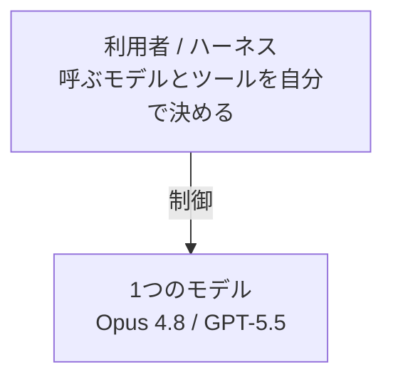
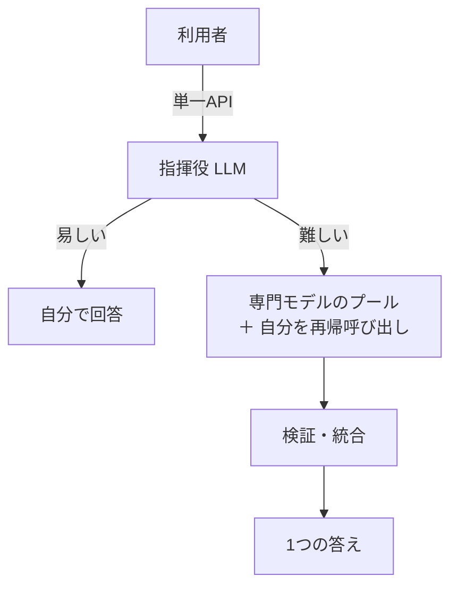

すでに Claude Code と Codex を日常的に使っている私が、今週GAされたばかりの Sakana Fugu に乗り換えるべきか迷い、同じプロンプト・同じタスクで実測して比べました。新しいコーディングエージェントが出るたびに乗り換えるか迷う人は多いと思います。私もその一人でした。

結論から書きます。

- 私が日常で回している用途では、いま乗り換える理由は見つかりませんでした。
- 差がついたのはコストと速度です。品質 (正答率) は4つともほぼ横並びでした。Fugu Ultra はコストが約20倍、速度も数倍遅い結果でした。
- これは2026年6月時点・単発タスクでの話で、Fugu のほうが良かった場面もあります。
- Fugu と Claude / Codex のどれを使うか迷っている人に向けて、比較の条件と実測値を全部出します。

公式は Fugu の上位モデルを "shoulder-to-shoulder with Fable 5" (Fable 5 と肩を並べる) と表現しています。ただ Fable 5 はもう提供終了で、そこは私には直接比較できていません。

## 先に向き不向きだけ

詳しくは最後にまとめますが、早見の判断材料を先に置きます。

- すでに Claude Code / Codex を使っているなら、いま急いで乗り換える必要は薄いです。
- 速度・コスト・データの扱いを重視するなら、Claude や OpenAI を直接使うほうが無難です。
- 唯一の差別化は複数プロバイダを1つにまとめられる点です。ただ、1つのモデルが使えれば足りるなら出番はありません。

## Fugu は中で何をしているのか

出たばかりで、単一の API に見えるのにマルチエージェントだと説明されていて、中身が掴みにくいモデルです。先に仕組みを押さえておくと、あとのコストの話が腑に落ちます。

Fugu の API の向こうには、指揮役の LLM が1ついます。公開情報では約7B の小さなモデルらしいと報じられています (一次ソースは未確認)。リクエストを送ると、指揮役は二択を内部で決めます。自分で答えるか、ほかのモデルにチームを組ませて振るかです。難しい問いなら複数の専門モデルに分けて投げ、結果を検証してから1つにまとめます。さらに自分自身を呼び直して深掘りすることもあります。プールに入るモデルの中身は公式には明かされていませんが、他社の最上位級のモデルが含まれると報じられています。Fugu はこれらを自前で持っているわけではなく、外部のモデルを取りまとめて使う形です。

Claude Code や Codex は、利用者の側がモデルとツールの呼び出しを握ります。

一方 Fugu は、その判断をモデル自身が内部で持ちます。

エージェントの動きが、利用者の手元ではなくモデルの内部で完結します。Claude Code や Codex のように手元で振り分けが見えることはありません。

実際にトークンを測ると、この内部処理の重さがはっきり出ました。通常の Fugu では指揮役がほぼ単独で答え、内部処理のトークンは0でした。Fugu Ultra では請求トークンの92%、1問あたり平均で約8,180トークンが裏側のやり取りに費やされていました。見えている入出力が数百トークンでも、裏で1万トークン近く動けばその分を払います。あとで見るコストの差は、ほぼこの内部処理で説明できます。

## 比較の前提

数字を出す前に、何をどう測ったかを揃えておきます。先に断っておくと、4つを完全に同じプロンプト・同じ採点で揃えたので、下に出す数字はそのまま横並びで比較できます。

比較したのは4つです。通常の Fugu と Fugu Ultra の2モデルに、Claude (Opus 4.8) と GPT-5.5 を加えました。どれも OpenAI 互換の API なので、同じコードでエンドポイントだけ差し替えて同じプロンプトを投げています。

タスクは公開された使い捨ての問題だけにしました。中身は1往復で答え合わせができる単発タスクが計11問です。内訳はアルゴリズムの実装が4問。文章題や論理パズルなどの推論が4問。もう少し実務に近い構造化出力が3問です (JSON を返す出荷判定、仕込んだバグのコードレビュー、API 仕様の抜き出し)。問題と採点の基準は Claude (Opus 4.8) に作らせ、実行は Codex に回しました。

各回について正誤・応答時間・トークン・推定コスト・内部処理の量を記録しています。評価軸は品質・速度・コスト・運用の4つです。

## 結果1：正答率はほぼ横並び

まず品質です。結論から言うと差はつきませんでした。

| モデル | 正答 (易問8問) | 平均応答時間 | コスト (8問合計) |
|---|---|---|---|
| Fugu Ultra | 8/8 | 48.9 秒 | $0.94 |
| Fugu | 8/8 | 10.8 秒 | 非公開 |
| Claude Opus 4.8 | 8/8 | 3.9 秒 | $0.053 |
| GPT-5.5 | 8/8 | 16.9 秒 | $0.047 |

※上表は採点が機械的に確定できた易問8問の集計です。残る推論4問・実務3問は本文で個別に扱います。

易しい8問は4つとも全問正解でした。実務寄りの3問でも、出荷判定と API 仕様の抜き出しは全員が解けました。差が出たのはコードレビューの1問だけです。サイズに0を渡したらエラーを出すべきなのに出していない、というバグがありました。これを Fugu Ultra と GPT-5.5 は見落とし、Claude と通常の Fugu は指摘しました。しかもこの見落としは Fugu Ultra で5回試して5回とも同じでした。内部で重く動く Fugu Ultra が、通常の Fugu より良い答えを返したわけではありません。

品質の面で Fugu が他をはっきり上回る場面は、今回の範囲ではありませんでした。

## 結果2：コストで大きく負ける

ここが一番の差です。1問あたりに直すと、Fugu Ultra は約$0.117、Claude は約$0.0066、GPT-5.5 は約$0.0058 でした。Claude や GPT-5.5 のおよそ20倍かかっています。

理由は最初に見たとおりです。Fugu Ultra は請求トークンの92%を内部処理に使い、その分がそのまま値段に乗ります。通常の Fugu はこの裏側のやり取りがほとんど無いぶん安いはずですが、料金が公開されておらず、コスト比較の対象にできません。

## 結果3：応答時間も遅い

応答時間も Fugu はどちらのモデルでも見劣りしました。Fugu Ultra は平均48.9秒、通常の Fugu でも10.8秒です。Claude が3.9秒、GPT-5.5 が16.9秒なので、通常の Fugu でも数倍遅いことになります。Fugu Ultra は1問に1分近くかかることもあり、対話的に使うにはつらい体感でした。

## ツールと運用 (作業環境とデータの行き先)

運用面では2つ問題があります。作業環境がないことと、既定でデータが外部に出ることです。

1つめ。Fugu は Claude Code や Codex と同じ土俵にいません。Claude Code や Codex はモデルに加えて、ファイルを編集したりコマンドを動かしたりする作業環境が一式ついてきます。Fugu にはそれが無く、モデル単体です。使うときは Codex のような既存のツールに、エンドポイントとして組み込む形になります。組み込み自体は可能ですが、その状態で各ツールの作り込まれた機能がどこまで活きるかは公式の説明がありません。

2つめはデータの行き先です。**Fugu は何も設定しなければ、入力したプロンプトを外部のモデルへ転送します。** 設定でプロバイダを絞れますが、既定では入力が第三者のモデルに渡る前提です。直接 API を叩くより経路が一段増えるので、機密や個人的な情報を扱うなら直接利用したほうが無難です。

## Fugu の良かった点はどこか

勝った項目こそ無かったものの、設計として一つ面白い点があります。複数プロバイダのモデルを、1つの API の裏で束ねている点です。どこか1社のモデルが止まったり使えなくなったりしても、Fugu の側で別のモデルに振り直せます。

もっとも、1つのモデルが使えれば足りる使い方では、この強みの出番はほぼありません。効いてくるのは、特定プロバイダの停止や縛りを避けたいという要件が実際にある場合です。今回の単発タスクでも、その出番はありませんでした。

## いま乗り換えないと判断した理由

測った範囲での結論をまとめます。すでに Claude や Codex を使っている自分にとって、いま乗り換える理由は見当たりませんでした。品質は横並びで、Fugu Ultra はコストが約20倍、どちらのモデルも遅く、専用の作業環境もありません。

向き不向きは用途で分かれます。

- すでに Claude や Codex を使っている人。いま乗り換える理由は薄いです。
- 特定プロバイダの停止や縛りを避けたい、という要件が実際にある人。唯一の差別化はここで、それ以外では出番がありません。
- コストや速度を最優先する人と、機密データを扱う人。直接 Claude や GPT を利用したほうがよいです。

自分はどうするか。単発タスクで乗り換える理由は見つかりませんでしたが、今月加入したぶんはキャンペーンで来月も Standard が無料です (公式に「2026年7月31日までに加入すれば2か月目が無料」とあります)。なので解約は急ぎません。

## おわりに

新しいモデルが出るたびに乗り換えを迷う、という話から始めました。Fugu を同じ条件で並べて測った結果、私の用途ではいまは乗り換えないという結論になりました。

ただし測ったのは英語の単発タスクで、様子見で入った Standard プランの範囲です。日本語や複数ファイルをまたぐ作業、長い文脈、論文の再現のような重い用途は測れていません。Fugu の本領が出るとすれば、むしろそちらかもしれません。
