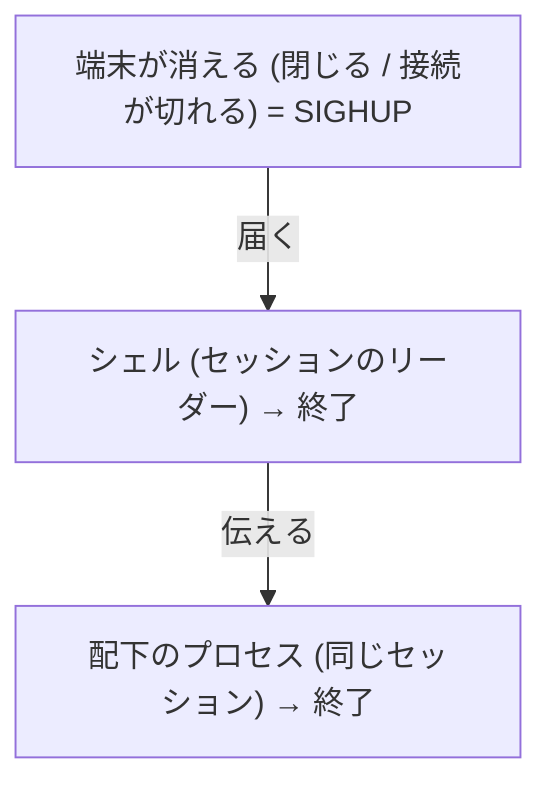
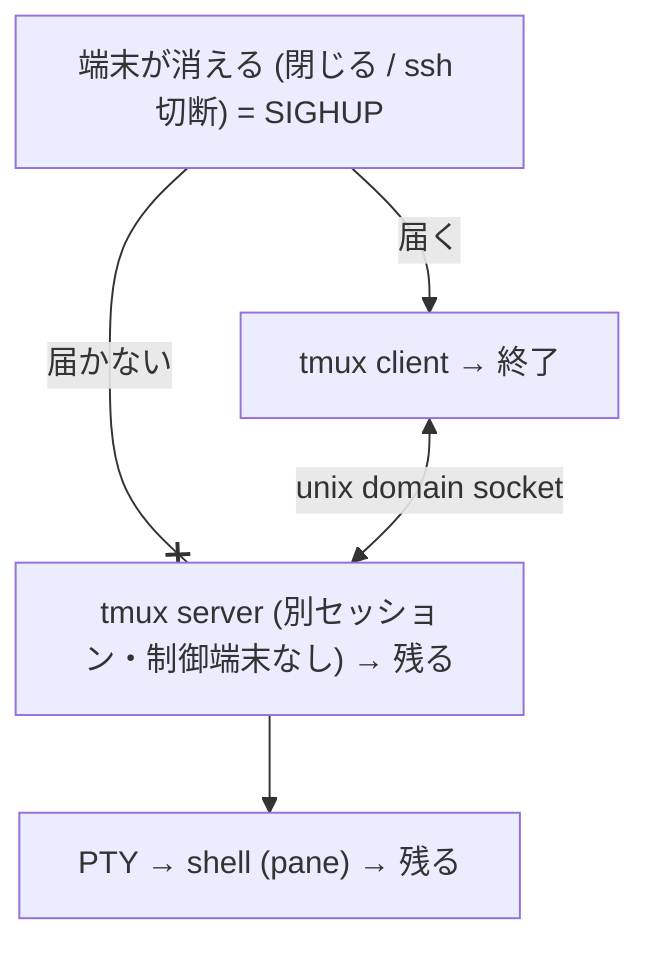

> tmux の魅力としてよく挙がるのは画面分割と、「端末を閉じても作業が残る」ことです。自分がいちばん頼っているのは後者で、端末を閉じても、接続が切れても、あとから戻れば作業がそのまま続いています。でも「なぜ残るのか」と聞かれると、うまく説明できませんでした。気になったので、client/server 構成や擬似端末 (PTY)、シグナルのあたりを手元で確かめながら調べました。そのまとめです。

## TL;DR

- `tmux` で操作しているのは **client** で、セッションやプロセスの実体は、裏で常駐する **server** が持っています
- server は pane ごとに **擬似端末 (PTY)** を用意し、その中でシェルを動かします
- server は起動時に自分のセッションへ分離され、**制御端末を持ちません**
- なので端末が消えたとき (端末を閉じる・ssh 切断など) の **SIGHUP** は client 側に飛び、server には届きません。中のプロセスは生き残ります
- **detach** は client が離れるだけで、server と PTY はそのまま残ります。**attach** すれば戻れます

## 前提 — 端末を閉じると中のプロセスはなぜ死ぬのか

端末を閉じる場面は様々です。ターミナルのタブを閉じた、ノート PC を閉じてスリープした、ssh の回線が切れた、別の作業のために一度 ssh を抜けた。どれも手元の端末との接続が切れます。こういうとき、ふつうに動かしていたコマンドはたいてい巻き込まれて終わりますが、tmux の中の作業は残ります。

なぜ残るのかを知るために、まず逆から、「なぜふつうのプロセスは巻き込まれて終わるのか」を考えます。これは端末まわりの仕組みによるものです。

端末には **制御端末 (controlling terminal)** という概念があり、端末が閉じる・切断されると、カーネルはその端末を持つセッションのリーダー (多くはログインシェル) に **SIGHUP** を送ります。シェルは終了時に配下のジョブにも SIGHUP を伝えるので、起動していたプロセスも道連れで終わります。



`nohup` でプロセスが残るのは、この SIGHUP を無視させているからです。つまり「残す」には、SIGHUP を受けない・届かない状態を作ればよいわけです。tmux はそれを別のやり方で実現しています。

## tmux は client と server の2プロセス

`tmux` と打つと1つのプログラムが動くように見えますが、実際は役割が2つに分かれています。

- **client**: 画面表示とキー入力を担当します。手元の端末に出ているのはこちらです
- **server**: セッション・ウィンドウ・ペインの実体を保持する常駐プロセスです

両者は **unix domain socket** (既定で `/tmp/tmux-<uid>/default`) を通じて会話します。server はユーザーにつき基本1つで、最初の `tmux` 実行時にいなければ起動し、以後は同じ server に client がつなぎ直します。

ここで効いてくるのが、**server は client を起動した親 (ssh なら sshd、ローカルなら端末エミュレータ) の子ではなく、そこから切り離されて常駐している** という点です。

```bash
$ ps -e -o pid,ppid,cmd | grep '[t]mux'
  10317       1 tmux new-session -d -s main
# 親 (PPID) が起動元の shell/sshd ではない (この機では 1 = init)

$ tmux list-sessions
main: 1 windows (created Fri Jun 12 06:21:04 2026)

$ tmux list-clients
# 空 — どの client も attach していない。それでも server とセッションは生きている
```



## pane の実体は擬似端末 (PTY)

各 pane には **擬似端末 (PTY)** が割り当てられ、その中でシェルが動きます。pane の中で動くプロセスの制御端末は、**手元の端末ではなく server が用意した端末** になっています。

確かめ方は簡単で、tmux の外と中で `tty` を打って比べるだけです。別々の pts が出ます。

```bash
# tmux の外 (手元の端末)
$ tty
/dev/pts/16

# tmux の中 (server が用意した端末)
$ tty
/dev/pts/4
```

## なぜ端末を閉じても残るのか

tmux server は起動時にデーモン化し、**自分のセッションのリーダーになって制御端末を持ちません** (`ps` の TTY が `?` になります)。

そのため、端末が消えたときに飛ぶ SIGHUP は **その端末をもつセッションのリーダー (client 側)** に向かい、別セッションにいる server には届きません。pane の PTY も server が握り続けるので、中のプロセスに hangup は起きません。結果として client だけが消え、server・PTY・中のプロセスは生き残ります。

```bash
$ ps -o pid,ppid,sid,tty,cmd -p 10317
    PID    PPID     SID TT       CMD
  10317       1   10317 ?        tmux new-session -d -s main
# SID=PID (10317) = server 自身が session リーダー。TTY が ? = 制御端末なし
```

端末を閉じて開き直しても (ssh なら切って入り直しても)、server と pane 内プロセスの PID が変わっていなければ、同じプロセスがそのまま生きている証拠になります。

## detach / attach で起きていること

- **detach (`Ctrl-b d`)**: client が終了するだけです。server・PTY・中のプロセスはそのまま残ります
- **attach (`tmux attach`)**: 新しい client が既存の server につなぎ、バッファから画面を描き直します

結局、ローカル端末を閉じても ssh が切れても detach でも、消えるのは client だけで server は残り、同じホストに入り直せば (ssh でも手元でも) 同じ session に attach できます。逆に残らないのは、server 自体が死ぬときです。ホストの再起動やシャットダウン、`tmux kill-server`、OOM kill で server が落ちれば、pane も中のプロセスも一緒に消えます。端末が消えても残るが、server が死ねば消える。これが保持の境界です。

## おわりに

残る理由を一言でいうと、**中のプロセスが「端末から切り離された server 配下の PTY」にぶら下がっているから**でした。手元の端末が消えても、ぶら下がり先の server が無事なので生き残る、という話です。

似た道具との違いも整理しておきます。

- `nohup`: SIGHUP を無視させるだけです。後から画面に戻ることはできません
- `disown`: シェルのジョブ管理から外すだけです。これも後から戻れません
- `screen`: tmux と同系の端末多重化ツールで、考え方は近いです

nohup や disown が後から戻れないのに対し、tmux が戻れるのは、制御端末ごと別プロセス (server) に預けているからです。ふだんは "残る" を半ば魔法のように使っていましたが、制御端末や SIGHUP まで辿ってみると、案外素直な仕組みでした。使い方が変わるわけではありませんが、中で起きていることが分かって、少し見通しが良くなった気がします。
